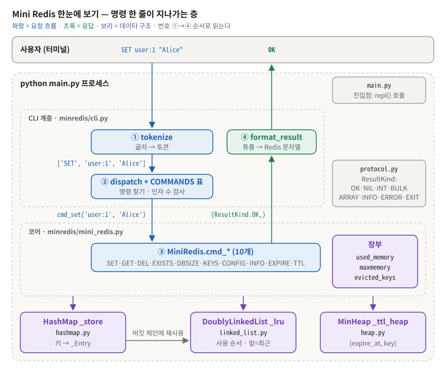
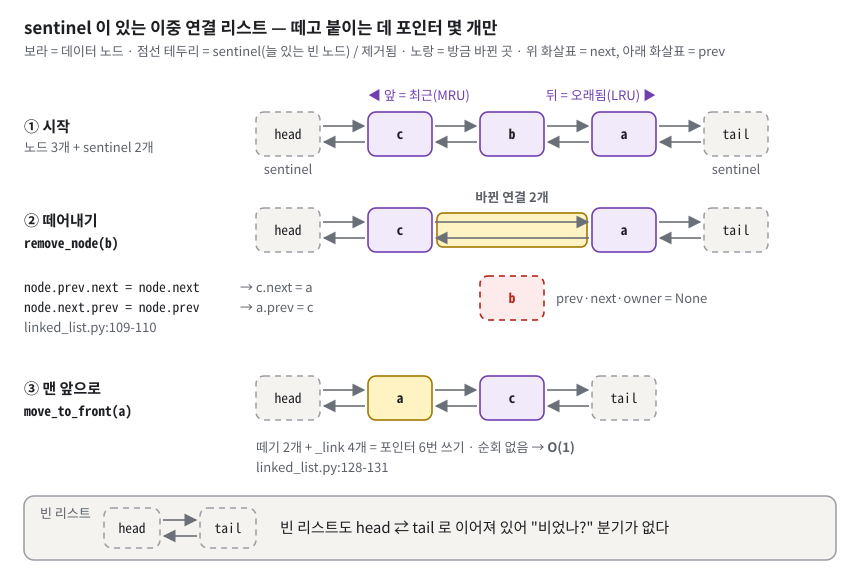
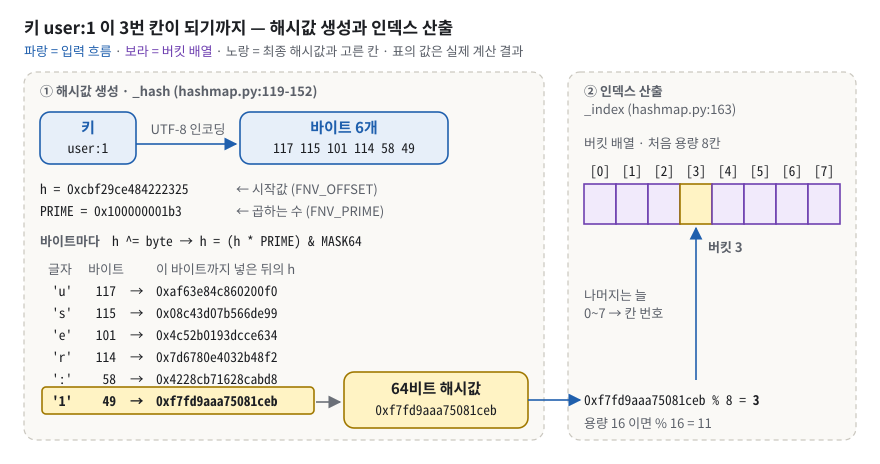

# B3-1 · 정보를 엄청 빠르게 찾아주는 작은 저장소 만들기 (Mini Redis) — 구술 평가 대비 학습 문서

> 동네 편의점의 작은 냉장고를 떠올리자. 물건마다 이름표가 붙어 있고, 점원은 이름표만 들으면 바로 그 칸을 연다. 냉장고가 꽉 차면 **가장 오래 아무도 꺼내지 않은 물건**부터 뺀다. 유통기한 스티커가 붙은 물건은 **기한이 지나는 순간 없는 물건**으로 친다. 이 과제는 그 냉장고를 파이썬으로 만드는 일이다.
>
> 정확히 말하면: 파이썬 내장 `dict`·`set`·`collections` 없이 **해시맵(체이닝)**, **이중 연결 리스트**, **배열 기반 최소 힙**을 직접 만들고, 셋을 엮어 `SET`·`GET`·`DEL`·`EXISTS`·`DBSIZE`·`KEYS`·`CONFIG SET maxmemory`·`INFO memory`·`EXPIRE`·`TTL` 10개 명령이 도는 `mini-redis> ` 대화형 저장소를 만든다. 메모리 한도를 넘으면 **LRU(가장 오래 안 쓴 키)부터 축출**하고, 만료 시각이 지난 키는 **TTL(Time To Live, 남은 수명) 만료**로 사라진다. 코드는 `minredis/` 패키지 7개 파일(1,172줄)과 루트 `main.py`(18줄), 테스트 117개다.

**읽는 법.**
① 처음이면 §1 부터 끝까지 정독한다(예상 4시간 안팎 — 체크리스트가 49문항이라 길다. §5 의 실행 출력 블록은 훑어 읽어도 된다). ② 평가 전날이면 §1 · §5 · §7.3 을 읽고, §6 은 문항마다 **핵심 한 줄**과 **말로 하는 답**만 소리 내어 본다(꼬리 질문은 막히는 문항만 펼친다). ③ 평가 30분 전이면 §8 만 본다.
§6 의 접이식 문답은 **질문만 보고 먼저 소리 내어 답해 본 뒤** 펼친다. 펼쳐서 읽기만 하면 평가장에서 입이 열리지 않는다.

> [!IMPORTANT]
> **이 문서의 `파일:줄` 은 커밋 `051d12f`(refactor: 코드 품질 가이드 적용) 기준이다.**
> - 예전 답변서 `docs/b3-1-redis-in-memory-db.md` 와 `review/*.md` 의 줄 번호는 리팩터 **전** 기준이라 믿지 않는다(내용이 틀린 곳은 부록 B 에 모았다).
> - 이 문서를 만든 환경에는 `python3`(3.14.4)만 있고 `python` 명령이 없다. 과제의 채점 경로는 `python main.py` 이므로, 평가장 PC 에서 `python --version` 부터 확인한다.
> - 실행 결과는 전부 저장소 복사본에서 실제로 돌린 출력이다. `# (N초 대기)` 줄만 시연 스크립트가 넣은 표시다.

## 1. 한눈에 보기

### 1.1 이 과제를 한 문장으로

**비유.** 도서관 대출 창구를 떠올리자. 사서는 ① 신청서를 읽고(토큰화) ② 어느 업무인지 안내표에서 찾고(명령 표) ③ 서고에서 책을 꺼낸다(코어). 서고에는 세 가지 도구가 있다. **색인 카드함**(해시맵)은 책이 어디 있는지 바로 알려 주고, **대출 순서 줄**(이중 연결 리스트)은 누가 최근에 빌렸는지 기억하고, **반납 기한 알림판**(최소 힙)은 기한이 가장 먼저 끝나는 책을 맨 위에 올려 둔다. 결과는 정해진 양식의 영수증(출력 문자열)으로 돌아온다.

**정확한 정의.** Redis 의 핵심 기능(String 명령, 메모리 한도와 LRU 축출, TTL 만료)을 파이썬 3.8 이상 표준 라이브러리만으로 흉내 내는 **CLI**(Command Line Interface — 터미널에 글자로 명령을 쳐서 쓰는 방식) 프로그램이다. 과제 원문은 목적을 이렇게 적는다: "해시맵, 이중 연결 리스트, 힙을 밑바닥부터 짜면서 LRU와 TTL이 어떻게 동작하는지 손으로 확인합니다."


*그림 1. 사용자가 친 한 줄은 CLI 계층(토큰화·명령 찾기)을 지나 코어의 cmd_∗ 가 세 자료구조를 고치고, 결과 튜플이 다시 CLI 에서 Redis 형식 문자열이 된다.*

그림 1 에서 봐야 할 것은 세 가지다.

- **파란 화살표(①→②→③).** ① `tokenize` 가 `SET user:1 "Alice"` 를 `['SET', 'user:1', 'Alice']` 로 자른다(`minredis/cli.py:31-88`). ② `dispatch` 가 명령 표 `COMMANDS` 에서 SET 행을 찾아 인자 개수를 검사한다(`minredis/cli.py:216-229`, `minredis/cli.py:243-260`). ③ 코어 `MiniRedis.cmd_set` 이 실제 일을 한다(`minredis/mini_redis.py:200-236`).
- **보라색 세 상자와 장부.** 코어는 `HashMap _store`(키 → **엔트리**: 키 하나의 값·리스트 노드·만료 시각을 묶은 상자), `DoublyLinkedList _lru`(사용 순서), `MinHeap _ttl_heap`(만료 시각 순서) 세 구조와 `used_memory`·`maxmemory`·`evicted_keys` 세 숫자(이 문서는 이 셋을 **장부**라고 부른다)를 들고 있다(`minredis/mini_redis.py:67-76`). 해시맵은 버킷 안의 줄을 만들 때 이중 연결 리스트를 다시 쓴다(회색 가는 화살표).
- **초록 화살표(④).** 코어는 화면에 아무것도 찍지 않는다. `(ResultKind.OK,)` 같은 **튜플**만 돌려주고, `format_result` 가 그것을 `OK` 같은 Redis 형식 문자열로 바꾼다(`minredis/cli.py:93-121`). 튜플의 종류 이름은 `minredis/protocol.py:21-31` 한 곳에 모여 있다.

### 1.2 평가자는 무엇을 보나

체크리스트(`checklists_md/redis_in_memory_db.md`)는 **49문항**이다. 이 문서는 모든 문항을 §6 에 번호와 함께 옮겨 두었다.

| 절 | 문항 수 | 평가 방식 | 배점 | 이 문서에서 대비하는 곳 |
|---|---|---|---|---|
| 1-A String 명령 | 5 | 실행 검증 | 1-A~1-D 합 35 | §5.2 시연, §6.1 |
| 1-B 메모리 / LRU | 6 | 실행 검증 | 〃 | §5.3, §6.1 |
| 1-C TTL | 7 | 실행 검증 | 〃 | §5.4, §6.1 |
| 1-D CLI / 에러 | 4 | 실행 검증 | 〃 | §5.5, §6.1 |
| 1-E 구현 제약 준수 | 8 | **코드 확인** | 15 | §5.6, §6.1 |
| 2 구현 구조 설명 | 5 | 구두 + **파일:줄 지목 + 채점자 육안 확인** | 20 | §3.5~§3.10, §6.2 |
| 3 핵심 개념 이해 | 6 | 구두 | 20 | §3.9~§3.13, §6.3 |
| 4 확장 사고·트러블슈팅 | 8 | 구두 | 10 | §6.4, §7 |
| 보너스 | — | 실행 검증 | +10 상한 | §2.4 |

- **합격선 70 / 100.** 2~4절(50점)은 말로 설명해야만 받는다.
- **즉시 불합격(Fail-fast)** — 하나라도 해당하면 나머지를 채점하지 않는다. ① `dict`·`set`·`collections` 사용(AST 검사 위반) ② 해시맵·이중 연결 리스트·최소 힙 중 하나라도 직접 구현 부재 ③ `python main.py` 실행 불가.
- **2절의 함정.** 원문: "README에 적힌 문장을 읽는 것은 근거로 인정하지 않는다." 코드를 열어 줄을 짚고, 주석을 가려도 코드 자체를 읽으며 설명해야 한다.
- **채점 시 주의(원문).** KEYS 순서로 채점하지 않는다(집합 비교). `EXPIRE k 3` 직후 TTL 은 2 와 3 모두 인정한다. 명세 예시 블록은 압축 표기라 문자열 완전 일치로 채점하지 않는다.

### 1.3 30초 자기소개 스크립트

평가가 시작되면 그대로 말한다.

> "Mini Redis 를 만들었습니다. 파이썬 dict 와 set 없이 세 자료구조를 직접 구현했습니다. 체이닝 해시맵이 키를 찾고, 이중 연결 리스트가 사용 순서를 기억하고, 배열 기반 최소 힙이 가장 이른 만료 시각을 들고 있습니다.
> 핵심 설계는 두 가지입니다. 첫째, 해시맵의 엔트리가 리스트 노드를 직접 가리키게 해서 GET·SET·축출이 모두 평균 O(1)입니다(리사이즈가 걸린 SET 한 번만 O(n)). 둘째, 축출하기 전에 힙으로 만료된 키부터 회수해서 살아 있는 키가 대신 쫓겨나지 않게 했습니다.
> 검증은 테스트 117개, 체크리스트의 AST 금지 API 검사, 그리고 힙을 일부러 망가뜨리면 테스트 11개가 실패하는 실험으로 했습니다.
> 지난 평가 뒤에는 패키지 구조와 명령 표로 정리하고, 문서에만 있던 규칙 여러 개를 테스트로 옮겼습니다."

## 2. 명세 정독 — 무엇을 요구받았나

### 2.1 요구사항 지도

ID 는 README 0.4 절의 R-번호(필수 53개)를 그대로 쓴다. 원문 요지는 과제 PDF 문구 그대로다. 단, 에러 문자열 4종(`R5-4`~`R5-7`)은 표가 옆으로 넘치지 않게 이름만 적었고, 원문 글자 그대로는 §2.3 에 있다. 상태: ✅ 충족 · ⚠️ 부분 · ❌ 미충족.

**R1. 기본 자료구조 직접 구현 (내장 Key-Value 컬렉션으로 대체 금지)**

| ID | 원문 요지 | 쉬운 말 | 왜 이런 요구를? | 내 구현 | 상태 |
|---|---|---|---|---|---|
| `R1-1` | 노드 구조: `prev`, `next`, `data` 필드 | 노드마다 앞·뒤 연결과 값 | 앞뒤를 다 알아야 아무 노드나 O(1)에 뺄 수 있다 | `minredis/linked_list.py:12-28` (`__slots__` 는 22줄) | ✅ 3필드 + 방어용 `owner` |
| `R1-2` | `insert_front`, `insert_back`, `remove_front`, `remove_back`, `remove_node`, `move_to_front` | 앞/뒤 넣기·빼기, 아무 노드 빼기, 맨 앞으로 옮기기 | LRU 갱신·축출과 체이닝에 필요한 연산 전부 | `minredis/linked_list.py:73-131` | ✅ 6개 직접 호출로 확인 |
| `R1-3` | 모든 삽입/삭제/이동 연산은 O(1) | 리스트 길이와 상관없이 같은 시간 | LRU 가 O(1) 이려면 "맨 앞으로 옮기기"가 O(1) 이어야 한다 | sentinel `minredis/linked_list.py:45-52`, `_link` `minredis/linked_list.py:149-155` | ✅ 순회 없음 |
| `R1-4` | `put`, `get`, `remove`, `contains`, `keys`, `size` | 해시맵 기본 6연산 | 저장소의 공개 API | `minredis/hashmap.py:52-108` | ✅ 충족 |
| `R1-5` | 해시 함수는 직접 설계 | 파이썬 `hash()` 대신 직접 만든 식 | 해시의 결정성·분포를 몸으로 이해 | `minredis/hashmap.py:119-152` (FNV-1a 64비트) | ✅ 내장 `hash(` 호출 0 |
| `R1-6` | 충돌 해결은 체이닝 (권장: 이중 연결 리스트 재사용) | 같은 칸에 오면 줄을 세운다 | 충돌 처리 전략 학습 + 자료구조 재사용 | `minredis/hashmap.py:165-179` | ✅ 버킷 = `DoublyLinkedList` |
| `R1-7` | 로드 팩터 0.75 초과 시 버킷을 2배 확장 | 칸 대비 키가 75% 를 넘으면 칸을 두 배로 | 줄을 짧게 유지(평균 O(1)) | `minredis/hashmap.py:62-65`, `_resize` `minredis/hashmap.py:195-213` | ✅ 확장 지점 7/13/25/49 를 테스트가 고정 |
| `R1-8` | `push`, `pop`, `peek`, `size` | 힙 기본 4연산 | TTL 관리의 핵심 API | `minredis/heap.py:24-55` | ✅ 충족 |
| `R1-9` | `_heapify_up`, `_heapify_down` 구현 필요 | 위로 올리기·아래로 내리기 | 힙 성질을 되살리는 알고리즘을 직접 | `minredis/heap.py:59-83` | ✅ `(i - 1) // 2`, `2 * i + 1`, `2 * i + 2` |
| `R1-10` | TTL 만료 관리를 위해 `(expire_at, key)` 형태의 요소 | 힙 원소 = (만료 시각, 키) | 가장 이른 만료와 그 키를 함께 안다 | push `minredis/mini_redis.py:330`, 꺼내기 `minredis/mini_redis.py:132` | ✅ 충족 |

**R2. String 타입 명령어 (Redis 스타일 출력)**

| ID | 원문 요지 | 쉬운 말 | 왜 이런 요구를? | 내 구현 | 상태 |
|---|---|---|---|---|---|
| `R2-1` | 키 기반 명령어는 실행 전 "만료 여부"를 먼저 확인 (만료된 키는 삭제 후 '없는 키'처럼) | 명령 전에 유통기한부터 본다 | 만료 키가 결과에 섞이면 안 된다 | `_get_live_entry` `minredis/mini_redis.py:112-120`; 집계 명령은 `minredis/mini_redis.py:276`·`:285`·`:309` 에서 먼저 회수 | ✅ 충족 |
| `R2-2` | 출력은 Redis 스타일: `OK`, `(nil)`, `(integer) N`, `(error) ...` | 정해진 모양의 응답 | 출력 문자열이 곧 약속(프로토콜) | `minredis/cli.py:93-121` | ✅ (값 속 따옴표·개행 이스케이프는 없음 → §7) |
| `R2-3` | SET 성공 시 `OK` | 저장되면 `OK` 한 줄 | 가장 흔한 응답이라 모양을 못 박는다 | `minredis/mini_redis.py:236` → `minredis/cli.py:96-97` | ✅ 충족 |
| `R2-4` | SET 메모리 초과 시 LRU 제거 수행 | 넣다가 넘치면 가장 오래 안 쓴 것부터 버린다 | SET 을 실패시키지 않고 한도를 지키려고 | `minredis/mini_redis.py:224` → `minredis/mini_redis.py:167-196` | ✅ 충족 |
| `R2-5` | 기존 키를 덮어쓰는 경우 기존 TTL은 "초기화(삭제)" | 덮어쓰면 유통기한이 없어진다 | 실제 Redis 동작 | `minredis/mini_redis.py:219-221`, `minredis/mini_redis.py:233` | ✅ 실행 `TTL k` → -1 |
| `R2-6` | GET: 키가 없거나 만료된 경우 `(nil)` | 없는 키와 만료 키는 똑같이 "없음" | 만료 키가 밖에서 보이면 안 된다 | `minredis/mini_redis.py:245-247` | ✅ 충족 |
| `R2-7` | GET: 존재하는 경우 `"value"` 형태 | 큰따옴표로 감싸 출력 | 값과 명령 응답(`OK` 등)을 구분한다 | `minredis/cli.py:102-103` | ✅ 충족 |
| `R2-8` | 반환이 성공한 경우에만 LRU 갱신 (만료로 삭제된 경우는 갱신하지 않음) | 진짜 읽었을 때만 "최근 사용" | 죽은 키가 순서를 오염시키지 않게 | `minredis/mini_redis.py:248` (None 검사 뒤) | ✅ 충족 |
| `R2-9` | DEL: 성공 `(integer) 1`, 없으면 `(integer) 0` | 지웠으면 1, 지울 게 없었으면 0 | 부른 쪽이 실제로 지워졌는지 안다 | `minredis/mini_redis.py:251-262` | ✅ 충족 |
| `R2-10` | 삭제 시 LRU/TTL 관련 구조에서도 함께 제거 | 세 구조를 같이 정리 | 유령 키·누수 방지 | `_hard_delete` `minredis/mini_redis.py:102-110`; 힙은 지연 삭제(`R4-11` 이 허용) | ✅ 관측 결과는 완전 제거와 같다 |
| `R2-11` | EXISTS: 존재 `(integer) 1`, 없으면 `(integer) 0` | 있으면 1, 없으면 0 | 값을 꺼내지 않고 존재만 확인 | `minredis/mini_redis.py:264-269` | ✅ 충족 |
| `R2-12` | DBSIZE: `(integer) N` | 지금 살아 있는 키 개수 | 상태를 밖에서 확인할 창 | `minredis/mini_redis.py:271-277` | ✅ 충족 |
| `R2-13` | KEYS: 전체 키를 배열 형태로 (정렬/순서 요구 안 함) | 모든 키 목록 | 순서는 해시 버킷 순서라 구현마다 달라 요구하지 않는다 | `minredis/mini_redis.py:279-286`, `minredis/cli.py:106-113` | ✅ `1) "key"` |
| `R2-14` | 키가 없으면 `(empty array)` 같은 형태로 표현해도 됨 | 비었으면 빈 목록 표시 | 빈 줄과 "결과 없음"을 구분한다 | `minredis/cli.py:108-109` | ✅ 충족 |

**R3. 메모리 관리 + LRU 자동 제거**

| ID | 원문 요지 | 쉬운 말 | 왜 이런 요구를? | 내 구현 | 상태 |
|---|---|---|---|---|---|
| `R3-1` | `bytes` 는 0 이상의 정수 | 음수 금지 | 한도는 음수가 될 수 없다 | `minredis/mini_redis.py:296-297`, `minredis/cli.py:138-154` | ✅ -1 은 에러, 기존 값 보존 |
| `R3-2` | 0은 "무제한"으로 간주 | 0 바이트가 아니라 "제한 없음" | Redis 관례 | `minredis/mini_redis.py:174-175`, `minredis/mini_redis.py:214`, `minredis/mini_redis.py:300` | ✅ 충족 |
| `R3-3` | 성공 시 `OK`, 정수 파싱 실패 시 에러 표준 | 숫자가 아니면 정해진 에러 | 잘못된 입력이 한도를 바꾸지 못하게 | `minredis/cli.py:184-188` | ✅ 충족 |
| `R3-4` | INFO memory: `used_memory:<number>` `maxmemory:<number>` `evicted_keys:<number>` 최소 포함 | 세 줄 통계 | 상태를 밖에서 볼 창 | `minredis/cli.py:114-118`, `minredis/mini_redis.py:304-310` | ✅ 3줄 |
| `R3-5` | `used_memory` = Σ( `len(utf8(key))` + `len(utf8(value))` ) | 키·값 UTF-8 바이트 합 | 글자와 바이트가 다름을 배우고, 결과가 기계마다 같게 | `minredis/mini_redis.py:80-91` | ✅ 한글·이모지 검산 일치 |
| `R3-6` | 자료구조(노드/포인터/버킷 등) 오버헤드는 계산에서 제외 | 순수 데이터만 센다 | 예시 재현·결정성 | `_entry_size` 만 사용(`minredis/mini_redis.py:110`, `minredis/mini_redis.py:235`) | ✅ 충족 |
| `R3-7` | maxmemory > 0 이고 SET 이후 used_memory 가 maxmemory 를 초과하면, 이하가 될 때까지 LRU 부터 제거 | 넘치면 가장 오래 안 쓴 것부터 버린다 | 캐시 교체 정책 | `minredis/mini_redis.py:185-196` | ✅ 연쇄 축출 실측 |
| `R3-8` | 제거된 키는 `evicted_keys` 에 누적 | 축출할 때마다 하나씩 센다 | 운영 지표 | `minredis/mini_redis.py:196` | ✅ 만료는 세지 않음 |
| `R3-9` | "단일 엔트리(키+값)" 자체가 maxmemory 초과 → 저장하지 않고 에러(OOM) | 너무 크면 거절 | 실패해도 기존 상태를 지킨다(원자성 — 전부 되거나 전부 안 되거나) | `minredis/mini_redis.py:211-215` | ✅ 기존 상태 보존 실측 |

**R4. TTL 관리 (힙 기반)**

| ID | 원문 요지 | 쉬운 말 | 왜 이런 요구를? | 내 구현 | 상태 |
|---|---|---|---|---|---|
| `R4-1` | EXPIRE: key 가 없으면 `(integer) 0` | 없는 키에는 걸 수 없어 0 | 성공 여부를 숫자로 알린다 | `minredis/mini_redis.py:319-321` | ✅ 충족 |
| `R4-2` | seconds 가 0 이하라면 "즉시 만료"로 처리해도 된다 (존재하면 삭제 후 `(integer) 1`) | 0 이하 초면 바로 지우고 1 | Redis 동작 | `minredis/mini_redis.py:322-325` | ✅ 충족 |
| `R4-3` | 정상 설정 시 `(integer) 1` | 걸었으면 1 | `R4-1` 과 같은 이유 | `minredis/mini_redis.py:326-336` | ✅ 충족 |
| `R4-4` | TTL: key 가 없으면 `(integer) -2` | 없는 키는 -2 | "없음"(-2)과 "영구"(-1)를 구분 | `minredis/mini_redis.py:350-352` | ✅ 충족 |
| `R4-5` | key 는 존재하지만 만료 시간이 없으면 `(integer) -1` | 만료가 안 걸린 키는 -1 | "없음"과 "영구"를 구분 | `minredis/mini_redis.py:353-354` | ✅ 충족 |
| `R4-6` | 만료 시간이 있으면 남은 초를 `(integer) N` | 남은 초(이 구현은 내림) | 명세 예시 `(integer) 2` 가 내림 값이다 | `minredis/mini_redis.py:356` (내림) | ✅ (int64 경계 출력 비고 → §7) |
| `R4-7` | 만료된 키는 GET 시 먼저 삭제 후 `(nil)`, LRU 갱신은 하지 않는다 | 만료 키는 읽는 순간 지우고 순서도 안 바꾼다 | 죽은 키가 "최근 사용"으로 올라가면 축출 순서가 틀어진다 | `minredis/mini_redis.py:245-248` | ✅ 충족 |
| `R4-8` | SET 이 기존 키를 덮어쓸 때 TTL 은 초기화(삭제) | (`R2-5` 와 같음) | (`R2-5` 와 같음) | `R2-5` 와 같은 코드 | ✅ 충족 |
| `R4-9` | EXPIRE 를 없는 키에 호출하면 `(integer) 0` | (`R4-1` 과 같음) | (`R4-1` 과 같음) | `R4-1` 과 같은 코드 | ✅ 충족 |
| `R4-10` | DEL 은 데이터/TTL/LRU 모든 구조에서 엔트리를 함께 제거 | (`R2-10` 과 같음) | (`R2-10` 과 같음) | `R2-10` 과 같은 코드 | ✅ 충족 |
| `R4-11` | "힙을 통해 가장 빠른 만료를 빠르게 찾을 수 있어야 한다" (lazy deletion 등은 구현 선택) | 힙 맨 위 = 가장 이른 만료 | 힙이 장식이면 안 된다 | `minredis/mini_redis.py:122-142` | ✅ 힙을 망가뜨리면 테스트 11개 실패 |

**R5. 에러 처리 표준 + CLI 인터페이스**

| ID | 원문 요지 | 쉬운 말 | 왜 이런 요구를? | 내 구현 | 상태 |
|---|---|---|---|---|---|
| `R5-1` | `mini-redis>` 프롬프트 출력 | 끝 공백까지 포함한 12바이트 | 채점 스크립트가 문자열로 본다 | `minredis/cli.py:265` | ✅ 충족 |
| `R5-2` | 사용자 입력을 읽고 명령어 파싱 및 실행 | 한 줄 읽기 → 자르기 → 실행 → 출력 반복 | 대화형 창(REPL)의 기본 | `minredis/cli.py:265-310` | ✅ (명령 실행 중 Ctrl+C 는 비고 → §7) |
| `R5-3` | `exit` 또는 `quit` 으로 종료 | 두 단어로 끝낸다 | 채점 스크립트가 세션을 끝낼 수 있어야 한다 | `minredis/cli.py:227-228`, `minredis/cli.py:304-305` | ✅ 충족 |
| `R5-4` | unknown command 에러 (원문 문자열 §2.3) | 표에 없는 명령은 친 이름 그대로 에러 | 에러도 문자열로 채점된다 | `minredis/cli.py:253` | ✅ 충족 |
| `R5-5` | wrong number of arguments 에러 (§2.3) | 끝에 ` command` 가 붙는다 | `R5-4` 와 같은 이유 | `minredis/cli.py:126-127` | ✅ 충족 |
| `R5-6` | not an integer or out of range 에러 (§2.3) | 숫자가 아니거나 64비트 범위 밖 | 거대 정수로 프로그램이 죽지 않게 | 상수 `minredis/mini_redis.py:43` | ✅ 충족 |
| `R5-7` | OOM 에러 (§2.3) | `ERR` 가 아니라 `OOM` 으로 시작 | 실제 Redis 문구와 같게 | 상수 `minredis/mini_redis.py:44` | ✅ 충족 |
| `R5-8` | 예시처럼 `"Alice"` 같은 따옴표 입력을 허용 | 큰따옴표로 감싼 값 받기 | 공백이 든 값을 한 인자로 넣으려고 | `minredis/cli.py:46-75` | ✅ 충족 |
| `R5-9` | 최소 요구: 공백이 없는 값 / 큰따옴표로 감싼 값 둘 중 하나 | 둘 중 하나만 돼도 통과 | 토크나이저 난이도를 낮춘 최소 기준 | `minredis/cli.py:76-87` + `minredis/cli.py:46-75` | ✅ 둘 다 지원 |

**종합.** 필수 53개 모두 ✅ 다(README 0.10 판정과 같고, 이번에 다시 실행해 확인했다). ✅ 안에 적은 경미한 비고 셋 — 출력 이스케이프, TTL 의 int64 경계 출력, 명령 실행 중 Ctrl+C — 은 §7 에서 정직하게 다룬다.

### 2.2 지켜야 할 제약과 그 이유

과제 PDF 7절 원문과 그 이유다.

| ID | 원문 | 왜 이런 제약을 거나 | 이 구현에서 |
|---|---|---|---|
| C1 | "`dict` , `set` , `collections` 사용 금지" | 해시맵을 직접 만들라는 과제인데 `dict` 한 줄이면 끝나 버린다. "라이브러리도 누군가 만든 자료구조"임을 손으로 겪게 하려는 것 | 체크리스트 AST 검사 `CLEAN`, 저장소 자체 테스트도 같은 검사를 한다(`tests/test_cli.py:369-414`) |
| C2 | "단, "고정 길이 배열/인덱스 접근" 수준의 저장소가 필요하다면 제한적으로 사용할 수 있는 구현 방식을 선택하되, 내장 컬렉션으로 해시맵/캐시를 대체하는 방식은 금지한다 (예: dict로 put/get 구현 금지)." | 배열 없이는 버킷 테이블도 힙도 만들 수 없으니 "번호로 칸에 접근하는 배열"까지는 허용 | 파이썬 `list` 는 버킷 테이블(`minredis/hashmap.py:168`), 힙 배열(`minredis/heap.py:19`), 잠깐 쓰는 목록(`keys()` 결과·토큰 버퍼)에만 쓴다 |
| C3 | "각 자료구조(해시맵/이중 연결 리스트/힙)는 독립된 모듈/파일로 분리한다" | 다른 곳에 가져가 쓰고 따로 테스트할 수 있게 | 파일 3개, 자료구조가 앱 코드를 import 하는 곳 0 (단, 이 규칙을 강제하는 테스트는 없다 → §7) |
| C4 | "핵심 클래스/함수에는 주석 또는 docstring을 작성한다" | 설명할 수 있어야 하므로 | 모든 공개 클래스·메서드에 **docstring**(함수·클래스 첫머리의 `"""…"""` 설명 문자열) |
| C5 | "네트워크 통신은 구현하지 않는다(오직 CLI)" | 범위를 자료구조에 집중 | socket·http import 0 |
| C6 | "데이터 영속성(파일 저장)은 구현하지 않는다" | 〃 | 파일 쓰기 0 — 끄면 데이터가 사라진다 |
| C7 | "Redis의 복잡 자료형(List/Set/Sorted Set)은 구현하지 않는다" | 〃 | String + 메모리 + TTL 명령만 |
| C8 | "멀티스레딩/락 같은 동시성 처리는 요구하지 않는다" | 〃 | 단일 스레드 REPL |
| 환경 | "Python 3.8 이상" | 채점 환경의 하한 | 3.9 이상 전용 문법 0(3.8 파서 + AST 검사 + `X \| Y` 주석 0건 확인, 한계는 §7.4), `pyproject.toml:16` `requires-python = ">=3.8"` |

### 2.3 출력·형식 규칙

원문 문자열 그대로다. 한 글자라도 다르면 채점 스크립트가 틀렸다고 본다.

- **프롬프트:** `mini-redis> ` — 끝에 공백 한 칸. `printf 'exit\n' | python3 main.py | od -c` 로 보면 `m i n i - r e d i s >` 뒤에 공백까지 12바이트(8진수 `0000014`)다.
- **응답:** `OK` · `(nil)` · `(integer) N` · `(error) ...` · GET 성공은 `"value"`.
- **INFO memory:** `used_memory:<number>` / `maxmemory:<number>` / `evicted_keys:<number>` 세 줄.
- **에러 4종:**
  - `(error) ERR unknown command '<cmd>'`
  - `(error) ERR wrong number of arguments for '<cmd>' command`
  - `(error) ERR value is not an integer or out of range`
  - `(error) OOM command not allowed when used_memory > 'maxmemory'`
- **KEYS:** 체크리스트는 `N) "key"`, 빈 목록은 `(empty array)`. PDF 예시의 `1. "user:2"` 는 문서의 목록 서식이고, 실제 redis-cli 는 `1)` 을 쓴다.

**PDF 결과 예시(원문, "정답이 아니라 참고 예시")** 와 **같은 입력을 실제로 친 결과**를 나란히 두면 이렇다.

```text
# ── PDF 원문 예시 ──                     # ── 실제 출력(3.2초 실제 대기) ──
mini-redis> CONFIG SET maxmemory 30       mini-redis> CONFIG SET maxmemory 30
OK                                        OK
mini-redis> SET user:1 "Alice"            mini-redis> SET user:1 "Alice"
OK                                        OK
mini-redis> SET user:2 "Bob"              mini-redis> SET user:2 "Bob"
OK                                        OK
mini-redis> SET user:3 "Charlie"          mini-redis> SET user:3 "Charlie"
OK                                        OK
# maxmemory(30) 초과로 LRU(user:1) 제거
mini-redis> GET user:1                    mini-redis> GET user:1
(nil)                                     (nil)
mini-redis> INFO memory                   mini-redis> INFO memory
used_memory:22                            used_memory:22
maxmemory:30                              maxmemory:30
evicted_keys:1                            evicted_keys:1
mini-redis> KEYS                          mini-redis> KEYS
1. "user:2"                               1) "user:3"
2. "user:3"                               2) "user:2"
mini-redis> EXPIRE user:2 3               mini-redis> EXPIRE user:2 3
(integer) 1                               (integer) 1
mini-redis> TTL user:2                    mini-redis> TTL user:2
(integer) 2                               (integer) 2
# (3초 경과 후)                            # (3.2초 대기)
mini-redis> GET user:2                    mini-redis> GET user:2
(nil)                                     (nil)
mini-redis> TTL user:2                    mini-redis> TTL user:2
(integer) -2                              (integer) -2
```

다른 곳은 KEYS 의 번호 모양(`1.` → `1)`)과 순서(해시 버킷 순서)뿐이다. 왼쪽의 `# maxmemory(30) 초과로 LRU(user:1) 제거` 는 원문이 붙인 설명 주석이라 오른쪽에 대응하는 출력이 없다. 숫자 검산: `user:1`(6바이트)+`Alice`(5)=11, `user:2`(6)+`Bob`(3)=9, `user:3`(6)+`Charlie`(7)=13. 세 번째 SET 에서 11+9+13=33 > 30 이 되어 가장 오래 안 쓴 `user:1` 을 빼면 9+13=**22**. 에러 예시 3줄(`CONFIG SET maxmemory abc`, `GET`, `HELLO`)도 원문과 글자 하나 다르지 않게 나온다(§5.1).

### 2.4 보너스 과제

| ID | 원문 요지 | 상태 |
|---|---|---|
| `B1` | 동적 배열 직접 구현(append/get/set/remove + capacity 2배 확장), 해시맵 버킷/힙 저장소에 적용 | ❌ 없음 (힙은 파이썬 list 의 `append`/`pop` 을 쓴다, `minredis/heap.py:34`, `minredis/heap.py:45`) |
| `B2` | 스택/큐/덱 조사 → `STACK_QUEUE_DEQUE.md` | ❌ 없음 (파일 없음) |
| `B3` | 이진 트리 + 전위/중위/후위/레벨 순회 | ❌ 없음 |
| `B4` | BST 삽입/탐색/삭제 + 중위 순회 정렬 | ❌ 없음 |
| `B5` | `PUBLISH`, `SUBSCRIBE` 채널 메시징 | ❌ 없음 — 명령 표(`minredis/cli.py:216-229`)에 없음 |

보너스는 0/5 다. 감점은 없지만 +10 을 포기한 상태다. 물으면: "필수 53개에 집중했습니다. 가장 싼 것은 B2 입니다 — 이미 만든 `DoublyLinkedList` 의 insert/remove front/back 네 개가 곧 덱(deque) API 입니다. B1 은 `MinHeap._data` 를 직접 만든 동적 배열로 바꾸면 힙 테스트 8개가 그대로 회귀 검증을 해 줍니다."

### 2.5 명세가 정하지 않아 이 구현이 정한 것

명세가 말하지 않는 지점은 구현마다 갈린다. 이 구현은 아래처럼 정하고 테스트로 고정했다(README "명세 해석 규칙" 절). 평가자가 "이건 왜 이렇게 했나요?"라고 물으면 여기서 답한다.

1. **만료 키는 접근 여부와 무관하게 존재하지 않는다.** DBSIZE·KEYS·used_memory·축출 판정 어디에도 들어가지 않고, 만료로 사라진 키는 `evicted_keys` 에 세지 않는다(`minredis/mini_redis.py:16-20` 모듈 docstring).
2. **정수 인자는 ASCII 부호와 숫자만**, int64 범위(−2^63 ~ 2^63−1) 밖이면 `not an integer` 에러. 인자 개수 검사가 정수 파싱보다 먼저다.
3. **TTL 은 내림(floor)** 한다 — 명세 예시 `(integer) 2` 를 재현한다. 실제 Redis 는 반올림이라 3 이 나온다. 체크리스트는 둘 다 인정한다.
4. **list 허용 경계:** 고정 길이 인덱스 배열(버킷 테이블), 힙의 배열, 잠깐 쓰는 목록까지.
5. **기타:**
   - CONFIG SET 으로 한도를 낮추면 그 자리에서 축출한다.
   - 음수 maxmemory 는 범위 에러다.
   - 명령 이름은 대소문자를 무시한다(키·값은 구분).
   - unknown 에러의 `<cmd>` 는 사용자가 친 그대로 찍는다.
   - KEYS 는 인자를 받지 않는다.
   - 따옴표 불균형은 `(error) ERR Protocol error: unbalanced quotes in request` 다.
   - 내부 예외는 `(error) ERR internal error: …` 를 찍고 계속한다.
   - 입력 디코딩 실패는 에러를 찍고 종료한다.

## 3. 배경 개념 — 처음부터 차근차근

개념은 쉬운 것에서 어려운 것 순서로 15칸이다. 3.1~3.4 는 바탕(저장소·복잡도·바이트·배열), 3.5~3.10 은 자료구조 세 개와 그 조합, 3.11~3.13 은 만료와 축출, 3.14~3.15 는 CLI 와 코드 품질이다. 체크리스트 2·3절의 답은 대부분 이 절에 있다.

### 3.1 키-값 저장소와 인메모리 — Redis 가 빠른 이유

**비유로 먼저.** 호텔 프런트의 **짐 보관함**을 떠올리자. 번호표(키)만 내밀면 직원이 그 칸(값)을 바로 연다. 짐을 지하 창고(디스크)에 보내지 않고 프런트 바로 뒤(메모리)에 두니 꺼내는 데 오래 걸리지 않는다.
비유의 한계: 보관함은 번호가 곧 칸의 위치지만, 해시맵은 키에서 칸 번호를 **계산**해 낸다(§3.6).

**정확히 말하면.** **키-값 저장소(key-value store)** 는 이름표(키) 하나에 내용(값) 하나를 붙여 저장하고 찾는 저장소다. **인메모리(in-memory)** 는 데이터를 디스크가 아니라 RAM 에 둔다는 뜻이다. RAM 은 빠르지만 프로그램이 끝나면 내용이 사라진다. 이 과제는 파일 저장을 금지(C6)하므로 `exit` 하면 데이터가 전부 없어진다.

**구체적인 숫자로.** `SET user:1 "Alice"` 는 키 `user:1`(6바이트)에 값 `Alice`(5바이트)를 붙인다. `GET user:1` 은 `"Alice"` 를 돌려준다.

**이 과제에서는.** 코어 객체 하나가 세 자료구조와 세 숫자를 들고 있고, 모든 데이터는 이 객체 안(프로세스 메모리)에만 있다.

```python
# minredis/mini_redis.py:67-76
def __init__(self, now_fn=time.time):
    self._store = HashMap()          # 키 -> _Entry (어디 있나)
    self._lru = DoublyLinkedList()   # 사용 순서 (앞 = 최근)
    self._ttl_heap = MinHeap()       # (expire_at, key) — 가장 이른 만료가 맨 위
    self._maxmemory = 0        # 0이면 무제한
    self._used_memory = 0
    self._evicted_keys = 0
    self._now_fn = now_fn      # 테스트 주입용
    self._ttl_heap_limit = self._TTL_HEAP_FLOOR
```
(앞 세 줄의 주석은 설명을 위해 이 문서가 붙였다.)

**한 칸 아래.** Redis 가 빠른 이유는 셋이다. ① RAM 접근은 디스크 접근보다 자릿수가 여러 개 작다(대략 RAM 은 100나노초, SSD 는 100마이크로초 수준 — 정확한 값은 하드웨어마다 다르니 "자릿수 감각"으로만 말한다). ② 명령마다 쓰는 자료구조가 O(1)·O(log n) 이다(§3.2). ③ 실제 Redis 는 명령을 한 스레드의 이벤트 루프에서 차례로 처리해 락 경쟁이 없다. 이 구현도 한 줄씩 처리하는 단일 스레드 REPL 이다.

> [!WARNING]
> **흔한 오해.** "인메모리라서 무조건 빠르다" → 자료구조가 O(n) 이면 메모리에 있어도 느리다. 이 환경에서 잰 값: 파이썬 `list` 로 "값을 찾아 빼서 맨 앞에 넣기"를 2천 번 하면 원소 1천 개일 때 4.8 ms, 10만 개일 때 496.8 ms 로 100배가 된다. 이 저장소의 `DoublyLinkedList.move_to_front` 는 **2만 번**에 원소 1천 개 3.4 ms, 40만 개 7.4 ms 로 거의 그대로다. 횟수가 달라 헷갈리니 한 번당으로 나누면: list 는 2.4 µs → 248 µs(100배), DLL 은 0.17 µs → 0.37 µs 다. 원소가 400배 늘 때 DLL 은 2배 남짓이다. `move_to_front` 에는 반복문이 없으니 이 차이는 순회 때문이 아니다(데이터가 커지며 CPU 캐시에 덜 맞는 효과로 본다).

### 3.2 시간복잡도 O(1)·O(log n)·O(n)과 상각 — "데이터가 늘면 얼마나 느려지나"

**비유로 먼저.** O(1) 은 사물함 번호로 바로 여는 것, O(log n) 은 두꺼운 사전을 반씩 접어 가며 찾는 것, O(n) 은 명부를 처음부터 한 줄씩 읽는 것이다. **상각(amortized)** 은 이사에 가깝다. 평소엔 짐을 하나씩 넣다가 방이 꽉 차면 두 배 큰 집으로 한 번에 이사한다. 이사하는 날은 힘들지만, 1년 치를 평균 내면 하루 부담은 작다.
비유의 한계: 상각은 "평균"이지 "매번"이 아니다. 이사하는 그날엔 아무것도 못 한다(꼬리 지연).

**정확히 말하면.** **시간복잡도**는 입력 크기 n 이 커질 때 연산 횟수가 늘어나는 모양이다. **상각 복잡도**는 연산을 여러 번 했을 때 "전체 비용 ÷ 연산 횟수"다. **꼬리 지연(tail latency)** 은 평균이 아니라 가장 느린 몇 % 요청의 응답 시간이다.

**구체적인 숫자로.** 이 해시맵은 키가 7·13·25·49개가 되는 순간 칸 수를 16·32·64·128 로 늘린다(`tests/test_hashmap.py:61` 이 이 네 지점을 고정). 이 환경에서 키 10만 개를 차례로 SET 해 보면 SET 한 번의 중앙값은 4.7 µs 인데, **98,305번째** SET 한 번만 465.7 ms 가 걸렸다(칸 수가 131,072 → 262,144 로 늘어나는 순간). 같은 측정을 다시 하면 829.7 ms 가 나오기도 하고 README 에는 269 ms 로 적혀 있다 — 절대값은 기계·부하마다 흔들리지만 "평소의 수만~십수만 배"라는 모양은 같다(README 는 스스로 "6만 배"라고 적었다).

**이 과제에서는.** `_resize` 의 docstring 이 이 구분을 직접 적어 두었다: "재배치가 걸리는 그 한 번의 put()은 통째로 O(n)이다"(`minredis/hashmap.py:195-205`).

**한 칸 아래.** 먼저 이 해시맵으로 세어 보자. 키 49개를 차례로 넣으면 재배치가 7·13·25·49번째에 일어나고, 그때마다 그 시점의 키 전부(7·13·25·49개)를 옮긴다. 옮긴 총량은 7+13+25+49 = 94개로, 넣은 수의 두 배(98)보다 적다. 한 번 넣을 때 평균 2개 미만을 옮긴 셈이다. 일반화하면: 두 배씩 늘릴 때 n 개를 넣는 동안 옮기는 총량은 n + n/2 + n/4 + … < 2n 이다. 그러니 한 번 넣을 때 평균 2개 미만을 옮긴다. 한 칸씩(+1) 늘리면 넣을 때마다 전부 옮기므로 총 O(n²) 이다.

> [!WARNING]
> **흔한 오해.** "상각 O(1) 이니 모든 SET 이 빠르다" → 리사이즈가 걸린 그 한 번은 O(n) 이다. 서비스 품질은 평균이 아니라 **p99**(요청 100개 중 가장 느린 1개의 응답 시간) 같은 꼬리 지연으로 평가받는다(Q6.4-2·Q6.4-7).

### 3.3 문자와 바이트(UTF-8) — 메모리 장부의 단위

**비유로 먼저.** 글자는 "뜻", 바이트는 "택배 상자 수"다. 영어 한 글자는 상자 1개, 한글 한 글자는 3개, 이모지 하나는 4개에 담긴다.
비유의 한계: UTF-16 같은 다른 포장 규칙(인코딩)을 쓰면 상자 수가 달라진다. 공식이 `utf8` 로 못 박은 이유다.

**정확히 말하면.** **UTF-8** 은 유니코드 글자를 1~4바이트 가변 길이로 적는 **인코딩**이다. ASCII(영문·숫자, 0~127)는 1바이트, 한글 음절은 3바이트, `🙂`(U+1F642)는 4바이트다. 파이썬에서 `len(s)` 는 글자 수, `len(s.encode('utf-8'))` 는 바이트 수다.

**구체적인 숫자로.**

| 입력 | 글자 수 `len(s)` | UTF-8 바이트 |
|---|---|---|
| `user:1` | 6 | 6 (`117 115 101 114 58 49`) |
| `한글키` | 3 | 9 |
| `값🙂` | 2 | 3 + 4 = 7 |
| `커피` | 2 | 6 |
| `아메리카노` | 5 | 15 |

`SET 한글키 값🙂` 뒤 `INFO memory` 는 `used_memory:16`(9+7), 이어서 `SET 커피 "아메리카노"` 뒤에는 `used_memory:37`(16+6+15)이다(§5.3 실제 출력).

**이 과제에서는.** used_memory 공식이 `len(utf8(key)) + len(utf8(value))` 이고, 코드가 그대로 옮긴다.

```python
# minredis/mini_redis.py:80-91
@staticmethod
def _utf8_len(s):
    """문자열의 UTF-8 인코딩 바이트 길이."""
    return len(s.encode('utf-8'))

def _entry_size(self, key, value):
    ...
    return self._utf8_len(key) + self._utf8_len(value)
```

**한 칸 아래.** 해시 함수도 **같은 UTF-8 바이트**를 재료로 쓴다(`minredis/hashmap.py:142-143`). 그래서 메모리 회계와 해시 입력이 같은 단위다. 파이썬 `str` 은 내부적으로 글자(코드포인트) 배열이라 `len` 이 글자 수를 준다.

> [!WARNING]
> **흔한 오해.** "`len(s)` 가 크기다" → 글자 수일 뿐이다. `한글키`·`값🙂` 을 `len` 으로 세면 3+2=5 로 틀린다. ASCII 로만 테스트하면 이 버그는 영원히 숨는다. 체크리스트 1-B 가 한글·이모지로 검산하라고 적은 이유다.

### 3.4 배열과 파이썬 list — 왜 "고정 길이 배열"까지만 허용되나

**비유로 먼저.** 번호가 붙은 **우편함 벽**. 번호(인덱스)만 알면 바로 그 칸을 연다.
비유의 한계: 우편함 벽은 크기가 고정이지만 파이썬 `list` 는 꽉 차면 스스로 늘어난다.

**정확히 말하면.** **배열**은 같은 크기의 칸을 메모리에 연달아 놓고 `시작 주소 + i × 칸 크기` 로 i 번째 칸을 바로 찾는 구조다(O(1)). 파이썬 `list` 는 객체를 가리키는 포인터들의 배열이고, 꽉 차면 더 큰 배열로 옮기는 **동적 배열**이다.

**구체적인 숫자로.** 처음 해시맵은 `[None] * 8` 로 8칸 배열을 만들고 칸마다 이중 연결 리스트를 하나씩 넣는다. 힙은 `_data` 라는 배열 하나에 트리 전체를 담는다(§3.10).

**이 과제에서는.** 제약 C2 가 "고정 길이 배열/인덱스 접근 수준"은 허용한다. 이 구현은 `list` 를 **번호로 칸에 접근하는 용도**로만 쓴다. 키 → 값 연결, 충돌 처리, 노드 연결, 힙 순서 유지는 전부 직접 짠 코드가 한다.

```python
# minredis/hashmap.py:165-171
@staticmethod
def _make_buckets(capacity):
    """capacity개의 빈 체인(버킷)을 가진 고정 길이 배열을 만든다."""
    buckets = [None] * capacity
    for i in range(capacity):
        buckets[i] = DoublyLinkedList()
    return buckets
```

힙의 배열은 `minredis/heap.py:19` 의 `self._data = []` 한 줄이다.

**한 칸 아래.** 파이썬 `list` 는 늘어날 때 필요한 크기보다 약간(약 1/8) 여유를 더 잡아 `append` 가 상각 O(1) 이다. 보너스 B1(동적 배열 직접 구현)은 이 "꽉 차면 더 큰 배열로 옮기기"를 capacity 2배 규칙으로 직접 짜 보라는 요구다(이 저장소는 하지 않았다, §2.4).

> [!WARNING]
> **흔한 오해.** "`list` 를 쓰면 제약 위반" → 금지는 "키→값 매핑·캐시를 내장 컬렉션에 맡기는 것"이다. 체크리스트의 AST 검사도 `dict`·`set`·`frozenset`·`collections` 만 잡고 `list` 는 잡지 않는다.

### 3.5 이중 연결 리스트와 sentinel — 떼고 붙이는 데 포인터 몇 개만

**비유로 먼저.** 서로 **손을 잡고 선 줄**을 떠올리자. 누구 하나가 빠질 때 양옆 사람만 손을 다시 잡으면 된다. 줄 전체를 셀 필요가 없다. 줄 맨 앞과 맨 뒤에는 늘 **마네킹**이 서 있다. 줄이 비어도 "맨 앞 사람의 왼쪽"이 늘 존재하니 "혹시 비었나?"를 따질 일이 없다.
비유의 한계: 빠질 사람을 **이미 알고 있어야** 빠르다. 이름만 알면 줄을 따라가며 찾아야 한다(O(n)). 그래서 LRU 에는 해시맵이 함께 필요하다(§3.9).

**정확히 말하면.** **이중 연결 리스트(doubly linked list)** 는 **노드**(한 칸)마다 앞 노드를 가리키는 `prev`, 뒤 노드를 가리키는 `next`, 값 `data` 를 두는 줄이다. **sentinel(보초) 노드**는 데이터 없이 머리와 꼬리에 늘 있는 가짜 노드다. 이 구현은 노드에 방어용 `owner`(이 노드가 속한 리스트) 칸을 하나 더 둔다.


*그림 2. 머리·꼬리에 늘 있는 sentinel 덕분에, 노드 하나를 빼거나 맨 앞으로 옮길 때 이웃 포인터 몇 개만 바꾸면 된다 — 리스트 길이와 상관없이 같은 일이다.*

그림 2 의 ② 줄에서 노란 두 연결만 바뀐다: `c` 의 `next` 가 `a` 를, `a` 의 `prev` 가 `c` 를 가리키게 된다. 떨어진 `b` 는 빨간 점선 상자로 아래에 있고 `prev`·`next`·`owner` 가 모두 `None` 이다. ③ 줄의 `move_to_front(a)` 는 떼기 2번 + 붙이기(`_link`) 4번, 모두 6번의 포인터 쓰기로 끝난다. 리스트에 노드가 몇 개든 이 숫자는 같다.

**구체적인 숫자로.** 직접 호출해 본 결과(복사본 실측): `insert_back('b')` → `insert_front('a')` → `insert_back('c')` 하면 `['a', 'b', 'c']`, `move_to_front(c)` 하면 `['c', 'a', 'b']`, `remove_node(a)` 하면 `['c', 'b']`, 이어서 `remove_front()` → `c`, `remove_back()` → `b`, 길이 0. `move_to_front` 2만 번의 시간은 원소 1천 개 3.4 ms, 40만 개 7.4 ms 로 길이에 거의 무관하다.

**이 과제에서는.** LRU 순서 기억(`_lru`)과 해시 버킷 안의 줄(체이닝) 두 곳에 같은 클래스를 쓴다.

```python
# minredis/linked_list.py:107-110, 123-131 (발췌)
    if node is None or node.owner is not self:   # remove_node: 남의 노드·이미 뺀 노드는 무시
        return None
    node.prev.next = node.next                    # 이웃 두 포인터만 다시 잇는다
    node.next.prev = node.prev
...
    if node is None or node.owner is not self:   # move_to_front
        return
    if node.prev is self._head:                   # 이미 맨 앞이면 끝
        return
    node.prev.next = node.next                    # 1) 떼기
    node.next.prev = node.prev
    self._link(self._head, node, self._head.next) # 2) head 바로 뒤에 붙이기
```

빈 리스트도 만들 때부터 `head ⇄ tail` 로 이어져 있다(`minredis/linked_list.py:45-52`). 그래서 `insert_front` 는 늘 `_link(head, 새 노드, head.next)` 한 줄이고, "리스트가 비었으면…" 같은 분기가 없다(`minredis/linked_list.py:73-79`). `_link` 는 포인터 4개를 쓴다(`minredis/linked_list.py:149-155`).

**한 칸 아래.** 연산별 포인터 쓰기 수: `remove_node` 2개(+ 떨어진 노드의 세 칸을 `None` 으로), `_link` 4개, `move_to_front` 2+4=6개. 어느 연산에도 반복문이 없으니 O(1) 이다. 단, **호출하는 쪽이 노드를 이미 쥐고 있어야** 한다. 코어는 이 노드를 `_Entry.lru_node` 에 저장해 둔다(`minredis/mini_redis.py:55`). 떨어진 노드의 `prev`·`next`·`owner` 를 `None` 으로 끊는 이유는 두 가지다. 제거된 노드가 옛 이웃을 붙잡아 메모리 회수를 늦추지 않게 하고, 같은 노드를 두 번 지워도 `owner` 검사에 걸려 아무 일도 없게 한다(`tests/test_linked_list.py:68`).

> [!WARNING]
> **흔한 오해.** "연결 리스트는 느리다" → 느린 것은 **찾기**(처음부터 따라가기)다. 노드를 쥐고 있으면 중간 삭제·삽입은 배열보다 빠르다. 배열은 중간을 지우면 뒤를 전부 한 칸씩 당겨야 한다(O(n)).
> "단일 연결 리스트로도 된다" → 노드를 지우려면 **앞 노드의** `next` 를 바꿔야 하는데 앞 노드를 모르니 처음부터 찾아야 한다(O(n)).

### 3.6 해시 함수 FNV-1a — 키 user:1 이 3번 칸이 되기까지

**비유로 먼저.** 이름을 넣으면 늘 같은 **사물함 번호**를 뱉는 계산기다. 같은 이름이면 언제나 같은 번호, 이름이 한 글자만 달라도 번호가 크게 달라져야 사물함이 고르게 쓰인다.
비유의 한계: 사물함 수보다 이름이 많으면 번호가 겹치는(충돌) 일은 피할 수 없다. 겹쳤을 때의 처리가 §3.7 이다.

**정확히 말하면.** **해시 함수**는 길이가 제각각인 입력을 고정 길이 정수(**해시값**)로 바꾸는 함수다. 좋은 해시 함수의 조건은 셋이다. ① 결정성: 같은 입력 → 같은 값 ② 균등 분포: 값이 한쪽에 몰리지 않음 ③ 빠름. 이 구현은 **FNV-1a** 64비트를 쓴다. 시작값 `h = 0xcbf29ce484222325` 에서 출발해, 입력 바이트마다 **XOR**(두 비트가 다르면 1)로 바이트를 섞고(`h ^= byte`), 소수 `0x100000001b3` 을 곱한 뒤 64비트만 남긴다(`& (2^64 - 1)`). 해시값을 칸 수로 나눈 **나머지**가 칸 번호(**인덱스**)다.


*그림 3. 해시 함수는 키의 UTF-8 바이트마다 'XOR 한 뒤 곱하기'를 반복해 64비트 수를 만들고(①), 그 수를 칸 수로 나눈 나머지가 버킷 번호가 된다(②).*

그림 3 은 두 단계를 나눠 보여 준다. 왼쪽 ① 이 **해시값 생성**(`_hash`)이고 오른쪽 ② 가 **인덱스 산출**(`_index`)이다. 체크리스트 2절이 "해시값 생성과 인덱스 산출을 나누어" 설명하라고 요구하는 바로 그 구분이다. 왼쪽 표의 마지막 노란 줄 `0xf7fd9aaa75081ceb` 가 오른쪽으로 넘어가 `% 8 = 3` 이 된다.

**구체적인 숫자로.** `user:1` 을 한 바이트씩 따라간 실측값이다.

| 바이트 | XOR 뒤 | × PRIME 하고 64비트만 남긴 값 |
|---|---|---|
| `'u'` 117 | `0xcbf29ce484222350` | `0xaf63e84c860200f0` |
| `'s'` 115 | `0xaf63e84c86020083` | `0x08c43d07b566de99` |
| `'e'` 101 | `0x08c43d07b566defc` | `0x4c52b0193dcce634` |
| `'r'` 114 | `0x4c52b0193dcce646` | `0x7d6780e4032b48f2` |
| `':'` 58 | `0x7d6780e4032b48c8` | `0x4228cb71628cabd8` |
| `'1'` 49 | `0x4228cb71628cabe9` | **`0xf7fd9aaa75081ceb`** |

최종 해시값 `0xf7fd9aaa75081ceb`(10진수 17869608953374579947)를 8 로 나누면 나머지 **3**, 16 으로 나누면 **11** 이다. 같은 방식으로 `user:2` 는 `0xf7fd9baa75081e9e` → 8칸에서 6번·16칸에서 14번, `user:3` 은 `0xf7fd9caa75082051` → 1번·1번이다.

**이 과제에서는.** 해시값 생성과 인덱스 산출이 서로 다른 메서드다.

```python
# minredis/hashmap.py:142-152 — ① 해시값 생성 (_hash)
if isinstance(key, str):
    data = key.encode('utf-8')          # 문자열 → UTF-8 바이트
...
h = self._FNV_OFFSET                     # 0xcbf29ce484222325
for byte in data:
    h ^= byte                            # 바이트를 섞고
    h = (h * self._FNV_PRIME) & self._MASK64   # 곱한 뒤 64비트만 남긴다
return h

# minredis/hashmap.py:163 — ② 인덱스 산출 (_index)
return self._hash(key) % capacity
```

상수는 `minredis/hashmap.py:41-43` 에 있다. `put`·`get`·`remove` 는 모두 첫 줄에서 `self._buckets[self._index(key, self._capacity)]` 로 버킷을 고른다(`minredis/hashmap.py:57`, `minredis/hashmap.py:70`, `minredis/hashmap.py:78`).

**한 칸 아래.**
- **`& MASK64` 가 왜 필요한가.** C 언어의 64비트 정수는 넘치면 저절로 잘리지만, 파이썬 정수는 크기 제한이 없어 곱할수록 끝없이 커진다. 매번 하위 64비트만 남겨 C 의 동작을 흉내 낸다.
- **왜 XOR 이 곱셈 앞(FNV-1a)인가.** 바이트를 먼저 섞고 곱하면 그 바이트가 곱셈의 자리올림을 타고 상위 비트까지 퍼진다. 곱한 뒤 XOR 하는 원조 FNV-1 은 마지막 바이트가 XOR 한 자리에만 남는다(`minredis/hashmap.py:126-129` 에 적어 둔 이유).
- **두 단계로 나눈 이유.** 리사이즈 때 같은 해시값을 새 칸 수로만 다시 나누면 되기 때문이다(§3.8).
- **한계 두 가지.** ① **시드(비밀 초기값)가 없다.** 해시 식이 공개돼 있으니 공격자가 같은 칸으로 가는 키를 대량으로 만들어 줄을 길게 늘리면 모든 조회가 O(n) 이 된다(**HashDoS**). 공개 서버라면 비밀 시드를 쓰는 SipHash 같은 해시가 필요하다 — 파이썬 문자열 해시가 무작위 시드 SipHash 를 쓰는 이유다(`minredis/hashmap.py:138-140`). ② **마지막 바이트는 곱셈을 딱 한 번만 거친다.** FNV-1a 는 FNV-1(마지막 바이트가 곱셈을 0번 거침)보다 낫지만, 앞 바이트들처럼 곱셈을 여러 번 거치며 퍼지지는 못한다. 그래서 **마지막 바이트만 다른 키**는 덜 섞인다. `user:1`/`user:2`/`user:3` 의 해시값 앞자리가 모두 `0xf7fd9…` 로 비슷한 것이 그 흔적이다. README 의 측정으로는 마지막 바이트 1비트를 바꿀 때 해시 64비트 중 평균 9.4비트만 바뀐다. 그래도 칸 번호를 정하는 하위 비트는 충분히 섞여 최장 줄 길이가 이상적인 난수 해시와 같은 5~7 에 머문다(`minredis/hashmap.py:157-161`).

> [!WARNING]
> **흔한 오해.** "해시값이 곧 칸 번호다" → 해시값은 64비트 수이고, 칸 번호는 그 수를 칸 수로 나눈 나머지다. 칸 수가 바뀌면 칸 번호도 바뀐다.
> "해시값이 같으면 같은 키다" → 아니다. 다른 키도 같은 칸에 올 수 있어서, 칸 안에서는 키 문자열을 `==` 로 다시 비교한다(§3.7).

### 3.7 충돌과 체이닝 — 같은 칸에 오면 줄을 선다

**비유로 먼저.** 한 사물함에 여러 사람이 배정되면 그 칸 앞에 **줄**을 세운다. 찾을 때는 그 줄만 앞에서부터 확인한다.
비유의 한계: 줄이 길어지면 느려진다. 그래서 줄이 길어지기 전에 사물함을 늘린다(§3.8).

**정확히 말하면.** **충돌(collision)** 은 서로 다른 키가 같은 인덱스를 받는 일이다. **체이닝(chaining)** 은 칸마다 목록을 하나씩 두고 같은 칸으로 온 키들을 그 목록에 이어 붙이는 해결법이다. 다른 방식인 **개방 주소법(open addressing)** 은 칸 하나에 하나만 넣고, 충돌하면 옆의 빈칸을 찾아간다.


*그림 4. 버킷마다 이중 연결 리스트가 하나씩 있고, 같은 번호로 접힌 age·job, email·phone 은 한 줄에 이어진다. 찾을 때는 그 줄만 앞에서부터 비교한다.*

그림 4 의 오른쪽 파란 상자를 따라가 보자. `GET job` 은 ① `_index('job', 8) = 4` 로 칸을 고르고 ② 4번 줄을 파란 화살표 방향(앞에서부터)으로 따라가며 첫 노드 `age` 와 비교(다름) → 둘째 노드 `job` 과 비교(같음)로 **비교 두 번**에 끝난다. 다른 칸의 키는 쳐다보지도 않는다. 키가 없는 0·1·3·5번 칸에도 `H ⇄ T` 만 이어진 빈 리스트가 미리 만들어져 있다는 점도 본다 — 이것이 뒤에서 말할 "빈 칸 선할당 비용"이다.

**구체적인 숫자로.** 빈 해시맵(8칸)에 `name`, `age`, `city`, `email`, `phone`, `job` 을 차례로 넣은 실측 결과다. 각 키의 `% 8` 은 name 6 · age 4 · city 2 · email 7 · phone 7 · job 4 다.

```text
[0] (빈칸)   [1] (빈칸)   [2] city   [3] (빈칸)
[4] age → job   [5] (빈칸)   [6] name   [7] email → phone
```

키 6개 ÷ 칸 8개 = 로드 팩터 0.75. "0.75 **초과**"가 아니므로 아직 칸을 늘리지 않는다. 7번째 키가 들어오면 늘린다(§3.8).

**이 과제에서는.** 칸마다 `DoublyLinkedList` 를 미리 하나씩 만들어 두고(§3.4 의 `_make_buckets`), 노드의 `data` 에 `(키, 값)` 튜플을 담는다.

```python
# minredis/hashmap.py:57-63 — put
bucket = self._buckets[self._index(key, self._capacity)]
node = self._find_in_bucket(bucket, key)
if node is not None:
    node.data = (key, value)        # 같은 키: 노드를 재사용하고 값만 교체
    return False
bucket.insert_back((key, value))    # 새 키: 줄 끝에 붙인다
self._size += 1

# minredis/hashmap.py:176-178 — _find_in_bucket
for node in bucket.iter_nodes():
    if node.data[0] == key:
        return node
```

삭제는 줄을 앞에서부터 훑어 노드를 찾은 뒤 `bucket.remove_node(node)` 로 뗀다(`minredis/hashmap.py:78-83`). 버킷 구조로 이중 연결 리스트를 고른 이유는 둘이다. ① 명세가 권장한 재사용 — LRU 용으로 만든 리스트 하나로 두 곳을 덮는다. ② 순회 도구(`iter_nodes`·`iter_data`)가 이미 있다. "찾은 노드를 O(1)에 뗀다"는 버킷에서는 결정적 이점이 **아니다**. 어차피 머리부터 훑으니, 단일 연결 리스트도 훑으면서 직전 노드를 기억하면 같은 O(줄 길이)에 끝난다. O(1) 삭제가 결정적인 곳은 노드를 미리 쥐고 있는 LRU 쪽(§3.9)뿐이다. 대가는 노드마다 `prev` 포인터 하나, 칸마다 sentinel 2개(빈 칸 하나 184 B)다.

**한 칸 아래.** 로드 팩터가 α 이면 줄의 평균 길이는 약 α 다. 0.75 이하로 유지하니 평균 1 미만이다. 단, 체인은 포인터를 따라 메모리 여기저기를 뛰므로 CPU 캐시에 불리하다. CPython `dict` 가 체이닝 대신 개방 주소법 + 압축 배열을 쓰는 이유 중 하나다. 개방 주소법은 삭제할 때 "여기 있었는데 지워졌음" 표시(tombstone)를 남겨야 탐색이 끊기지 않는다. Java `HashMap` 은 한 줄이 8개를 넘으면 줄을 균형 트리로 바꿔 최악을 O(log n) 으로 줄인다.

> [!WARNING]
> **흔한 오해.** "좋은 해시 함수면 충돌이 없다" → 키가 칸보다 많으면 반드시 겹친다(비둘기집 원리). 목표는 충돌 0 이 아니라 **고르게** 흩어지는 것이다. 실측으로 `banana`·`cherry`·`grape`·`lemon` 네 키는 8칸에서 넷 다 0번 칸에 모인다 — 우연한 쏠림은 늘 생긴다.

### 3.8 로드 팩터와 리사이즈 — 8칸에서 16칸으로 이사

**비유로 먼저.** 주차장이 75% 넘게 차면 **두 배 크기 주차장으로 이사**한다. 이사할 때 차마다 새 주차장 규칙(번호 % 16)으로 자리를 다시 정한다. 한참 비면 반 크기로 이사한다.
비유의 한계: 이사하는 날엔 모든 차를 한꺼번에 옮기느라 입구가 막힌다(일괄 재배치의 순간 지연, Q6.4-7).

**정확히 말하면.** **로드 팩터(load factor)** = 키 수 ÷ 칸 수. 이 구현은 로드 팩터가 **0.75 를 넘으면** 칸을 2배로, **0.1875 밑으로** 떨어지면 절반으로(최소 8칸) 줄인다. 칸 수가 바뀌면 인덱스(`% 칸 수`)가 달라지므로 모든 키를 새 칸에 다시 배치해야 한다. 이것이 **리사이즈(rehash)** 다.


*그림 5. 7번째 키는 먼저 옛 테이블에 들어가고, 그 순간 로드 팩터가 0.75를 넘어 칸이 16개로 늘며 새 키까지 모든 키를 다시 해싱한다. 용량이 2의 거듭제곱이라 각 키는 제자리(i)나 i+8 로만 간다.*

그림 5 의 순서를 먼저 본다. `put` 은 새 키 `user:7` 을 옛 테이블 5번 칸(`% 8 = 5`)에 **먼저** 넣고 개수를 7 로 올린 **다음에** 7 > 6 을 확인해 `_resize(16)` 을 부른다(`minredis/hashmap.py:62-65`). 그래서 초록 화살표는 옛 5번에서 시작해 다른 키들과 함께 13번으로 옮겨 간다. 아래 두 줄은 칸 i 와 칸 i+8 을 위아래로 맞춰 그렸다. 주황 화살표(user:6 2→10, user:1 3→11, user:2 6→14)는 전부 **바로 아래 칸**으로 내려가고, 회색(user:3·4·5)은 제자리다. 오른쪽 범례처럼 해시값 하위 4비트의 **맨 앞 비트**(16칸이 되며 새로 보게 된 비트)가 1 이면 +8, 0 이면 제자리다.

**구체적인 숫자로.** `user:1` 부터 `user:7` 까지 넣은 실측이다.

```text
user:6 까지: size=6 cap=8  load=0.750
  [0]· [1]user:3 [2]user:6 [3]user:1 [4]user:4 [5]· [6]user:2 [7]user:5
user:7 넣음: size=7 cap=16 load=0.438  <-- RESIZE 8->16
  [0]· [1]user:3 [2]· [3]· [4]user:4 [5]· [6]· [7]user:5
  [8]· [9]· [10]user:6 [11]user:1 [12]· [13]user:7 [14]user:2 [15]·
```

하위 4비트: user:1 `1011`(3→11), user:2 `1110`(6→14), user:6 `1010`(2→10), user:3 `0001`(1→1), user:4 `0100`(4→4), user:5 `0111`(7→7), user:7 `1101`(→13).

**이 과제에서는.**

```python
# minredis/hashmap.py:62-65 — put 의 확장 판정
bucket.insert_back((key, value))
self._size += 1
if self._size > self._capacity * self._LOAD_FACTOR:   # 7 > 8 × 0.75 = 6
    self._resize(self._capacity * 2)

# minredis/hashmap.py:206-213 — _resize
new_buckets = self._make_buckets(new_capacity)
for bucket in self._buckets:
    for data in bucket.iter_data():
        key, _ = data
        idx = self._hash(key) % new_capacity        # 해시를 다시 계산해 새 칸 번호
        new_buckets[idx].insert_back(data)
self._buckets = new_buckets
self._capacity = new_capacity
```

축소는 `remove` 끝의 `_maybe_shrink` 가 맡는다(`minredis/hashmap.py:85`, `minredis/hashmap.py:181-193`). 키 200개를 넣으면 512칸, 197개를 지우면 16칸, 하나 더 지우면 8칸이 된다(`tests/test_hashmap.py:94`).

**한 칸 아래.**
- **왜 i 아니면 i+8 인가.** 칸 수가 2의 거듭제곱이면 `h % 2^k` 는 해시의 하위 k비트와 같다. 8(2³)→16(2⁴)이 되면 한 비트를 더 보게 되고, 그 비트가 0 이면 같은 칸, 1 이면 +8 이다.
- **이 코드는 해시를 다시 계산한다.** 노드에 해시값을 저장하지 않아서 `_resize` 가 `self._hash(key)` 를 다시 부른다(`minredis/hashmap.py:210`). 해시 **값**은 전과 같고 나머지만 달라지지만, FNV 계산 자체는 다시 한다. CPython `dict` 는 엔트리에 해시를 저장해(문자열 키만 있는 dict 는 문자열 객체에 캐시된 해시를 써서) 리사이즈 때 다시 계산하지 않는다. 반면 실제 Redis 의 해시 테이블 엔트리(`dictEntry`)에는 키·값·다음 포인터만 있어서, 테이블을 **늘릴** 때는 Redis 도 키마다 해시를 다시 계산한다(줄일 때만 옛 칸 번호에 마스크를 씌워 계산을 건너뛴다). 이 코드와 같은 선택이다.
- **축소 임계를 0.1875(=0.75 ÷ 4)로 둔 이유.** 절반으로 줄인 직후 로드 팩터가 0.375 미만이라 확장 임계 0.75 와 거리가 넉넉하다. "줄였다가 곧바로 다시 늘리는" 왕복(진동)이 없다(`minredis/hashmap.py:35-38`, `tests/test_hashmap.py:112`). 이렇게 늘리는 기준과 줄이는 기준을 떨어뜨려 두는 것을 **히스테리시스**라고 한다.

> [!WARNING]
> **흔한 오해.** "로드 팩터가 0.75 가 되면 확장한다" → **초과**일 때다. 8칸이면 6개(0.75)까지 그대로이고, **7번째**에서 16칸이 된다. 확장 지점 7·13·25·49 를 `tests/test_hashmap.py:61` 이 고정한다.

### 3.9 LRU = 해시맵 + 이중 연결 리스트 — 찾기와 순서를 각자 O(1)로

**비유로 먼저.** 도서관의 **색인 카드함**(해시맵)과 **대출 순서 줄**(리스트)을 함께 쓴다. 카드마다 "그 책이 지금 줄의 어디에 서 있는지" 적힌 **쪽지**(노드 참조)가 붙어 있다. 누가 책을 보면 쪽지를 보고 그 책을 바로 줄 맨 앞으로 옮긴다. 서가가 모자라면 줄 맨 뒤 책을 뺀다.
비유의 한계: 실제 Redis 는 메모리를 아끼려고 이 줄을 두지 않는다. 무작위로 몇 권을 뽑아 그중 가장 오래된 것을 빼는 **근사 LRU** 다.

**정확히 말하면.** **LRU(Least Recently Used)** 는 가장 오래 사용되지 않은 항목부터 버리는 교체 정책이다. O(1) 로 만들려면 두 질문에 모두 O(1) 로 답해야 한다. "이 키는 **어디** 있나?"는 해시맵이, "누가 **가장 오래** 안 쓰였나?"는 이중 연결 리스트가 답한다. 리스트 앞은 **MRU(Most Recently Used, 가장 최근)**, 뒤는 LRU 다.


*그림 6. 해시맵의 엔트리가 리스트 노드를 직접 가리키므로(lru_node), GET 은 찾기(해시)와 앞으로 옮기기(포인터 교체) 모두 탐색 없이 끝나고, 축출 대상은 늘 리스트 맨 뒤다.*

그림 6 의 점선 화살표가 핵심이다. 엔트리의 `lru_node` 가 리스트 노드를 **직접** 가리키므로, 리스트를 앞에서부터 따라가며 `user:2` 를 찾을 필요가 없다. 아래 파란 단계는 GET 의 두 동작 — ① 해시로 엔트리 찾기 ② 쥐고 있는 노드를 맨 앞으로 — 을, 빨간 메모는 축출이 리스트 맨 뒤(`back()`)에서 키를 꺼내 엔트리를 찾고, `_hard_delete` 한 번으로 리스트 노드 떼기·저장소에서 지우기·장부 빼기를 함께 하는 길을 보여 준다.

**구체적인 숫자로.** 명세 예시(한도 30)를 따라가면 이렇다.

| 단계 | 리스트 (앞 = 최근 → 뒤 = 축출 후보) | used_memory |
|---|---|---|
| `SET user:1 "Alice"` | user:1 | 11 |
| `SET user:2 "Bob"` | user:2 · user:1 | 20 |
| `SET user:3 "Charlie"` — 20+13=33 > 30 → 뒤의 user:1 축출 | user:3 · user:2 | 9 → 22 |
| `GET user:2` | user:2 · user:3 | 22 |

**이 과제에서는.** 엔트리가 두 구조를 잇는 접착제다.

```python
# minredis/mini_redis.py:52-56 — _Entry
def __init__(self, key, value, lru_node, expire_at=None):
    self.key = key              # (이 문서 주: 대입만 되고 어디서도 읽지 않는다 → §7.4)
    self.value = value
    self.lru_node = lru_node    # LRU 리스트에서 이 키를 가리키는 노드(O(1) 제거/이동용)
    self.expire_at = expire_at  # 절대 만료 시각. None 이면 만료 없음

# minredis/mini_redis.py:245-249 — cmd_get
entry = self._get_live_entry(key, self._now_fn())   # ① 해시로 찾기 (+ 만료 확인)
if entry is None:
    return (ResultKind.NIL,)
self._lru.move_to_front(entry.lru_node)            # ② 쥐고 있는 노드를 맨 앞으로
return (ResultKind.BULK, entry.value)
```

SET 은 `lru_node = self._lru.insert_front(key)` 로 노드를 만들어 엔트리에 저장한다(`minredis/mini_redis.py:232-234`). 리스트 노드의 `data` 에는 **키 문자열**만 넣는다. 축출 때 맨 뒤 노드에서 키를 꺼내, 그 키로 저장소를 한 번 더 조회해 엔트리를 얻는다(`minredis/mini_redis.py:187-189`). 반대로 `_Entry` 의 `key` 칸은 대입만 되고 저장소 어디에서도 읽히지 않는다(`grep` 결과 `minredis/mini_redis.py:53` 한 곳). 노드 `data` 에 엔트리 자체를 넣었다면 이 조회 한 번이 없어지고 `entry.key` 가 쓰였을 것이다 — 평가자가 짚기 쉬운 흔적이라 §7.4 에 약점으로 적었다.

**한 칸 아래.** 연산별 비용: GET = 해시 조회(평균 O(1)) + 만료 확인 O(1) + `move_to_front` O(1). SET = `insert_front` O(1) + `put` 평균 O(1)(리사이즈가 걸린 한 번만 O(n), 상각 O(1)). 축출 = `back()` O(1) + `remove` 평균 O(1). 최근성을 갱신하는 명령은 **SET 과 GET 뿐**이다. 명세가 이 둘만 "LRU 추적 업데이트"로 적었기 때문이다. EXISTS·TTL·EXPIRE 는 순서를 바꾸지 않는다.
실제 Redis 는 키마다 24비트 LRU 시계만 두고, 축출할 때 키 몇 개(기본 `maxmemory-samples 5`)를 무작위로 뽑아 가장 오래된 것을 고른다. 키마다 포인터 두 개(64비트 기계에서 16바이트)를 아끼는 대신 정확도를 조금 포기한 선택이다.

> [!WARNING]
> **흔한 오해.** "리스트만으로 LRU 가 O(1) 이다" → 키로 노드를 찾으려면 줄을 따라가야 해 O(n) 이다. "해시맵만으로 된다" → 순서가 없어 가장 오래된 키를 찾으려면 전부 훑어야 해 O(n) 이다. **둘 다 필요하고, 둘을 잇는 `lru_node` 가 있어야** O(1) 이다.

### 3.10 최소 힙 — 트리로 생각하고 배열에 저장한다

**비유로 먼저.** **회사 조직도**를 떠올리자. 모든 상사(부모)는 자기 부하 두 명(자식)보다 마감이 이른 일을 맡고 있다. 그래서 맨 위 사장의 일이 회사 전체에서 가장 급하다. 새 일이 오면 맨 아래 빈자리에 앉히고, 상사보다 급하면 자리를 바꾸며 위로 올라간다(**sift up**). 사장 일이 끝나 자리가 비면 맨 끝 사람을 사장 자리에 앉히고, 더 급한 부하와 자리를 바꾸며 내려보낸다(**sift down**).
비유의 한계: 조직도에서 형제(같은 상사의 부하)끼리는 누가 더 급한지 정해져 있지 않다. 힙도 마찬가지라 **정렬이 아니다** — 1등(맨 위)만 확실하고 2등·3등의 자리는 정해져 있지 않다.

**정확히 말하면.** **최소 힙(min heap)** 은 모든 부모가 자식보다 작거나 같은 **완전 이진 트리**(위층부터 왼쪽→오른쪽으로 빈틈없이 채운 트리)다. 완전 이진 트리는 배열에 층 순서대로 담을 수 있고, 그러면 포인터 없이 인덱스 계산만으로 부모·자식을 찾는다: i 번의 부모는 `(i - 1) // 2`, 자식은 `2i + 1` 과 `2i + 2`. 맨 위(배열 0번) 보기 **peek** 는 O(1), 넣기 **push** 와 꺼내기 **pop** 은 트리 높이만큼이라 O(log n) 이다.


*그림 7. 부모가 늘 자식보다 작아 맨 위(배열 0번)가 가장 이른 만료다. 새 항목은 배열 끝에 넣고 부모와 비교하며 올라가므로 교환은 트리 높이만큼만 일어난다.*

그림 7 에서 트리의 노드 번호와 아래 배열의 칸 번호가 같다는 점을 본다. 4번 `(1030.0, 'e')` 의 부모는 `(4 - 1) // 2 = 1` 번 `(1020.0, 'b')` 다. 오른쪽 주황 패널과 주황 선은 **4번째로** 넣은 `(1010.0, 'd')` 가 올라간 길이다. d 를 넣은 순간에는 원소가 4개라 배열 끝이 3번이었다. 거기서 시작해 1번·0번 부모와 차례로 바꿔 **교환 2번**으로 맨 위에 도착했다. 그 뒤 마지막 e 가 4번 칸에 들어갔지만 부모 b 보다 커서 제자리에 멈췄다. 트리 높이가 2 이니 교환은 최대 2번이다.

힙 원소는 `(만료 시각, 키)` 튜플이다. 파이썬은 튜플을 **앞 칸부터** 비교한다. `(1010.0, 'd') < (1020.0, 'b')` 는 첫 칸만으로 정해진다. 첫 칸이 같을 때만 둘째 칸으로 넘어간다 — `(10.0, 'A') < (10.0, 'a')` 는 `'A'`(65) < `'a'`(97) 라 참이다. 그래서 만료 시각이 1순위, 키 문자열이 동점 처리 기준이 된다(Q6.2-5).

**구체적인 숫자로.** 시각 1000.0 에 `EXPIRE a 50`, `b 20`, `c 40`, `d 10`, `e 30` 순서로 넣은 실측이다.

| 넣은 원소 | sift up 동작 | 넣은 뒤 배열 |
|---|---|---|
| `(1050.0,'a')` | 루트 | `[a]` |
| `(1020.0,'b')` | 1↔0 교환 | `[b, a]` |
| `(1040.0,'c')` | 2번에서 멈춤(부모 0번이 더 작음) | `[b, a, c]` |
| `(1010.0,'d')` | 3↔1, 1↔0 교환(2번) | `[d, b, c, a]` |
| `(1030.0,'e')` | 4번에서 멈춤(부모 1번 b 가 더 작음) | `[d, b, c, a, e]` |

그다음 `pop` 은 `(1010.0,'d')` 를 꺼내고, 마지막 `(1030.0,'e')` 를 0번에 올린 뒤 더 작은 자식 `(1020.0,'b')` 와 한 번 바꾸고 멈춘다 → `[(1020.0,'b'), (1030.0,'e'), (1040.0,'c'), (1050.0,'a')]`.

**이 과제에서는.** 체크리스트 1-E 가 지목하라는 두 줄이 `minredis/heap.py:62` 와 `minredis/heap.py:73-74` 다.

```python
# minredis/heap.py:61-65 — _heapify_up
while i > 0:
    parent = (i - 1) // 2                         # 부모 인덱스
    if self._data[i] < self._data[parent]:
        self._data[i], self._data[parent] = self._data[parent], self._data[i]
        i = parent

# minredis/heap.py:73-82 — _heapify_down
left = 2 * i + 1                                  # 자식 인덱스
right = 2 * i + 2
smallest = i
if left < n and self._data[left] < self._data[smallest]:
    smallest = left
if right < n and self._data[right] < self._data[smallest]:
    smallest = right
if smallest == i:
    break
self._data[i], self._data[smallest] = self._data[smallest], self._data[i]
```

`push` 는 `append` + `_heapify_up`(`minredis/heap.py:34-35`), `pop` 은 맨 위를 꺼내고 마지막 원소를 0번에 둔 뒤 `_heapify_down`(`minredis/heap.py:44-48`), `peek` 은 `_data[0]`(`minredis/heap.py:51-55`)이다.

**한 칸 아래.** 트리 높이는 ⌊log₂ n⌋ 이라 원소 100만 개에서도 교환은 최대 19번이다. n 개를 한꺼번에 힙으로 만들 때는 하나씩 push(O(n log n))하는 것보다, 배열에 다 넣고 마지막 부모부터 0번까지 거꾸로 `_heapify_down` 하는 **bottom-up heapify** 가 O(n) 으로 빠르다. 아래층일수록 원소는 많지만 내려갈 거리가 짧기 때문이다. 파이썬 표준 `heapq` 도 같은 배열 힙이다(이 과제는 쓰지 않고 직접 구현).

> [!WARNING]
> **흔한 오해.** "힙 = 정렬된 배열" → 위 배열 `[d, b, c, a, e]` 에서 3번 `a`(1050.0)가 4번 `e`(1030.0)보다 앞에 있다. 힙은 "부모 ≤ 자식"만 지킨다. "pop 도 O(1)" → O(1) 은 peek 뿐이다. pop 은 sift down 때문에 O(log n) 이다.

### 3.11 TTL 과 만료 — lazy expiration 과 active expiration

**비유로 먼저.** 냉장고 음식의 **유통기한 스티커**. **lazy(게으른) 방식**은 음식을 꺼낼 때 스티커를 보고 지났으면 버린다. **active(부지런한) 방식**은 정해진 시간마다 냉장고를 몇 칸씩 점검한다. 힙은 유통기한이 **가장 임박한 것부터** 앞에 세워 둔 줄이다.
비유의 한계: 이 구현에는 정해진 시간마다 도는 점검(active)이 없다. 대신 DBSIZE·KEYS·INFO 같은 "재고 조사" 명령이 올 때 임박한 것부터 치운다(§3.12).

**정확히 말하면.** **TTL(Time To Live)** 은 남은 수명(초)이다. 이 구현은 `EXPIRE k 10` 을 받으면 "지금 + 10초"라는 **절대 시각** `expire_at` 을 엔트리에 적는다. 만료 판정은 `expire_at <= now` 다. 경계값(정확히 그 시각)도 만료로 친다.

**구체적인 숫자로.**
- `EXPIRE k 10` 직후 `TTL k` → `(integer) 9`. 명령 사이에 몇 밀리초가 흘러 9.99…초가 남았고, 내림하면 9 다(§5.4 실제 출력).
- 명세 예시: `EXPIRE user:2 3` → `TTL user:2` → `(integer) 2` → 3.2초 뒤 `GET user:2` → `(nil)`, `TTL user:2` → `(integer) -2`.
- 경계: EXPIRE 3 뒤 2.999초엔 살아 있고 정확히 3.000초엔 만료다(`tests/test_mini_redis.py:244`). 남은 0.1초일 때 TTL 은 0 이지만 키는 살아 있다(`tests/test_mini_redis.py:254`).

**이 과제에서는.** 모든 키 기반 명령이 이 두 헬퍼를 지난다.

```python
# minredis/mini_redis.py:100 — _is_expired
return entry.expire_at is not None and entry.expire_at <= now

# minredis/mini_redis.py:114-120 — _get_live_entry
entry = self._store.get(key)
if entry is None:
    return None
if self._is_expired(entry, now):
    self._hard_delete(key, entry)     # 만료면 그 자리에서 지우고
    return None                       # 없는 키처럼
return entry
```

`cmd_ttl` 은 `now` 를 **한 번** 읽고 그 값으로 생존 판정과 남은 시간을 모두 계산한다(`minredis/mini_redis.py:349-356`).

**한 칸 아래.** 아래에서 **불변식(invariant)** 이라는 말을 자주 쓴다. 어떤 명령을 처리한 뒤에도 늘 참이어야 하는 사실이라는 뜻이다. 이 저장소의 예: "used_memory = 살아 있는 키·값 UTF-8 바이트 합", "만료 키는 밖에서 보이지 않는다", "한 명령은 시계를 한 번만 읽는다". 테스트는 이 사실이 깨지는 순간 실패하도록 만든다.
- **시계는 명령당 한 번.** 한 명령 안에서 시계를 두 번 읽으면, 첫 읽기에선 살아 있어 지우지 않았는데 둘째 읽기에선 만료라 `-2` 를 돌려주는 모순이 생길 수 있다("-2 라고 했는데 DBSIZE 엔 잡히는" 상태). 리팩터 전 `cmd_ttl` 에 실제로 있던 결함이고, 지금은 모듈 docstring 이 불변식으로 적고(`minredis/mini_redis.py:22-30`) 읽을 때마다 흐르는 가짜 시계 `DriftingClock`(`tests/helpers.py:34`)으로 강제한다(`tests/test_mini_redis.py:386-449`).
- **시계 주입.** 코어는 `now_fn=time.time` 을 인자로 받는다(`minredis/mini_redis.py:67`). 테스트는 손으로 감는 `FakeClock`(`tests/helpers.py:16`)을 넣어 `sleep` 없이 만료를 재현한다. 그래서 테스트 117개가 약 0.5초에 끝난다.
- **`time.time()` 은 벽시계다.** 운영체제 시계가 뒤로 조정되면 TTL 이 늘어날 수 있다. 영속성이 없는 이 과제에는 뒤로 가지 않는 `time.monotonic()` 이 더 안전하다(§6.5). 실제 Redis 는 재시작·복제 때도 의미가 있어야 해서 절대 unix 밀리초로 저장한다.
- **내림 vs 반올림.** 이 구현은 `int(expire_at - now)` 로 내림한다(명세 예시 `2` 재현). 실제 Redis 는 반올림이라 같은 상황에서 3 을 준다. 체크리스트는 둘 다 인정한다.
- **실제 Redis 는 두 방식을 함께** 쓴다. 키에 접근할 때 검사(lazy) + 주기적으로 무작위 표본을 뽑아 지우기(active). Q6.4-6 에서 자세히 다룬다.

> [!WARNING]
> **흔한 오해.** "만료되면 그 순간 메모리에서 사라진다" → lazy 방식에선 누군가 건드리거나 회수 명령이 돌 때까지 **내부에는 남아 있다**. 밖에서 보이지 않게 막을 뿐이다. 이 구현은 "밖에서 보이는 결과는 항상 없는 것과 같다"를 불변식으로 지킨다(`minredis/mini_redis.py:16-20`).

### 3.12 lazy deletion 과 stale 항목·컴팩션 — 힙을 "나중에" 청소하는 법

**비유로 먼저.** 은행 **대기표**. 손님이 그냥 가 버려도 번호표를 뭉치에서 바로 찾아 빼지 않는다. 그 번호가 호출될 때 "이 손님 아직 있나? 번호가 최신인가?"를 확인하고 아니면 건너뛴다. 번호표 뭉치가 너무 두꺼워지면 한 번 싹 정리해 남아 있는 손님 번호로 새로 만든다.
비유의 한계: 먼 미래 번호는 호출될 때까지(또는 정리할 때까지) 뭉치에 그대로 남는다.

**정확히 말하면.** 힙에서 특정 키의 항목을 찾아 지우려면 배열을 다 훑어야 해 O(n) 이다. 그래서 DEL·덮어쓰기·EXPIRE 재설정 때 힙은 건드리지 않는다. 쓸모없어진 항목을 **stale(낡은) 항목**이라 부르고, 꺼낼 때 검증해서 버린다. 이것이 **lazy deletion(지연 삭제)** 이다. 낡은 항목의 판정 기준은 둘이다: ① 저장소에 그 키가 없다 ② 있지만 엔트리의 현재 `expire_at` 이 꺼낸 시각과 다르다. 낡은 항목이 너무 많아지면 살아 있는 TTL 키만으로 힙을 새로 만든다 — **컴팩션(compaction)**.


*그림 8. 힙 맨 앞부터 '시각이 지났나 → 저장소의 현재 만료 시각과 같은가'를 확인해 같으면 지우고 다르면 낡은 항목으로 버리며, 미래 시각을 만나면 멈춘다.*

그림 8 의 오른쪽 네 줄이 판정 네 가지를 모두 보여 준다. 빨간 **삭제**(①·③)는 힙의 시각과 저장소의 시각이 같을 때, 회색 **버림**(②)은 다를 때, 초록 **멈춤**(④)은 아직 오지 않은 시각을 만났을 때다. 주황 메모처럼 ④의 `(1100.0, 'b')` 도 실은 낡은 항목(b 는 이미 지워짐)이지만, 시각이 미래라 이번 청소에서는 손대지 못하고 남는다.

**구체적인 숫자로.** 시각 1000 에 `SET a`, `SET b`, `SET c` → `EXPIRE a 5` · `EXPIRE b 100` · `EXPIRE b 8` · `EXPIRE c 6` → `SET c new`(덮어쓰기로 TTL 초기화) → 시각 1010 에 `DBSIZE` 를 부른 실측이다.

```text
t=1000 EXPIRE a5,b100,b8,c6   heap=[(1005.0,'a'), (1006.0,'c'), (1008.0,'b'), (1100.0,'b')]
t=1000 SET c new             expire_at: a=1005.0  b=1008.0  c=None
t=1010 DBSIZE -> (integer) 1
DBSIZE 뒤                     heap=[(1100.0,'b')]  store=['c']
```

- `(1005.0,'a')`: 1005 ≤ 1010 → 꺼냄 → a 의 `expire_at` 1005.0 과 같다 → **삭제**.
- `(1006.0,'c')`: 꺼냄 → c 의 `expire_at` 은 `None` → 다르다 → **버림**(c 는 살아남는다).
- `(1008.0,'b')`: 꺼냄 → b 의 `expire_at` 1008.0 과 같다 → **삭제**.
- `(1100.0,'b')`: 1100 > 1010 → **멈춤**. 남는다.

컴팩션 실측: 같은 키에 `EXPIRE` 를 반복하면 힙이 32개까지 자랐다가 33번째에 1개로 줄고, 5000번 반복 뒤에도 8개다. 이렇게 아무리 반복해도 크기가 어떤 상한을 넘지 않는 성질을 **유계(bounded)** 라고 한다 — 체크리스트 4-5 가 쓰는 말이다.

**이 과제에서는.**

```python
# minredis/mini_redis.py:131-142 — _purge_expired_via_heap
while not self._ttl_heap.is_empty():
    expire_at, key = self._ttl_heap.peek()
    if expire_at > now:
        break                                  # 가장 이른 것도 미래 → 끝
    self._ttl_heap.pop()
    entry = self._store.get(key)
    if entry is None:
        continue                               # 이미 DEL 등으로 제거됨
    if entry.expire_at != expire_at:
        continue                               # 다른 TTL 로 갱신됨 (낡은 항목)
    self._hard_delete(key, entry)
self._maybe_compact_ttl_heap()
```

컴팩션은 `minredis/mini_redis.py:156-165`: 힙 크기가 한도 이하면 바로 돌아가고, 넘으면 저장소의 **모든** 키를 돌며 `expire_at` 이 있는 엔트리만 새 힙에 넣은 뒤 한도를 `max(32, 2 × 새 힙 크기)` 로 바꾼다. 상수는 `_TTL_HEAP_SLACK = 2`, `_TTL_HEAP_FLOOR = 32`(`minredis/mini_redis.py:64-65`).

**한 칸 아래.**
- **컴팩션 검사는 두 곳**: 힙이 커지는 유일한 지점인 `cmd_expire` 의 push 직후(`minredis/mini_redis.py:335`)와 purge 끝(`minredis/mini_redis.py:142`). EXPIRE 에서도 검사해야 "GET 후 EXPIRE 로 세션 연장"처럼 purge 명령이 전혀 섞이지 않는 사용 패턴에서도 힙이 끝없이 커지지 않는다. 키 100개 × 2000라운드(push 200,100번) 뒤 힙은 186개였다(실측).
- **왜 "2배"인가.** 재구축 뒤 살아남은 TTL 항목이 t 개면 한도는 max(32, 2t) 다. 그러니 다음 재구축까지 push 가 최소 max(t, 32 − t) + 1 번 필요하다. 재구축 비용이 **힙 크기에만** 비례한다면(t log t) 그 비용을 push 여러 번에 나눠 push 한 번당 상각 O(log t) 가 된다. 코드 주석(`minredis/mini_redis.py:62-63`, `minredis/mini_redis.py:153-154`)도 이 논리로 "상각 O(log n)"이라 적었다.
- **한도 기준이 "전체 키 수"가 아닌 이유.** TTL 없는 키가 대부분인 저장소에서 한도가 쓸데없이 커지지 않도록 "직전 재구축 때 살아남은 TTL 항목 수"를 기준으로 삼는다. 일반 키 500개 + 한 키에 EXPIRE 3000번 → 힙 ≤ 32(`tests/test_mini_redis.py:291`). 힙 **크기**는 이렇게 유계지만, 그 대가가 바로 다음 항목이다.
- **어디서 깨지나 — 재구축이 저장소 전체를 훑는다.** 이 코드는 힙이 아니라 `self._store.keys()` 로 **저장소의 모든 키**를 뽑고 키마다 `get()` 으로 다시 찾는다(`minredis/mini_redis.py:159-162`). `keys()` 는 칸 배열 전체를 돈다(`minredis/hashmap.py:93-104`). 그래서 재구축 한 번의 비용은 O(전체 키 N + 칸 수 + t log t) 다. TTL 키가 드물면(t 가 작으면) EXPIRE 약 32번마다 전체 스캔이 한 번씩 돌아, EXPIRE 한 번의 상각 비용이 O(N/32) 로 커진다. 복사본 실측(가짜 시계, 일반 키 N 개 + 한 키에 EXPIRE 3,200번, 재구축 99번): EXPIRE 평균이 N = 0 에서 1.5 µs, 1천에서 52.1 µs, 1만에서 588.8 µs, 10만에서 8,550.1 µs(약 8.6 ms)로 N 에 거의 정비례한다. 즉 "상각 O(log n)" 은 TTL 키가 저장소의 상당 부분일 때만 맞다. 고치는 방법은 §7.4 ⑧.
- **대안 — 인덱스 힙.** 엔트리에 "힙 속 내 위치"를 저장하고 힙이 교환할 때마다 갱신하면, EXPIRE 재설정·DEL 때 그 자리를 바로 고치거나 뺄 수 있다(O(log n)). 낡은 항목이 아예 생기지 않는다. 대가는 힙이 엔트리 구조를 알아야 해 범용성이 떨어지고, 교환마다 쓰기가 늘어난다.

> [!WARNING]
> **흔한 오해.** "낡은 항목이 나중에 새 값을 지울 수 있다" → `entry.expire_at != expire_at` 비교가 막는다(새로 만든 엔트리의 `expire_at` 은 None 이라 옛 시각과 다르다). 덮어쓰기 SET 이나 DEL 뒤 재SET 으로 TTL 이 사라진 뒤 옛 만료 시각을 지나도 새 값은 살아 있다(덮어쓰기 경우는 `tests/test_mini_redis.py:58`, DEL 뒤 재SET 은 복사본에서 직접 확인: `GET` → `v2`, `DBSIZE` → 1).
> "낡은 항목은 곧 사라진다" → 시각이 먼 미래인 낡은 항목은 purge 가 `break` 에서 멈춰 손대지 못한다. 한도 이하라면 컴팩션도 돌지 않아 그대로 남는다(정확성에는 영향 없고 메모리만 차지).

### 3.13 메모리 한도와 축출 — used_memory 장부, OOM, evicted_keys, 만료 회수 순서

**비유로 먼저.** 30칸짜리 **냉장고 칸막이**. 13칸짜리 새 반찬을 넣으려는데 20칸이 차 있다. 먼저 **유통기한 지난 반찬부터** 버린다(만료 회수). 그래도 모자라면 **가장 오래 안 먹은 반찬**부터 버리고 "버린 반찬 수"를 적는다(LRU 축출, `evicted_keys`). 반찬 하나가 냉장고보다 크면 아예 넣지 않는다(OOM).
비유의 한계: 실제 메모리는 반찬 그릇(노드·버킷)도 자리를 차지하지만, 이 과제의 장부는 반찬(키·값 바이트)만 센다(Q6.4-3).

**정확히 말하면.** `used_memory` 는 살아 있는 키들의 `utf8(키) + utf8(값)` 합이다. 매번 전부 다시 더하지 않고, 넣을 때 더하고 뺄 때 빼는 **증분 회계**로 유지한다. `maxmemory > 0` 이고 SET 뒤 한도를 **초과**하면 이하가 될 때까지 LRU 뒤부터 **축출(eviction)** 하고 `evicted_keys` 를 하나씩 올린다. 엔트리 하나가 한도보다 크면 **OOM(Out Of Memory)** 에러로 거절한다.


*그림 9. 만료됐지만 장부에 남은 user:1 을 먼저 치우면 아무것도 축출하지 않아도 되지만(왼쪽), 치우지 않으면 살아 있는 user:2 가 대신 쫓겨나고 evicted_keys 가 1 로 오염된다(오른쪽, 실제 실행 결과).*

그림 9 는 **같은 입력**을 두 코드에 넣은 실제 결과다. 위 공통 상자의 "SET user:3 직전" 막대에서 주황색 `user:1`(11바이트)은 이미 만료됐지만 장부와 리스트에 남아 있다. 게다가 리스트의 **뒤**에 있는 것은 살아 있는 `user:2` 다. 왼쪽(지금 코드)은 희생자를 고르기 **전에** 만료 키를 치워 9+13=22 로 축출이 필요 없다. 오른쪽(회수 한 줄을 지운 사본)은 20+13=33 > 30 으로 오판해 LRU 뒤의 살아 있는 `user:2` 를 쫓아낸다. 빨간 배지 세 개가 체크리스트 3절이 묻는 "세 가지 잘못"이다.

**구체적인 숫자로.**
- 명세 예시: 11+9=20, `user:3`(13) → 33 > 30 → `user:1` 축출 → 9+13 = **22**, `evicted_keys:1`.
- 연쇄 축출: 한도 6 에서 a·b·c(각 2바이트) → `GET a`(a 가 맨 앞으로) → `SET d 4` 는 맨 뒤 b 하나 축출(evicted 1). 이제 리스트는 앞에서부터 d·a·c 이고 used 6 이다. `SET e xxxx`(키 1 + 값 4 = 5바이트)는:
  - 지금 6 + 새 5 = 11 > 6 → 맨 뒤 c 축출. 남은 4, 4 + 5 = 9 > 6
  - → 다음 맨 뒤 a 축출. 남은 2, 2 + 5 = 7 > 6
  - → 다음 맨 뒤 d 축출. 남은 0, 0 + 5 = 5 ≤ 6 → 멈춤
  - SET 한 번에 **세 개를 연쇄로** 축출해 evicted 1 → 4.
- OOM: 한도 20, `k1`(6)·`k2`(4) 저장 뒤 `SET k1 abcdefghijklmnopqrstuvwxyz`(2+26=28 > 20) → OOM. 기존 `k1` 값·TTL·`evicted_keys:0` 이 그대로다.
- 만료 회수 유무(그림 9): 지금 코드 `"Bob"`·`used_memory:22`·`evicted_keys:0` / 회수 삭제 사본 `(nil)`·`used_memory:13`·`evicted_keys:1`.

**이 과제에서는.** 축출 함수는 네 덩어리다 — 가드, 만료 회수, LRU 뒤부터 축출, 카운터.

```python
# minredis/mini_redis.py:174-196 — _evict_to_fit (주석 생략)
if self._maxmemory <= 0:
    return                                            # 무제한: 축출 없음
self._purge_expired_via_heap(now)                     # 만료 키부터 회수 (evicted 안 셈)
while (self._used_memory + additional_size > self._maxmemory
       and not self._lru.is_empty()):
    tail_node = self._lru.back()                      # 가장 오래 안 쓴 키
    victim_key = tail_node.data
    victim = self._store.get(victim_key)
    if victim is None:                                # (불변식상 오지 않는 방어 분기 → §7)
        self._lru.remove_node(tail_node)
        continue
    self._hard_delete(victim_key, victim)
    self._evicted_keys += 1
```

장부가 바뀌는 곳은 딱 두 곳이다. SET 성공 때 `+=`(`minredis/mini_redis.py:235`), `_hard_delete` 에서 `-=`(`minredis/mini_redis.py:110`). DEL·만료·축출·덮어쓰기가 모두 `_hard_delete` 를 지나므로 장부가 어긋날 틈이 없다. 3000번의 무작위 명령 뒤에도 "장부 = 실제 합"을 확인하는 테스트가 있다(`tests/test_mini_redis.py:158`).

**한 칸 아래.** `cmd_set`(`minredis/mini_redis.py:200-236`)은 **순서가 전부**다.

1. `now` 를 한 번 읽고 `new_size` 를 계산한다(`minredis/mini_redis.py:208-209`).
2. **OOM 사전 검사** — 엔트리 하나가 한도보다 크면 아무것도 건드리지 않고 거절(`minredis/mini_redis.py:214-215`). **원자성**(명령이 전부 되거나 전부 안 되거나 둘 중 하나여서, 반쯤 바뀐 상태를 남기지 않는 성질)이 여기서 지켜진다.
3. 같은 키가 살아 있으면 먼저 지운다(`minredis/mini_redis.py:219-221`). 옛 크기를 먼저 빼야 필요 이상 축출하지 않는다.
4. `_evict_to_fit(new_size, now)` — 만료 회수 → LRU 축출(`minredis/mini_redis.py:224`).
5. 맨 앞에 노드를 만들고 엔트리를 저장하고 장부에 더한다(`minredis/mini_redis.py:232-235`).

무제한 모드(`maxmemory 0`)의 SET 은 만료 회수를 **하지 않는다**. 가드가 회수보다 앞에 있다(`minredis/mini_redis.py:169-175` 주석). 회수를 앞에 두면 무제한 SET 한 번이 그동안 쌓인 만료 키 전부를 떠안아 멈추기 때문이다(주석 기록: 만료 키 5만 개 약 1.5초). 무제한 모드의 회수는 DBSIZE·KEYS·INFO 가 맡으므로 밖에서 보이는 결과는 같다(`tests/test_mini_redis.py:300`). 단, 멈춤은 **없어진 것이 아니라 옮겨 간 것**이다. 복사본에서 키 5만 개에 5초 TTL 을 걸고 10초 뒤 무제한 SET 을 치면 0.006 ms 인데, 바로 다음 첫 DBSIZE 가 약 0.7초(두 번 재서 672 ms·692 ms)를 떠안았다(둘째 DBSIZE 는 0.004 ms). 회수 루프(`minredis/mini_redis.py:131-141`)에 개수·시간 예산이 없기 때문이다(§7.4 ⑰).

> [!WARNING]
> **흔한 오해.** "만료로 사라진 키도 evicted 다" → 아니다. `evicted_keys` 는 "메모리가 모자라 정책이 버린 키 수"라는 운영 지표다. 만료 회수는 `_hard_delete` 만 부르고 카운터를 건드리지 않는다.
> "OOM 이면 일단 축출해 보고 그래도 안 되면 거절" → 기존 데이터만 날리고 결국 실패하는 최악의 순서다. 그래서 OOM 검사가 맨 앞이다.

### 3.14 REPL · 토크나이저 · 에러 프로토콜 — 어떤 입력에도 죽지 않는 창구

**비유로 먼저.** **은행 창구**. 번호표를 부르고(프롬프트), 신청서를 읽고(토크나이저 — 따옴표 안의 띄어쓰기는 한 칸으로), 담당 업무를 안내표에서 찾고(명령 표), 처리한 뒤, 정해진 양식의 영수증을 준다(출력). 이상한 신청서가 와도 창구는 문을 닫지 않고 "양식 오류" 쪽지를 건넨다.
비유의 한계: 처리하는 **도중에** 비상벨(Ctrl+C)이 울리면 지금은 창구가 닫힌다(§7).

**정확히 말하면.** **REPL(Read–Eval–Print Loop)** 은 한 줄 읽기 → 실행 → 결과 출력을 반복하는 대화형 창이다. **토크나이저**는 글자 줄을 단어 조각(토큰) 목록으로 자른다. **디스패처**는 명령 이름을 보고 처리 함수를 골라 부른다. 이 구현의 명령 표 `COMMANDS` 는 행마다 (이름, 최소 인자 수, 최대 인자 수, 처리 함수) 를 담는다.

**구체적인 숫자로.** `tokenize('SET k "a b"')` → `['SET', 'k', 'a b']`. 따옴표 안에서는 `\"`·`\\`·`\n`·`\t` 이스케이프를 푼다. 명령·따옴표·백슬래시·한글·이모지·거대 정수를 섞은 무작위 5000줄을 파이프로 넣은 실측: `exit code: 0 | stderr bytes: 0 | Traceback: False | internal error count: 0`. 여기서 **traceback** 은 파이썬이 잡히지 않은 예외로 죽을 때 찍는 호출 경로이고, 그것이 한 번도 없었다는 뜻이다.

**이 과제에서는.** 명령 표 한 줄이 곧 명령 하나다.

```python
# minredis/cli.py:216-229 (발췌)
COMMANDS = (
    _Command('SET',     2, 2,    lambda redis, args: redis.cmd_set(args[0], args[1])),
    _Command('GET',     1, 1,    lambda redis, args: redis.cmd_get(args[0])),
    ...
    _Command('CONFIG',  1, None, _handle_config),
    _Command('EXPIRE',  2, 2,    _handle_expire),
    _Command('EXIT',    0, None, lambda redis, args: (ResultKind.EXIT,)),
    _Command('QUIT',    0, None, lambda redis, args: (ResultKind.EXIT,)),
)
```

`dispatch` 는 이 표에서 행을 찾고(`lookup(raw_cmd.upper())`), 없으면 `ERR unknown command '<친 그대로>'`, 인자 수가 범위 밖이면 `_wrong_args(command.name)` 을 돌려준다(`minredis/cli.py:251-259`). REPL 은 세 겹으로 방어한다: ① 토크나이저의 `ValueError` 를 에러 문자열로 바꾸고 계속(`minredis/cli.py:291-295`) ② 정수 파서가 형식과 int64 범위를 먼저 검사(`minredis/cli.py:138-154`) ③ 실행~포맷 전체를 감싼 최상위 가드(`minredis/cli.py:300-309`).

**한 칸 아래.**
- **표에서 테스트를 만든다.** 인자 개수 테스트가 `COMMANDS` 를 순회하며 "최소보다 하나 적게, 최대보다 하나 많게"를 자동으로 만든다(`tests/test_cli.py:244`). 명령을 표에 추가하면 검사가 저절로 따라붙는다.
- **코어는 튜플만 돌려준다.** 출력 형식과 로직이 분리돼, 코어 테스트는 문자열을 파싱하지 않고 `('info', 22, 30, 1)` 같은 튜플을 비교한다(`tests/test_mini_redis.py:98`). 네트워크 서버로 바꾼다면 포매터만 Redis 의 **RESP** 프로토콜(Redis 서버와 클라이언트가 주고받는 전송 형식)용으로 바꾸면 된다.
- **`except Exception` 이 못 잡는 것.** 파이썬 예외 계층에서 `KeyboardInterrupt`(Ctrl+C)·`SystemExit` 은 `Exception` 이 아니라 그 위의 `BaseException` 에 바로 달려 있다. 그래서 명령 **실행 중** 들어온 Ctrl+C 는 최상위 가드를 통과해 프로세스를 끝낸다. **프롬프트에서** 누른 Ctrl+C 는 `input()` 을 감싼 `except KeyboardInterrupt` 가 잡는다(`minredis/cli.py:276-279`).

> [!WARNING]
> **흔한 오해.** "`except Exception` 이면 모든 예외를 잡는다" → `KeyboardInterrupt`·`SystemExit` 은 못 잡는다. 이것은 일부러 그렇게 설계된 것이다(사용자가 프로그램을 멈추려는 신호를 삼키지 않게).
> "`line.split()` 이면 충분하다" → `SET k "a b"` 가 `"a` 와 `b"` 로 쪼개져 인자 개수 에러가 난다.

### 3.15 코드 품질 — "실패는 시끄럽게, 규칙은 검사로"

**비유로 먼저.** **화재경보기와 "불조심" 포스터**. 포스터(문서에 적은 규칙)는 아무도 안 읽어도 조용하다. 경보기(실행되는 테스트)는 규칙이 깨지는 순간 울린다. 그리고 경보기는 **일부러 한 번 울려 봐야** 믿을 수 있다(뮤테이션 테스트).
비유의 한계: 경보기가 없는 방은 여전히 포스터뿐이다. 이 저장소에도 그런 방이 남아 있다(§7.2).

**정확히 말하면.**
- **조용한 실패** — 모르는 입력에 기본값(빈 문자열 등)을 돌려주고 넘어가는 코드. 버그가 에러가 아니라 이상한 데이터가 되어 흘러간다.
- **규칙을 검사로** — "dict 를 쓰지 말 것", "시계는 한 번만 읽을 것" 같은 규칙을 문서가 아니라 실패하는 테스트로 표현하는 것.
- **뮤테이션 테스트** — 코드의 한 곳을 일부러 망가뜨린 사본으로 테스트를 돌려, 테스트가 그 줄을 정말 지키는지 확인하는 것. 살아남은(테스트가 못 잡은) 망가뜨림 = 검사되지 않는 규칙.

**구체적인 숫자로.** 복사본에서 실제로 망가뜨려 본 결과다.

| 망가뜨린 곳 | 결과 |
|---|---|
| `MinHeap.push` 첫 줄을 `return None` 으로 | `FAILED (failures=11)` |
| `_evict_to_fit` 의 만료 회수 한 줄(`minredis/mini_redis.py:182`) 삭제 | `FAILED (failures=4)` |
| `_heapify_up` 의 부모식을 `i // 2` 로 | `FAILED (failures=2)` |
| `cmd_get` 의 `move_to_front`(`minredis/mini_redis.py:248`) 삭제 | `FAILED (failures=1)` |
| `cmd_expire` 를 "새 만료가 더 이를 때만 push" 로 | **`OK` — 117개 전부 통과(살아남음)** |

마지막 줄이 중요하다. README 는 이 최적화를 "쓰지 말 것, 회귀 테스트로 고정해 두었다"라고 적었지만, 실제로는 어떤 테스트도 잡지 못한다(§7.4).

**이 과제에서는.** 리팩터 전 `format_result` 의 마지막 줄은 `return ''` 였다(커밋 `5c92595` 의 옛 `main.py` 113행). 새 명령을 추가하면서 포매터 분기를 빠뜨려도 테스트 105개가 모두 통과하고 화면엔 빈 줄만 찍혔다. 지금은 이렇다.

```python
# minredis/cli.py:119-121
# 모르는 종류를 빈 문자열로 삼키면 REPL에 빈 줄만 찍히고 아무도 모른다.
# 새 명령을 추가하면서 여기 분기를 빠뜨리는 것이 정확히 그 경로였다.
raise ValueError(f'unknown result kind: {kind!r}')
```

그리고 `ResultKind` 의 모든 종류에 출력 형식이 있는지 테스트가 확인한다(`tests/test_cli.py:107`).

**한 칸 아래.** 이 저장소가 이미 "규칙을 검사로" 바꿔 둔 곳: dict·set 금지와 3.8 문법(`tests/test_cli.py:358-443`, 단 3.8 파서 검사의 한계는 §7.4 ⑯), 명령별 인자 개수(`tests/test_cli.py:226-268`), 명령당 시계 한 번(`tests/test_mini_redis.py:386-449`), README 의 코드 좌표가 실제로 존재하는지(`tests/test_docs.py:62-100`). 아직 문서에만 있는 규칙은 §7.2 에 정리했다.

> [!WARNING]
> **흔한 오해.** "테스트가 다 통과하면 안전하다" → 테스트가 그 규칙을 검사하지 않으면 통과는 아무 뜻이 없다. 위 표의 살아남은 망가뜨림이 증거다.

## 4. 내 코드 투어

### 4.1 폴더·파일 지도

```text
codyssey_B3-1/
├── main.py                 18줄  실행 진입점(shim): from minredis.cli import repl → repl()
├── pyproject.toml          24줄  requires-python >=3.8, dependencies = [], 스크립트 minredis
├── minredis/
│   ├── __init__.py         23줄  공개 API 재노출 + 계층 규칙 docstring
│   ├── linked_list.py     155줄  Node, DoublyLinkedList (sentinel, O(1) 6연산)   import 0개
│   ├── hashmap.py         213줄  HashMap (FNV-1a, 체이닝, 2배 확장·절반 축소)    import: linked_list
│   ├── heap.py             83줄  MinHeap (배열, _heapify_up/_down)              import 0개
│   ├── protocol.py         31줄  ResultKind — 결과 튜플의 종류 이름 8개
│   ├── mini_redis.py      356줄  MiniRedis 코어: 세 구조 조합, 장부, 축출, TTL, cmd_* 10개
│   └── cli.py             311줄  tokenize, format_result, _parse_int, COMMANDS, dispatch, repl
└── tests/                        117개 (helpers.py 에 FakeClock·DriftingClock)
```

| 파일 | 책임 한 줄 | 핵심 위치 |
|---|---|---|
| `main.py` | `python main.py` 채점 경로를 지키는 얇은 입구. 로직 없음 | `main.py:15`, `main.py:17-18` |
| `minredis/linked_list.py` | 노드와 이중 연결 리스트. LRU 순서와 해시 버킷 줄에 함께 쓰인다 | `remove_node` 101-116, `move_to_front` 118-131 |
| `minredis/hashmap.py` | 키 → 값 저장. 해시·체이닝·리사이즈 | `_hash` 119-152, `_resize` 195-213 |
| `minredis/heap.py` | `(expire_at, key)` 를 담는 최소 힙 | `_heapify_up` 59-67, `_heapify_down` 69-83 |
| `minredis/protocol.py` | 코어와 CLI 사이 약속(결과 종류 8개) | `minredis/protocol.py:21-31` |
| `minredis/mini_redis.py` | 세 구조를 엮는 코어. 화면 출력 없음 | 헬퍼 80-196, 명령 200-356 |
| `minredis/cli.py` | 사람 ↔ 코어 번역(입력 해석, 출력 문자열) | `COMMANDS` 216-229, `repl` 265-310 |

**의존 방향.** `main.py → minredis/cli.py → minredis/mini_redis.py → {hashmap.py → linked_list.py, heap.py, linked_list.py}` 이고, `protocol.py` 는 cli 와 mini_redis 가 함께 쓰는 잎이다. 실제 import 줄은 `minredis/hashmap.py:12`(`from .linked_list import DoublyLinkedList`), `minredis/mini_redis.py:33-38`, `minredis/cli.py:19-23`, `main.py:15`, 그리고 패키지 재노출 `minredis/__init__.py:15-16` 과 `minredis/protocol.py:18`(`from enum import Enum`)이 전부다. `linked_list.py`·`heap.py` 는 import 가 하나도 없다. 자료구조 세 파일은 앱(`mini_redis`·`cli`·`main`)을 모른다.

### 4.2 핵심 시나리오 따라가기

**시나리오 ① `SET user:3 "Charlie"` — 한도 30, `user:1`(11바이트)·`user:2`(9바이트)가 이미 있는 상태(명세 예시).**


*그림 10. SET 하나가 토큰화 → 명령 찾기 → 크기 계산과 OOM 검사 → 만료 회수 → LRU 꼬리 축출 → 맨 앞 삽입과 장부 갱신 순서로 처리되고, 결과 튜플이 OK 로 바뀌어 돌아온다.*

그림 10 의 번호를 코드 줄과 맞춰 따라간다. ⑦·⑨ 줄의 세 상자는 왼쪽부터 실제 실행 순서다(리스트 → 해시맵 → 장부).

1. ① `repl` 이 `input('mini-redis> ')` 로 한 줄을 읽고 앞뒤 공백을 지운다(`minredis/cli.py:272`, `minredis/cli.py:287`).
2. ② `tokenize` → `['SET', 'user:3', 'Charlie']`(`minredis/cli.py:292`, 따옴표 분기 `minredis/cli.py:46-75`). `dispatch` 가 `lookup('SET')` 으로 `_Command('SET', 2, 2, …)` 를 찾고 인자 2개를 확인한다(`minredis/cli.py:251-260`).
3. ③ 표의 처리 함수가 `redis.cmd_set('user:3', 'Charlie')` 를 부른다(`minredis/cli.py:217`).
4. ④ `now = self._now_fn()`, `new_size = 6 + 7 = 13`(`minredis/mini_redis.py:208-209`). OOM 사전 검사: 13 > 30? 아니오(`minredis/mini_redis.py:214`).
5. ⑤ `_get_live_entry('user:3', now)` → 저장소에 없음 → `None`(`minredis/mini_redis.py:219`). 덮어쓸 키가 없다.
6. ⑥ `_evict_to_fit(13, now)`(`minredis/mini_redis.py:224`): 한도 30 > 0 → 만료 회수(힙이 비어 있어 바로 끝, `minredis/mini_redis.py:182`) → `while 20 + 13 > 30` 참(`minredis/mini_redis.py:185`).
7. ⑦ (빨강) `back()` = `user:1` 노드 → 키 `'user:1'` → `_store.get` → `_hard_delete`: 리스트에서 `remove_node`, 저장소에서 `remove`, 장부 20 → 9(`minredis/mini_redis.py:108-110`) → `evicted_keys` 0 → 1(`minredis/mini_redis.py:196`).
8. ⑧ `9 + 13 = 22 ≤ 30` → 반복 끝.
9. ⑨ (초록) 안전망 검사 통과(`minredis/mini_redis.py:228`) → `insert_front('user:3')` → `_Entry('user:3', 'Charlie', 노드, None)` → `_store.put` → 장부 9 → 22(`minredis/mini_redis.py:232-235`).
10. ⑩ `return (ResultKind.OK,)`(`minredis/mini_redis.py:236`) → `format_result` → `'OK'`(`minredis/cli.py:96-97`) → `print`(`minredis/cli.py:310`).

최종 상태: 리스트 (앞) `user:3` · `user:2` (뒤), `used_memory` 22, `evicted_keys` 1.

**시나리오 ② 만료된 키 `GET t` (`EXPIRE t 1` 뒤 1.2초).**

1. `tokenize` → `dispatch` → GET 행(인자 1개) → `cmd_get('t')`(`minredis/cli.py:218`).
2. `_get_live_entry('t', now)`: 엔트리를 찾고 `_is_expired` 가 `expire_at <= now` 로 참 → `_hard_delete` → `None`(`minredis/mini_redis.py:112-120`).
3. `return (ResultKind.NIL,)` — `move_to_front`(`minredis/mini_redis.py:248`)에 **도달하지 않는다**(`minredis/mini_redis.py:246-247`).
4. `format_result` → `(nil)`(`minredis/cli.py:98-99`).

힙에는 `(expire_at, 't')` 가 남아 있다가, 다음 회수 때 `store.get → None` 으로 버려진다(§3.12).

**시나리오 ③ 한 번도 접근하지 않은 만료 키가 있을 때 `DBSIZE`.** 그림 8 이 이 경우다.

1. `dispatch` → `cmd_dbsize()`(`minredis/cli.py:221`).
2. `_purge_expired_via_heap(now)`(`minredis/mini_redis.py:276`): peek → 시각이 지났으면 pop → 저장소에 없으면 버림 / 시각이 다르면 버림 / 같으면 `_hard_delete` → 반복 → 미래 시각을 만나면 멈춤(`minredis/mini_redis.py:131-141`) → 컴팩션 검사(`minredis/mini_redis.py:142`).
3. `return (ResultKind.INT, self._store.size())`(`minredis/mini_redis.py:277`) → `(integer) N`.

KEYS(`minredis/mini_redis.py:285`)와 INFO memory(`minredis/mini_redis.py:309`)도 결과를 만들기 전에 같은 회수를 부른다.

**시나리오 ④ `EXPIRE k 10`.**

1. `_handle_expire` → `_parse_int('10')` → 10(`minredis/cli.py:198-203`). 형식이 틀리면 여기서 `ERR value is not an integer or out of range`.
2. `cmd_expire`: `now` 한 번 → `_get_live_entry` → 없으면 0(`minredis/mini_redis.py:318-321`) → `seconds <= 0` 이면 즉시 삭제 후 1(`minredis/mini_redis.py:322-325`) → 아니면 `expire_at = now + 10` 을 엔트리에 적고 `(expire_at, 'k')` 를 힙에 push → 컴팩션 검사 → 1(`minredis/mini_redis.py:326-336`).

### 4.3 설계 결정과 이유

| 결정 | 대안 | 왜 이걸 골랐나 | 대가(트레이드오프) |
|---|---|---|---|
| 해시 = FNV-1a 64비트 | djb2(h = h×33 + 글자, 고전 문자열 해시), 다항식 해시(글자마다 밑수의 거듭제곱을 곱해 더함), SipHash(비밀 시드 해시, §3.6) | 짧고 바이트 단위로 직접 구현하기 좋고 분포도 충분(최장 줄 5~7) | 시드 없음(HashDoS), 마지막 바이트 확산 약함 |
| 충돌 = 체이닝, 버킷 = 기존 DLL | 개방 주소법(§3.7), 단일 연결 리스트, (키, 값) 튜플을 담은 작은 list | 명세 권장, 자료구조 재사용(버킷 삭제는 어차피 훑으므로 O(1) 삭제는 결정적 이점 아님) | 빈 버킷마다 DLL + sentinel 2개 = 184 B, 노드마다 prev 포인터, 포인터 추적이라 캐시에 불리 |
| 리사이즈 = 한 번에 전부 재배치 | 점진적 리해싱(옛·새 테이블을 함께 두고 조금씩 옮김, Q6.4-7) | 코드가 짧고 상각 O(1) | 그 한 번의 SET 이 O(n) (10만 키에서 수백 ms) |
| 축소 경로(0.1875 미만이면 절반) | 축소 없음 | 대량 축출 뒤 KEYS·메모리 회복 | 축소하는 순간도 O(n) |
| `_resize` 가 해시를 다시 계산 | 노드에 해시 저장 | 노드 구조가 단순 | 리사이즈마다 FNV 재실행 |
| LRU = DLL + 엔트리의 노드 참조 | Redis 식 근사 LRU(표본 추출) | 정확한 LRU, 명세가 DLL 을 요구 | 키마다 노드 하나(64 B) 추가 |
| 덮어쓰기 SET = 지우고 새로 | 노드 재사용·값만 교체 | TTL 초기화·LRU 이동·장부 보정이 한 경로(`_hard_delete`)로 일관 | 객체를 새로 만든다 |
| TTL = 최소 힙 + 지연 삭제 | 인덱스 힙(§3.12), 정렬 리스트, 타이머 휠(시간을 칸으로 나눈 원형 배열, Q6.3-3) | 가장 이른 만료 O(1), 구현 단순, 명세가 지연 삭제 허용 | 낡은 항목 누적 → 컴팩션 필요 |
| 컴팩션 한도 = max(32, 2 × TTL 생존 수) | 전체 키 수 기준 / 없음 | 힙 크기가 TTL 키 수에 비례하는 상한 안에 머문다(유계) | 재구축이 TTL 키가 아니라 **전체 키**를 훑음(`keys()` + `get()`) → TTL 키가 드물면 EXPIRE 상각 O(N/32), 10만 키에서 EXPIRE 평균 8.6 ms |
| 축출 직전 만료 회수 | 회수 없이 축출 | 살아 있는 키 보호, `evicted_keys` 정확 | 축출이 잦은 부하에서 느려짐(커밋 `92283e2` 메시지 기록 12%) |
| 무제한 모드 SET 은 회수 안 함 | 항상 회수 | 대량 만료 때 SET 한 번이 멈추는 것 방지 | 접근 없는 만료 키가 조회 전까지 내부에 남고, 회수 비용은 다음 DBSIZE·KEYS·INFO 가 예산 없이 떠안음(5만 개에 약 0.7초) |
| TTL 내림 | Redis 식 반올림 | 명세 예시 `(integer) 2` 재현 | 시계 해상도에 따라 2/3 흔들림 |
| 시계 주입 + 명령당 한 번 읽기 | `time.time()` 직접 호출 | sleep 없는 결정적 테스트, 경계 모순 방지 | 헬퍼마다 `now` 인자 전달 |
| 코어는 튜플 반환, CLI 가 문자열화 | 코어가 print | 계층 분리, 튜플 비교 테스트 | 튜플 길이가 종류마다 1·2·4 로 다름 |
| 결과 종류 = `ResultKind(str, Enum)` | 문자열 리터럴 | 오타가 `AttributeError` 로 바로 드러남 | 내용물은 여전히 위치(`result[1]`)로 꺼냄 |
| 명령 표 `COMMANDS` + 표에서 만든 인자 수 테스트 | if 사다리 11갈래 | 명령 추가 = 표 한 줄, 검사 자동 | CONFIG 처럼 하위 명령별 인자 수는 처리 함수 안에서 |
| 정수 파서 = **정규식**(글자 패턴 규칙) + int64 범위 | `int()` | `1_000`·공백·유니코드 숫자·OverflowError 차단 | 코드가 조금 는다 |
| REPL 최상위 `except Exception` | 예외 전파 | 인메모리 데이터 보호(프로세스 유지) | 버그 원인 정보가 사라짐, Ctrl+C 는 못 잡음 |
| 패키지 `minredis/` + `pyproject.toml` + 루트 shim | 루트에 `.py` 5개 | 배포 형태, 흔한 모듈 이름 충돌 방지, `python main.py` 유지 | 테스트가 `tests/helpers.py` 의 sys.path 조작에 의존 |

### 4.4 어떻게 검증했나

**① 저장소 테스트 117개** (복사본에서 실행한 출력 그대로).

```text
$ python3 -m unittest discover -s tests -t .
.....................................................................................................................
----------------------------------------------------------------------
Ran 117 tests in 0.501s

OK
```

모듈별: `test_cli` 37 · `test_mini_redis` 40 · `test_hashmap` 15 · `test_linked_list` 14 · `test_heap` 8 · `test_docs` 3. 무엇을 지키는지 대표만 꼽으면 이렇다.

| 테스트 | 지키는 규칙 |
|---|---|
| `tests/test_mini_redis.py:98` | 명세 예시 숫자(`('info', 22, 30, 1)`) |
| `tests/test_mini_redis.py:158` | 무작위 3000스텝 뒤에도 장부 = 실제 UTF-8 합, 리스트 길이 = 저장소 크기 |
| `tests/test_mini_redis.py:332-383` | 만료 키가 축출 판정을 오염시키지 않음(회귀 4종) |
| `tests/test_mini_redis.py:386-449` | 명령당 시계 한 번(흐르는 시계 `DriftingClock`) |
| `tests/test_cli.py:244` | 명령 표에서 만든 인자 수 에러 검사 |
| `tests/test_cli.py:358-443` | dict·set·collections 금지 + 3.8 파서 |
| `tests/test_docs.py:62-100` | README 의 코드 좌표·링크·실행 명령이 실제로 존재 |

**② 체크리스트의 AST 금지 API 스크립트.** 체크리스트 문서 안의 스크립트를 그대로 뽑아 복사본 루트에서 돌렸다: `CLEAN`, 종료 코드 0.

**③ Python 3.8 문법.** 저장소의 `.py` 16개 전부 `ast.parse(..., feature_version=(3, 8))` 통과. 단, 이 파서는 "최선 노력"이다 — 복사본에서 재 보니 `def f(x: int | None)`, `x: list[int] = []`, 괄호 컨텍스트 매니저 `with (open(a) as f, open(b) as g)` 를 모두 **통과**시키고 `match`·`except*` 만 거절했다. 그래서 `list[...]` 는 AST 검사(`tests/test_cli.py:399-404`)가 따로 잡고, `X | Y` 는 모든 타입 주석 안의 `|`(`BinOp(BitOr)`)를 AST 로 훑어 0건임을 이 문서가 확인했다(`minredis/cli.py:166` 은 `Optional[int]` 를 쓴다). 🔍 이 환경에 3.8 인터프리터가 없어 **실제 3.8 실행은 확인하지 못했다.** 리팩터 **전** 코드는 이전 검수가 CPython 3.8.20 을 받아 당시 테스트 105개 전부 OK 를 확인한 기록이 있다(`review/review_all.md` B3-1 절). 평가 전에 3.8 에서 한 번 돌려 둘 것.

**④ 뮤테이션(일부러 망가뜨린 사본).** §3.15 의 표 — 힙 push 무력화 11개 실패, 만료 회수 삭제 4개 실패, 부모식 오류 2개 실패, GET 의 LRU 갱신 삭제 1개 실패, "더 이를 때만 push" 는 0개 실패(살아남음).

**⑤ 스텁 실험(힙이 정말 동작 경로에 있나).** 코어의 힙을 모든 메서드가 아무 일도 안 하는 가짜로 바꾸고, `a`·`b` 저장 → `a` 에 5초 TTL → 10초 경과(a 는 한 번도 안 건드림) 뒤 집계를 본 결과:

```text
정상 MinHeap DBSIZE 1 KEYS ['b'] used 2
no-op 스텁 DBSIZE 2 KEYS ['a', 'b'] used 4
```

같은 가짜 클래스를 코어 파일(`minredis/mini_redis.py`)의 `MinHeap` 자리에 넣은 사본에서는 테스트 117개 중 **6개**가 실패한다(재현 명령은 §5.6 ⑤).

**⑥ CLI 퍼징.** 무작위 5000줄(따옴표 불균형·백슬래시·한글·이모지·400자리 정수 섞음) → `exit code: 0 | stderr bytes: 0 | Traceback: False | internal error count: 0`.

**⑦ 성능 실측(이 환경, Python 3.14.4 — 수치는 기계마다 다르다).**

```text
100k SET: p50 4.7 us, max 465.7 ms at insert #98305 (capacity now 262144)
KEYS 100k: 62.3 ms
after CONFIG SET maxmemory 1000: dbsize 100 capacity 512 evicted 99900
KEYS after mass eviction: 1.346 ms (100 keys)
n=1000 DLL move_to_front x20000: 3.4 ms
n=400000 DLL move_to_front x20000: 7.4 ms
Entry 64 Node 64 tuple2 64 DLL 56 float 24   (sys.getsizeof, 바이트)
```

## 5. 시연 리허설 — 평가장에서 그대로

아래 출력은 전부 이 환경의 저장소 복사본에서 `python3 main.py` 를 띄우고 한 줄씩 입력해 얻은 **실제 출력**이다. `# (N초 대기)` 줄은 실제로 기다렸다는 표시일 뿐 프로그램 출력이 아니다.

### 5.0 준비 — 시작 전 1분

1. `python --version` — 3.8 이상인지, `python` 명령이 있는지 본다. 없으면 `python3 main.py` 로 시연하며 "이 PC 에는 python3 만 있어서"라고 한 줄 말한다(채점 기준 Fail-fast ③ 이 `python main.py` 실행이다).
2. 테스트부터 한 번 돌린다: `python -m unittest discover -s tests -t .` → `Ran 117 tests … OK`.
3. 시연 묶음마다 **새 세션**(`python main.py`)으로 시작해 앞 상태가 섞이지 않게 한다.
4. TTL 시연은 **실제로 기다린다**(1.2초·3.2초). 서두르면 결과가 달라진다.
5. **명령이 실행되는 도중에는 Ctrl+C 를 누르지 않는다**(§7.4 ②). 프롬프트에서 누르는 것은 괜찮다.
6. `python3 - <<'EOF'` 로 시작하는 블록은 첫 줄부터 마지막 `EOF` 줄까지 **통째로 복사해** 저장소 루트의 터미널에 붙여 넣는다. 그 사이 줄이 파이썬 코드로 실행된다(셸의 here-document 기능). 여기의 `EOF` 는 "입력 끝" 표시로 쓰는 이름일 뿐, 체크리스트 1-D-1 의 EOF(Ctrl+D)와는 상관없다.

### 5.1 명세 예시 통째로 — 시작 인사로

```text
mini-redis> CONFIG SET maxmemory 30
OK
mini-redis> SET user:1 "Alice"
OK
mini-redis> SET user:2 "Bob"
OK
mini-redis> SET user:3 "Charlie"
OK
mini-redis> GET user:1
(nil)
mini-redis> INFO memory
used_memory:22
maxmemory:30
evicted_keys:1
mini-redis> KEYS
1) "user:3"
2) "user:2"
mini-redis> EXPIRE user:2 3
(integer) 1
mini-redis> TTL user:2
(integer) 2
# (3.2초 대기)
mini-redis> GET user:2
(nil)
mini-redis> TTL user:2
(integer) -2
mini-redis> CONFIG SET maxmemory abc
(error) ERR value is not an integer or out of range
mini-redis> GET
(error) ERR wrong number of arguments for 'GET' command
mini-redis> HELLO
(error) ERR unknown command 'HELLO'
mini-redis> exit
```

말할 것: "22 는 user:2(6+3)와 user:3(6+7)의 UTF-8 바이트 합입니다. 세 번째 SET 에서 33 이 30 을 넘어 가장 오래 안 쓴 user:1 이 축출됐습니다. KEYS 순서는 해시 버킷 순서라 명세와 반대로 나오는데, 체크리스트도 집합으로 비교하라고 합니다."

### 5.2 1-A String 명령

```text
mini-redis> KEYS
(empty array)
mini-redis> SET k v
OK
mini-redis> EXPIRE k 100
(integer) 1
mini-redis> TTL k
(integer) 99
mini-redis> SET k v2
OK
mini-redis> TTL k
(integer) -1
mini-redis> GET k
"v2"
mini-redis> GET nope
(nil)
mini-redis> SET t temp
OK
mini-redis> EXPIRE t 1
(integer) 1
mini-redis> GET t
"temp"
# (1.2초 대기)
mini-redis> GET t
(nil)
mini-redis> EXISTS t
(integer) 0
mini-redis> EXISTS k
(integer) 1
mini-redis> EXISTS nope
(integer) 0
mini-redis> SET a 1
OK
mini-redis> SET b 2
OK
mini-redis> EXPIRE b 1
(integer) 1
mini-redis> DBSIZE
(integer) 3
# (1.2초 대기)
mini-redis> DBSIZE
(integer) 2
mini-redis> KEYS
1) "k"
2) "a"
mini-redis> DEL k
(integer) 1
mini-redis> DEL k
(integer) 0
mini-redis> DEL a
(integer) 1
mini-redis> KEYS
(empty array)
mini-redis> DBSIZE
(integer) 0
mini-redis> INFO memory
used_memory:0
maxmemory:0
evicted_keys:0
```

말할 것(시연 순서대로 — 1-A-3 은 내부 구조를 보여 줄 스크립트가 따로 있어 마지막에 둔다):
- **1-A-1** "덮어쓰면 TTL 이 -1 로 돌아갑니다. 기존 엔트리를 지우고 만료 시각 없는 새 엔트리를 만들기 때문입니다(`minredis/mini_redis.py:219-221`, `minredis/mini_redis.py:233`)."
- **1-A-2** "없는 키와 만료된 키 모두 `(nil)` 입니다."
- **1-A-4** "b 는 한 번도 건드리지 않았는데 DBSIZE 가 2 로 줄었습니다. DBSIZE 가 답하기 전에 힙으로 만료 키를 먼저 회수합니다."
- **1-A-5** "`N) "key"` 형식이고, 비면 `(empty array)` 입니다."
- **1-A-3** "DEL 은 1 → 0 이고 used_memory 가 0 으로 돌아왔습니다." CLI 로는 리스트·힙 내부가 안 보이므로, 세 구조의 상태를 직접 찍어 보여 준다(저장소 루트에서):

```bash
python3 - <<'EOF'
from tests.helpers import FakeClock
from minredis import MiniRedis
c = FakeClock(); r = MiniRedis(now_fn=c)
r.cmd_set('k', 'v'); r.cmd_set('other', 'x'); r.cmd_expire('k', 100)
print('전 : store', r._store.size(), 'lru', list(r._lru.iter_data()), 'heap', r._ttl_heap._data, 'used', r._used_memory)
print('DEL k ->', r.cmd_del('k'))
print('후 : store', r._store.size(), 'lru', list(r._lru.iter_data()), 'heap', r._ttl_heap._data, 'used', r._used_memory)
print('TTL k ->', r.cmd_ttl('k'))
EOF
```

```text
전 : store 2 lru ['other', 'k'] heap [(1100.0, 'k')] used 8
DEL k -> (<ResultKind.INT: 'int'>, 1)
후 : store 1 lru ['other'] heap [(1100.0, 'k')] used 6
TTL k -> (<ResultKind.INT: 'int'>, -2)
```

"저장소·리스트·장부에서는 즉시 빠졌고, 힙 항목 `(1100.0, 'k')` 는 지연 삭제로 남아 있다가 꺼낼 때 버려집니다. 명세가 'lazy deletion 등은 구현 선택'이라고 허용합니다."

### 5.3 1-B 메모리 / LRU

**1-B-1 · 1-B-2 · 1-B-3** (한 세션):

```text
mini-redis> SET a 1
OK
mini-redis> CONFIG SET maxmemory 100
OK
mini-redis> CONFIG SET maxmemory -1
(error) ERR value is not an integer or out of range
mini-redis> CONFIG SET maxmemory abc
(error) ERR value is not an integer or out of range
mini-redis> CONFIG SET maxmemory 1.5
(error) ERR value is not an integer or out of range
mini-redis> CONFIG SET maxmemory 9223372036854775808
(error) ERR value is not an integer or out of range
mini-redis> CONFIG SET maxmemory 9223372036854775807
OK
mini-redis> CONFIG SET maxmemory 100
OK
mini-redis> CONFIG SET maxmemory -5
(error) ERR value is not an integer or out of range
mini-redis> INFO memory
used_memory:2
maxmemory:100
evicted_keys:0
mini-redis> GET a
"1"
mini-redis> CONFIG SET maxmemory 0
OK
mini-redis> SET big xxxx…(x 128개)
OK
mini-redis> INFO memory
used_memory:133
maxmemory:0
evicted_keys:0
mini-redis> DEL a
(integer) 1
mini-redis> DEL big
(integer) 1
mini-redis> SET 한글키 값🙂
OK
mini-redis> INFO memory
used_memory:16
maxmemory:0
evicted_keys:0
mini-redis> SET 커피 "아메리카노"
OK
mini-redis> INFO memory
used_memory:37
maxmemory:0
evicted_keys:0
```

말할 것: "음수·문자·소수·2^63 은 전부 같은 에러이고, 에러 뒤에도 한도 100 과 a 의 값이 그대로입니다. 한도 0 에서는 131바이트짜리 big(3+128)도 축출 없이 들어가 a(2)와 합쳐 133 입니다. 한글은 한 글자 3바이트, 이모지는 4바이트라 9+7=16, 거기에 6+15 를 더해 37 입니다."

**1-B-4** LRU 축출과 연쇄 축출:

```text
mini-redis> CONFIG SET maxmemory 6
OK
mini-redis> SET a 1
OK
mini-redis> SET b 2
OK
mini-redis> SET c 3
OK
mini-redis> INFO memory
used_memory:6
maxmemory:6
evicted_keys:0
mini-redis> GET a
"1"
mini-redis> SET d 4
OK
mini-redis> KEYS
1) "c"
2) "d"
3) "a"
mini-redis> INFO memory
used_memory:6
maxmemory:6
evicted_keys:1
mini-redis> SET e xxxx
OK
mini-redis> KEYS
1) "e"
mini-redis> INFO memory
used_memory:5
maxmemory:6
evicted_keys:4
```

말할 것: "GET a 로 a 가 맨 앞으로 가서, d 를 넣을 때 가장 오래된 b 가 빠졌습니다. 5바이트짜리 e 는 c·a·d 세 개를 연쇄로 빼고 들어가 evicted 가 1 에서 4 가 됐습니다."

**1-B-5** OOM 과 보존:

```text
mini-redis> CONFIG SET maxmemory 20
OK
mini-redis> SET k1 aaaa
OK
mini-redis> EXPIRE k1 100
(integer) 1
mini-redis> SET k2 bb
OK
mini-redis> INFO memory
used_memory:10
maxmemory:20
evicted_keys:0
mini-redis> SET k1 abcdefghijklmnopqrstuvwxyz
(error) OOM command not allowed when used_memory > 'maxmemory'
mini-redis> INFO memory
used_memory:10
maxmemory:20
evicted_keys:0
mini-redis> GET k1
"aaaa"
mini-redis> TTL k1
(integer) 99
mini-redis> GET k2
"bb"
```

말할 것: "k1 에 28바이트를 덮어쓰려 했지만 한도 20 보다 커서 OOM 입니다. 검사가 기존 키 삭제와 축출보다 먼저라 k1 의 값·TTL, k2, evicted 0 이 전부 그대로입니다(`minredis/mini_redis.py:214-215`)."

**1-B-6** 한도 축소 즉시 축출:

```text
mini-redis> SET a 111
OK
mini-redis> SET b 222
OK
mini-redis> SET c 333
OK
mini-redis> INFO memory
used_memory:12
maxmemory:0
evicted_keys:0
mini-redis> CONFIG SET maxmemory 8
OK
mini-redis> INFO memory
used_memory:8
maxmemory:8
evicted_keys:1
mini-redis> KEYS
1) "c"
2) "b"
```

말할 것: "OK 를 돌려주기 **전에** 가장 오래된 a 를 축출해 8 이하로 맞췄습니다(`minredis/mini_redis.py:300-301`)."

### 5.4 1-C TTL

**1-C-1 · 1-C-2 · 1-C-3 · 1-C-4** (한 세션):

```text
mini-redis> EXPIRE nokey 10
(integer) 0
mini-redis> SET k v
OK
mini-redis> TTL k
(integer) -1
mini-redis> EXPIRE k 10
(integer) 1
mini-redis> TTL k
(integer) 9
mini-redis> TTL nokey
(integer) -2
mini-redis> SET z 1
OK
mini-redis> EXPIRE z 0
(integer) 1
mini-redis> EXISTS z
(integer) 0
mini-redis> SET w 1
OK
mini-redis> EXPIRE w -5
(integer) 1
mini-redis> EXISTS w
(integer) 0
mini-redis> EXPIRE ghost 0
(integer) 0
mini-redis> SET x v
OK
mini-redis> SET y w
OK
mini-redis> EXPIRE x 1
(integer) 1
# (1.3초 대기)
mini-redis> DBSIZE
(integer) 2
mini-redis> KEYS
1) "k"
2) "y"
mini-redis> INFO memory
used_memory:4
maxmemory:0
evicted_keys:0
```

말할 것: "TTL 9 는 내림이라서입니다(실제 Redis 는 반올림이라 10). 0 이하 EXPIRE 는 있는 키를 바로 지우고 1, 없는 키면 0 입니다. x 는 한 번도 조회하지 않았는데 DBSIZE·KEYS·INFO 어디에도 없습니다 — 세 명령이 결과를 만들기 전에 힙으로 먼저 회수합니다."

**1-C-5** 만료 키가 예산을 차지해도 살아 있는 키가 희생되지 않음:

```text
mini-redis> CONFIG SET maxmemory 30
OK
mini-redis> SET user:2 "Bob"
OK
mini-redis> SET user:1 "Alice"
OK
mini-redis> EXPIRE user:1 1
(integer) 1
# (1.3초 대기)
mini-redis> SET user:3 "Charlie"
OK
mini-redis> GET user:2
"Bob"
mini-redis> KEYS
1) "user:3"
2) "user:2"
mini-redis> INFO memory
used_memory:22
maxmemory:30
evicted_keys:0
```

말할 것: "만료된 user:1 이 장부에 11바이트로 남아 있었고 LRU 꼬리에는 살아 있는 Bob 이 있었습니다. 축출하기 전에 만료 키부터 회수해서 Bob 은 살고 evicted 는 0 입니다. 이 회수 한 줄(`minredis/mini_redis.py:182`)을 지운 사본에서는 GET user:2 가 `(nil)`, evicted 가 1 이 됩니다(그림 9)."

**1-C-6** 만료 키 GET 은 LRU 를 건드리지 않음 — CLI 로는 리스트 순서가 안 보이므로 직접 찍는다:

```bash
python3 - <<'EOF'
from tests.helpers import FakeClock
from minredis import MiniRedis
c = FakeClock(); r = MiniRedis(now_fn=c)
for k in ('a', 'b', 'c'): r.cmd_set(k, '1')
r.cmd_expire('b', 1); c.advance(2)
print('전      :', list(r._lru.iter_data()))
print('GET b ->', r.cmd_get('b'), list(r._lru.iter_data()))
print('GET a ->', r.cmd_get('a'), list(r._lru.iter_data()))
EOF
```

```text
전      : ['c', 'b', 'a']
GET b -> (<ResultKind.NIL: 'nil'>,) ['c', 'a']
GET a -> (<ResultKind.BULK: 'bulk'>, '1') ['a', 'c']
```

"만료된 b 는 빠지기만 하고 순서는 그대로, 살아 있는 a 는 맨 앞으로 갔습니다." 테스트로는 `tests/test_mini_redis.py:235`.

**1-C-7** 같은 키에 EXPIRE 를 반복해도 힙이 유계:

```bash
python3 - <<'EOF'
from tests.helpers import FakeClock
from minredis import MiniRedis
c = FakeClock(); r = MiniRedis(now_fn=c)
r.cmd_set('k', 'v')
for i in range(1, 5001):
    r.cmd_expire('k', 3600)
    if i in (32, 33, 5000): print(i, '번 EXPIRE 후 힙 크기', r._ttl_heap.size())
EOF
```

```text
32 번 EXPIRE 후 힙 크기 32
33 번 EXPIRE 후 힙 크기 1
5000 번 EXPIRE 후 힙 크기 8
```

"33번째에 한도 32 를 넘어 살아 있는 항목 하나로 다시 만들었습니다." 테스트로는 `tests/test_mini_redis.py:271`(EXPIRE 5000번 → ≤ 32), `tests/test_mini_redis.py:279`(GET+EXPIRE 만 2만 번 → ≤ 32).

### 5.5 1-D CLI / 에러

**1-D-1** 프롬프트 바이트 확인:

```text
$ printf 'exit\n' | python3 main.py | od -c
0000000   m   i   n   i   -   r   e   d   i   s   >    
0000014
```

`>` 뒤의 빈칸이 공백 한 칸이고 전체 12바이트(8진수 14)다. 이어서 대화형으로: 빈 줄·공백만 친 줄 → 프롬프트만 다시 뜬다. 프롬프트에서 Ctrl+C → `^C` 뒤 새 프롬프트, 다음 명령이 정상 처리된다. Ctrl+D(**EOF** — End Of File, "입력이 끝났다"는 신호) → 줄바꿈 후 종료(종료 코드 0). `QUIT`, `exit now please` 도 종료한다.

```text
mini-redis> 
mini-redis>    
mini-redis> SET k "a b"
OK
mini-redis> GET k
"a b"
mini-redis> SET msg "hello world x"
OK
mini-redis> GET msg
"hello world x"
mini-redis> ^C
mini-redis> DBSIZE
(integer) 2
```

**1-D-2** 는 위 `SET k "a b"` → `"a b"` 가 그대로 답이다.

**1-D-3** 표준 에러 4종(새 세션):

```text
mini-redis> HELLO
(error) ERR unknown command 'HELLO'
mini-redis> GET
(error) ERR wrong number of arguments for 'GET' command
mini-redis> CONFIG SET maxmemory abc
(error) ERR value is not an integer or out of range
mini-redis> CONFIG SET maxmemory 10
OK
mini-redis> SET key averylongvalue
(error) OOM command not allowed when used_memory > 'maxmemory'
mini-redis> INFO memory
used_memory:0
maxmemory:10
evicted_keys:0
```

**1-D-4** 어떤 입력에도 죽지 않음(새 세션, 마지막은 Ctrl+D):

```text
mini-redis> SET k v
OK
mini-redis> SET k "abc
(error) ERR Protocol error: unbalanced quotes in request
mini-redis> SET k "ab"cd
(error) ERR Protocol error: unbalanced quotes in request
mini-redis> SET k ab"cd
(error) ERR Protocol error: unbalanced quotes in request
mini-redis> EXPIRE k 1000…0 (394자리)
(error) ERR value is not an integer or out of range
mini-redis> EXPIRE k 1e3
(error) ERR value is not an integer or out of range
mini-redis> EXPIRE k 1_000
(error) ERR value is not an integer or out of range
mini-redis> SET onlykey
(error) ERR wrong number of arguments for 'SET' command
mini-redis> KEYS *
(error) ERR wrong number of arguments for 'KEYS' command
mini-redis> DBSIZE x
(error) ERR wrong number of arguments for 'DBSIZE' command
mini-redis> INFO cpu
(error) ERR Unsupported INFO section: cpu
mini-redis> CONFIG GET maxmemory
(error) ERR Unsupported CONFIG subcommand: GET
mini-redis> CONFIG SET foo 1
(error) ERR Unsupported CONFIG parameter: foo
mini-redis> CONFIG SET maxmemory
(error) ERR wrong number of arguments for 'CONFIG' command
mini-redis> SET "" v
OK
mini-redis> GET ""
"v"
mini-redis> GET k
"v"
mini-redis> DBSIZE
(integer) 2
mini-redis> 
[종료 코드 0]
```

체크리스트가 적은 `EXPIRE k 10^400` 을 정확히 재현하려면 숫자를 파이썬으로 만들어 파이프로 넣는다:

```text
$ { echo 'SET k v'; python3 -c "print('EXPIRE k 1' + '0'*400)"; echo 'GET k'; echo 'exit'; } | python3 main.py
mini-redis> OK
mini-redis> (error) ERR value is not an integer or out of range
mini-redis> "v"
mini-redis> 
```
(파이프 입력이라 입력한 글자가 화면에 되풀이되지 않아 프롬프트 뒤에 바로 결과가 붙는다.)

말할 것: "어떤 잘못된 입력 뒤에도 k 가 그대로 살아 있습니다. 10^400 은 예전엔 float 변환 OverflowError 로 프로세스를 죽였는데, 지금은 파서가 int64 범위를 먼저 봅니다."

### 5.6 1-E 코드 확인 — 열어서 보여 줄 것

1. **금지 API(1-E-1).** 체크리스트의 스크립트를 저장소 **밖**에 저장하고 저장소 루트에서 실행한다(스크립트가 현재 폴더를 훑는다). 저장소에 파일을 남기지 않는다. 첫 줄은 **작업 공간 루트**(`checklists_md/` 와 `codyssey_B3-1/` 이 나란히 있는 `/home/coder/volume`)에서 친다.
   ```text
   $ cd /home/coder/volume
   $ awk '/^```python$/{f=1;next} /^```$/{f=0} f' checklists_md/redis_in_memory_db.md > /tmp/check_constraints.py
   $ cd codyssey_B3-1 && python3 /tmp/check_constraints.py
   CLEAN
   ```
   저장소가 스스로 같은 검사를 한다는 것도 보여 준다: `python -m unittest tests.test_cli.TestConstraints -v` → 2개 OK.
2. **해시맵이 직접 계산·순회(1-E-2).** `minredis/hashmap.py:57-58`(put), `minredis/hashmap.py:70-71`(get), `minredis/hashmap.py:78-79`(remove), `minredis/hashmap.py:163`(인덱스), `minredis/hashmap.py:148-152`(해시 반복문), `minredis/hashmap.py:176-178`(체인 순회).
3. **필수 메서드 직접 호출(1-E-3).** 앱이 부르지 않는 `remove_front`·`remove_back`·`contains` 까지 부른다.
   ```bash
   python3 - <<'EOF'
   from minredis.linked_list import DoublyLinkedList
   from minredis.hashmap import HashMap
   from minredis.heap import MinHeap
   d = DoublyLinkedList()
   nb = d.insert_back('b'); na = d.insert_front('a'); nc = d.insert_back('c')
   print('DLL', list(d.iter_data()))
   d.move_to_front(nc); print('move_to_front(c)', list(d.iter_data()))
   print('remove_node(a) ->', d.remove_node(na), list(d.iter_data()))
   print('remove_front() ->', d.remove_front(), '| remove_back() ->', d.remove_back(), '| len', len(d))
   h = HashMap()
   print('put', h.put('x', 1), h.put('x', 2), '| get', h.get('x'), '| contains', h.contains('x'), h.contains('y'))
   h.put('y', 3); print('keys', sorted(h.keys()), '| size', h.size(), '| remove', h.remove('x'), '| size', h.size())
   hp = MinHeap()
   for t in [(30.0, 'c'), (10.0, 'a'), (20.0, 'b'), (10.0, 'A')]: hp.push(t)
   print('heap', hp._data, '| peek', hp.peek(), '| size', hp.size())
   print('pop x4', [hp.pop() for _ in range(4)], '| pop(empty)', hp.pop())
   hp2 = MinHeap(); hp2._data = [5, 3, 8, 1]; hp2._heapify_up(3); print('_heapify_up(3)', hp2._data)
   hp3 = MinHeap(); hp3._data = [9, 2, 3, 4, 5]; hp3._heapify_down(0); print('_heapify_down(0)', hp3._data)
   EOF
   ```
   ```text
   DLL ['a', 'b', 'c']
   move_to_front(c) ['c', 'a', 'b']
   remove_node(a) -> a ['c', 'b']
   remove_front() -> c | remove_back() -> b | len 0
   put True False | get 2 | contains True False
   keys ['x', 'y'] | size 2 | remove 2 | size 1
   heap [(10.0, 'A'), (10.0, 'a'), (20.0, 'b'), (30.0, 'c')] | peek (10.0, 'A') | size 4
   pop x4 [(10.0, 'A'), (10.0, 'a'), (20.0, 'b'), (30.0, 'c')] | pop(empty) None
   _heapify_up(3) [1, 5, 8, 3]
   _heapify_down(0) [2, 4, 3, 9, 5]
   ```
   또는 자료구조 테스트 37개: `python -m unittest tests.test_linked_list tests.test_hashmap tests.test_heap -v`.
4. **힙 인덱스식(1-E-4).** `minredis/heap.py:62`(부모 `(i - 1) // 2`), `minredis/heap.py:73-74`(자식 `2 * i + 1`, `2 * i + 2`).
5. **힙이 동작 경로에 있음(1-E-5).** 저장소를 임시 폴더에 복사해 push 를 무력화하고 테스트를 돌린다(원본은 건드리지 않는다). 복사 줄은 원본을 절대 경로로 적었으니 어느 폴더에서 쳐도 된다. 앞에서 한 번 해 본 사본이 남아 있으면 `cp -r` 가 그 **안에** 한 겹 더 복사하므로, 먼저 지운다(`rm -rf`).
   ```text
   $ rm -rf /tmp/mr-mut && cp -r /home/coder/volume/codyssey_B3-1 /tmp/mr-mut && cd /tmp/mr-mut
   $ sed -i '34s/.*/        return None/' minredis/heap.py
   $ python3 -m unittest discover -s tests -t . 2>&1 | tail -1
   FAILED (failures=11)
   ```
   (`sed -i` 는 GNU 방식이다. macOS 라면 `sed -i ''`.) 이 11개 중 5개는 힙 자체의 단위 테스트이고, **코어가 힙을 실제로 쓴다는 증거는 나머지 6개**다.

   체크리스트 문장 그대로 "`MinHeap` 을 no-op 스텁으로 교체"하는 재현도 준비한다. 파일을 고치지 않고 그 자리에서 바꿔 끼우는 방법이다. 지금 있는 곳은 push 를 망가뜨린 사본(`/tmp/mr-mut`)이라 '정상' 줄이 틀리게 나온다. **원본 저장소 루트로 돌아와서** 친다:
   ```bash
   cd /home/coder/volume/codyssey_B3-1
   python3 - <<'EOF'
   import minredis.mini_redis as m
   from tests.helpers import FakeClock
   class NoopHeap:
       def push(self, item): pass
       def pop(self): return None
       def peek(self): return None
       def size(self): return 0
       def is_empty(self): return True
   def run(label):
       c = FakeClock(); r = m.MiniRedis(now_fn=c)
       r.cmd_set('a', '1'); r.cmd_set('b', '1'); r.cmd_expire('a', 5); c.advance(10)
       print(label, r.cmd_dbsize()[1], sorted(r.cmd_keys()[1]), r.cmd_info_memory()[1])
   run('정상'); m.MinHeap = NoopHeap; run('스텁')
   EOF
   ```
   ```text
   정상 1 ['b'] 2
   스텁 2 ['a', 'b'] 4
   ```
   한 번도 건드리지 않은 만료 키 `a` 가 스텁에서는 DBSIZE·KEYS·used_memory 에 그대로 남는다. 같은 가짜 클래스를 코어 파일에 넣은 사본으로 테스트를 돌리면 6개가 실패한다(원본은 건드리지 않고 **새** 복사본에서):
   ```text
   $ rm -rf /tmp/mr-stub && cp -r /home/coder/volume/codyssey_B3-1 /tmp/mr-stub && cd /tmp/mr-stub
   $ python3 - <<'EOF'
   p = 'minredis/mini_redis.py'; s = open(p, encoding='utf-8').read()
   stub = ('class MinHeap:\n    def push(self, item): pass\n    def pop(self): return None\n'
           '    def peek(self): return None\n    def size(self): return 0\n    def is_empty(self): return True\n')
   open(p, 'w', encoding='utf-8').write(s.replace('from .heap import MinHeap\n', stub))
   EOF
   $ python3 -m unittest discover -s tests -t . 2>&1 | tail -1
   FAILED (failures=6)
   ```
   실패하는 6개: `test_config_set_purges_expired_before_evicting`, `test_eviction_purges_expired_before_evicting_live_keys`, `test_bounded_mode_still_purges_before_evicting`, `test_expired_key_hidden_from_aggregates_without_access`, `test_ttl_heap_drains_when_keys_expire`, `test_unlimited_mode_set_does_not_stall_on_mass_expiry`.
6. **의존 방향(1-E-6).** `grep -n "^from\|^import" minredis/*.py main.py` — 자료구조 파일의 import 는 `minredis/hashmap.py:12` 한 줄(`from .linked_list import DoublyLinkedList`)뿐이다.
7. **docstring(1-E-7).** `cmd_*` 10개(`minredis/mini_redis.py:200`~`minredis/mini_redis.py:356`)를 열어 역할이 적힌 docstring 을 보여 준다. 반환 줄(`반환: ('ok',) | …`)은 `protocol.py` 의 표와 겹치는 약점이라 먼저 말한다(§7.4 ⑮).
8. **Python 3.8(1-E-8).** 3.8 이 있으면 `python3.8 -m unittest discover -s tests -t .`, 없으면 `python -m unittest tests.test_cli.TestConstraints.test_every_file_parses_as_python_38`. 후자는 `X | Y` 주석을 못 잡으니(§4.4 ③) "`X | Y` 는 따로 AST 로 0건을 확인했다"를 덧붙인다.

## 6. 구술 문답 — 체크리스트 전 문항 + 꼬리 질문

체크리스트 49문항을 문항 문장 그대로 옮겼다. `<sub>체크리스트 1-A-1</sub>` 은 "1-A 절의 첫째 문항"이라는 뜻이다. **질문만 보고 먼저 소리 내어 답한 뒤** 펼친다. 답은 "결론 → 근거 → 코드 위치" 순서다.

### 6.1 기능 동작 검증

#### 1-A. String 명령

<details>
<summary><b>Q6.1-1</b> SET: 성공 시 `OK`이고, 같은 키를 덮어쓰면 값이 교체되면서 기존 TTL이 사라지는가? (`SET k v` → `EXPIRE k 100` → `SET k v2` → `TTL k`가 `(integer) -1`) <sub>체크리스트 1-A-1</sub></summary>

**핵심 한 줄.** 예. 덮어쓰기 SET 은 기존 엔트리를 통째로 지우고 만료 시각이 없는 새 엔트리를 만들기 때문에, TTL 을 지우는 별도 코드 없이도 구조상 -1 이 된다.

**말로 하는 답 (30초).**
> "네, `TTL k` 가 -1 로 돌아옵니다. `cmd_set` 은 살아 있는 같은 키가 있으면 먼저 `_hard_delete` 로 리스트 노드·저장소·장부에서 한꺼번에 지우고(`minredis/mini_redis.py:219-221`), `expire_at=None` 인 새 `_Entry` 를 만들어 넣습니다(`minredis/mini_redis.py:233`). 힙에 남은 옛 `(expire_at, 'k')` 항목은 나중에 꺼낼 때 엔트리의 `expire_at` 이 None 이라 불일치로 버려져서 새 값을 지우지 않습니다."

**보여 줄 것.** §5.2 시연: `EXPIRE k 100` → `TTL k` → `(integer) 99` → `SET k v2` → `TTL k` → `(integer) -1` → `GET k` → `"v2"`. 테스트 `tests/test_mini_redis.py:49`(TTL 초기화), `tests/test_mini_redis.py:58`(옛 힙 항목이 새 값을 지우지 않음).

**꼬리 질문.**
- **Q.** 값만 바꿔 끼우면 안 되나요? → **A.** TTL 이 그대로 남아 명세 위반이고, 장부의 크기 차이 보정과 LRU 이동도 따로 챙겨야 합니다. "지우고 새로 만든다"로 세 구조를 한 경로에서 일관되게 처리했습니다. 대가는 노드·엔트리 객체를 새로 만드는 비용입니다.
- **Q.** 힙에 남은 옛 만료 항목이 나중에 새 값을 지우지 않나요? → **A.** 꺼낼 때 `entry.expire_at != expire_at` 이면 버립니다(`minredis/mini_redis.py:139-140`). DEL 뒤 같은 키를 다시 SET 하고 옛 만료 시각을 지나도 `GET` 이 새 값을 돌려주는 것을 확인했습니다.
- **Q.** 덮어쓴 키는 LRU 에서 어디로 가나요? → **A.** 맨 앞(MRU)입니다. 새 노드를 `insert_front` 로 만듭니다(`minredis/mini_redis.py:232`).

</details>

<details>
<summary><b>Q6.1-2</b> GET: 존재 시 `"value"`, 없거나 만료 시 `(nil)`인가? <sub>체크리스트 1-A-2</sub></summary>

**핵심 한 줄.** 예. 살아 있으면 큰따옴표로 감싼 값, 없거나 만료면 그 자리에서 지운 뒤 `(nil)` 이다.

**말로 하는 답 (30초).**
> "네. `cmd_get` 은 `_get_live_entry` 를 부르는데, 저장소에 없으면 None, 있어도 `expire_at <= now` 면 그 자리에서 지우고 None 을 돌려줍니다(`minredis/mini_redis.py:112-120`). None 이면 `(ResultKind.NIL,)` 이 `(nil)` 로, 살아 있으면 LRU 를 갱신한 뒤 `(ResultKind.BULK, value)` 가 되고 포매터가 큰따옴표를 씌웁니다(`minredis/cli.py:102-103`)."

**보여 줄 것.** §5.2: `GET k` → `"v2"`, `GET nope` → `(nil)`, `GET t` → `"temp"` → 1.2초 뒤 `(nil)`. 코드 `minredis/mini_redis.py:238-249`.

**꼬리 질문.**
- **Q.** 만료 판정이 `<` 가 아니라 `<=` 인 이유는요? → **A.** 만료 시각과 현재가 정확히 같은 순간을 "만료"로 정했습니다(`minredis/mini_redis.py:100`). 2.999초엔 살아 있고 3.000초엔 만료라는 것을 `tests/test_mini_redis.py:244` 가 고정합니다.
- **Q.** 출력의 큰따옴표가 저장값에 들어가나요? → **A.** 아닙니다. 출력 형식일 뿐입니다(`f'"{result[1]}"'`). `SET user:2 "Bob"` 의 값 크기는 3바이트로 셉니다.
- **Q.** 값 안에 큰따옴표가 있으면요? → **A.** 지금은 이스케이프 없이 그대로 찍습니다. `SET q "a\"b"` → `GET q` → `"a"b"` 입니다. 입력은 이스케이프를 푸는데 출력은 다시 씌우지 않는 비대칭이라 약점으로 알고 있습니다(§7.4).

</details>

<details>
<summary><b>Q6.1-3</b> DEL: 있으면 `(integer) 1` / 없으면 `0`이며, 데이터·TTL·LRU 세 구조에서 모두 제거되는가? <sub>체크리스트 1-A-3</sub></summary>

**핵심 한 줄.** 예. 데이터·LRU·장부는 즉시, TTL 힙은 지연 삭제로 제거되며, 밖에서 보이는 결과는 완전 제거와 같다.

**말로 하는 답 (30초).**
> "있으면 1, 없거나 만료면 0 입니다(`minredis/mini_redis.py:251-262`). 지울 때는 `_hard_delete` 한 함수가 리스트 노드 제거, 저장소 제거, used_memory 차감을 한 번에 합니다(`minredis/mini_redis.py:102-110`). 힙은 특정 항목을 찾아 지우려면 O(n) 이라 즉시 지우지 않고, 나중에 꺼낼 때 저장소에 키가 없으면 버립니다(`minredis/mini_redis.py:136-138`). 명세가 'lazy deletion 등은 구현 선택'이라고 허용한 방식입니다."

**보여 줄 것.** §5.2 의 스크립트 출력 — DEL 전 `store 2 lru ['other', 'k'] … used 8` → 후 `store 1 lru ['other'] heap [(1100.0, 'k')] used 6`, `TTL k` → -2. 테스트 `tests/test_mini_redis.py:31`(리스트 길이 0, 장부 0 까지 확인).

**꼬리 질문.**
- **Q.** 힙에서도 즉시 지우려면요? → **A.** 엔트리마다 "힙 속 내 위치"를 저장하고 힙이 교환할 때마다 갱신하는 인덱스 힙을 쓰면 임의 삭제가 O(log n) 입니다. dict 가 금지라 그 위치는 엔트리 필드에 둡니다. 대가는 힙이 엔트리 구조를 알아야 한다는 결합입니다.
- **Q.** 힙에 남은 항목은 결국 없어지나요? → **A.** 그 시각이 지나 DBSIZE·KEYS·INFO·제한 모드 SET 이 회수할 때 버려지거나, 힙이 한도를 넘어 컴팩션할 때 사라집니다(§3.12).
- **Q.** 채점자가 CLI 만으로 "세 구조 제거"를 어떻게 확인하나요? → **A.** `TTL k` 가 -2, `DBSIZE` 감소, `INFO memory` 의 used_memory 감소로 봅니다. 내부는 테스트와 위 스크립트로 보여 드립니다.

</details>

<details>
<summary><b>Q6.1-4</b> EXISTS는 `1`/`0`, DBSIZE는 `(integer) N`이며 만료 키를 제외한 값인가? <sub>체크리스트 1-A-4</sub></summary>

**핵심 한 줄.** 예. EXISTS 는 키 단위로 만료를 확인하고, DBSIZE 는 답하기 전에 힙으로 만료 키를 먼저 회수한다.

**말로 하는 답 (30초).**
> "네. EXISTS 는 `_get_live_entry` 를 거치므로 만료 키면 그 자리에서 지우고 0 입니다(`minredis/mini_redis.py:264-269`). DBSIZE 는 개수를 세기 **전에** `_purge_expired_via_heap` 을 불러 가장 이른 만료부터 지난 것들을 회수합니다(`minredis/mini_redis.py:276`). 그래서 한 번도 건드리지 않은 만료 키도 개수에서 빠집니다."

**보여 줄 것.** §5.2: `SET a`, `SET b`, `EXPIRE b 1`, `DBSIZE` → 3 → 1.2초 → `DBSIZE` → 2. `EXISTS t`(만료) → 0, `EXISTS k` → 1.

**꼬리 질문.**
- **Q.** DBSIZE 는 O(1) 인가요? → **A.** 개수는 카운터라 O(1) 입니다. 다만 그 앞의 회수가 만료된 k 개를 꺼내면 O(k log n) 이 듭니다. 만료가 없으면 peek 한 번으로 끝납니다(`minredis/mini_redis.py:132-134`).
- **Q.** 조회 명령인 EXISTS 가 삭제까지 하는 게 이상하지 않나요? → **A.** 명세 공통 규칙이 "키 기반 명령어는 실행 전 만료 여부를 먼저 확인, 만료된 키는 삭제 후 없는 키처럼"입니다. 읽는 순간을 정리 기회로 쓰는 것이 lazy expiration 입니다.
- **Q.** EXISTS 도 LRU 순서를 바꾸나요? → **A.** 아닙니다. 명세가 SET/GET 만 LRU 갱신 대상으로 적었고, `cmd_exists` 는 `move_to_front` 를 부르지 않습니다.

</details>

<details>
<summary><b>Q6.1-5</b> KEYS: 전체 키를 `N) "key"` 형식으로 출력하고, 비었을 때 `(empty array)`인가? (순서는 보장하지 않으므로 집합 비교로 판정할 것) <sub>체크리스트 1-A-5</sub></summary>

**핵심 한 줄.** 예. 회수 후 버킷 순서대로 키를 모아 `1) "key"` 로 번호를 붙이고, 비면 정확히 `(empty array)` 다.

**말로 하는 답 (30초).**
> "네. `cmd_keys` 가 먼저 만료 키를 회수한 뒤 `HashMap.keys()` 를 부르고(`minredis/mini_redis.py:285-286`), `keys()` 는 버킷 0번부터 끝까지 줄을 돌며 키를 모읍니다(`minredis/hashmap.py:93-104`). 포매터가 `1) "key"` 로 번호를 붙이고 비었으면 `(empty array)` 를 찍습니다(`minredis/cli.py:106-113`). 순서는 버킷 순서라 삽입순도 정렬순도 아닙니다 — user:3 이 1번 칸, user:2 가 6번 칸이라 명세 예시와 반대로 나옵니다."

**보여 줄 것.** §5.2: 빈 상태 `KEYS` → `(empty array)`; §5.1: `1) "user:3"` / `2) "user:2"`; `KEYS *` → `(error) ERR wrong number of arguments for 'KEYS' command`.

**꼬리 질문.**
- **Q.** PDF 예시는 `1. "user:2"` 인데 왜 `1)` 인가요? → **A.** 실제 redis-cli 의 배열 출력이 `1)` 이고 체크리스트가 `N) "key"` 를 요구합니다. PDF 의 `1.` 은 문서 목록 서식으로 봤습니다.
- **Q.** KEYS 비용은요? → **A.** 칸 수 + 키 수에 비례합니다(O(capacity + n)). 실제 Redis 에서도 KEYS 는 서버를 멈추게 해서 운영에서는 SCAN(커서로 조금씩)을 씁니다.
- **Q.** `KEYS *` 를 받아서 그냥 무시하면 안 되나요? → **A.** 패턴 매칭이 되는 것처럼 오해를 줍니다. 명세가 패턴 매칭을 구현하지 않는다고 했으니 인자를 받지 않도록 표에서 최대 인자 0 으로 막았습니다(`minredis/cli.py:222`).

</details>

#### 1-B. 메모리 / LRU

<details>
<summary><b>Q6.1-6</b> CONFIG SET maxmemory: 성공 시 `OK`, 음수/비정수/64비트 초과 시 `(error) ERR value is not an integer or out of range`이며 기존 값과 데이터가 보존되는가? <sub>체크리스트 1-B-1</sub></summary>

**핵심 한 줄.** 예. 형식·범위가 틀리면 코어를 부르기도 전에 거절하고, 음수는 코어가 대입 **전에** 거절하므로 아무 상태도 바뀌지 않는다.

**말로 하는 답 (30초).**
> "네. CLI 의 `_handle_config` 가 하위 명령과 파라미터를 확인한 뒤 `_parse_int` 로 값을 읽습니다(`minredis/cli.py:170-188`). `_parse_int` 는 ASCII 부호와 숫자만 받는 정규식 `^[+-]?[0-9]+\Z` 와 int64 범위를 검사하고(`minredis/cli.py:133-154`), 실패하면 코어를 부르지 않고 에러를 돌려줍니다. 음수는 형식으로는 통과하지만 `cmd_config_set_maxmemory` 가 대입하기 전에 거절합니다(`minredis/mini_redis.py:296-297`). 그래서 기존 한도와 데이터가 그대로입니다."

**보여 줄 것.** §5.3: `-1`, `abc`, `1.5`, `9223372036854775808` → 에러, `9223372036854775807` → OK, `-5` 에러 뒤 `INFO memory` → `maxmemory:100`, `GET a` → `"1"`.

**꼬리 질문.**
- **Q.** 그냥 `int()` 를 쓰면 뭐가 문제인가요? → **A.** `int('1_000')`, `int(' 12 ')`, 아랍-인도 숫자 `'١٢'` 가 통과하고 범위 제한이 없습니다. 범위가 없으면 `EXPIRE k 10^400` 에서 `now + seconds` 가 float 로 바뀌다 `OverflowError` 로 REPL 이 죽었습니다(커밋 `92283e2` 에서 수정).
- **Q.** 정규식 끝이 `$` 가 아니라 `\Z` 인 이유는요? → **A.** 파이썬의 `$` 는 끝 줄바꿈 앞에서도 매치해서, 따옴표 이스케이프로 만든 `"1\n"` 이 통과합니다(`minredis/cli.py:130-133` 주석, `tests/test_cli.py:69`).
- **Q.** 음수 검사를 왜 파서가 아니라 코어에서 하나요? → **A.** 같은 파서를 쓰는 EXPIRE 에게 음수는 "즉시 만료"라는 정상 의미이기 때문입니다. 형식 검사는 파서가, 의미 검사는 명령이 맡습니다.

</details>

<details>
<summary><b>Q6.1-7</b> maxmemory `0`이 무제한으로 동작하는가? <sub>체크리스트 1-B-2</sub></summary>

**핵심 한 줄.** 예. 한도를 쓰는 세 곳이 모두 "0 보다 클 때만"이라는 가드를 가진다.

**말로 하는 답 (30초).**
> "네. 축출 함수 첫 줄이 `if self._maxmemory <= 0: return` 이고(`minredis/mini_redis.py:174-175`), SET 의 OOM 검사도 `self._maxmemory > 0 and …` 이고(`minredis/mini_redis.py:214`), CONFIG SET 도 0 보다 클 때만 축출합니다(`minredis/mini_redis.py:300`). 한도 0 에서 131바이트 엔트리가 축출 없이 들어가는 것을 보여 드릴 수 있습니다."

**보여 줄 것.** §5.3: `CONFIG SET maxmemory 0` → `SET big xxxx…(128개)` → `used_memory:133`(a 2 + big 3+128), `evicted_keys:0`. 테스트 `tests/test_mini_redis.py:108`(값 50바이트짜리 키 100개를 넣어도 evicted 0).

**꼬리 질문.**
- **Q.** `> 0` 가드를 하나 빼먹으면요? → **A.** 0 으로 두는 순간 모든 SET 이 `new_size > 0` 이라 OOM 이 되거나 전부 축출됩니다.
- **Q.** 무제한 모드의 SET 은 만료 키를 회수하나요? → **A.** 하지 않습니다. 가드가 회수보다 앞에 있습니다(`minredis/mini_redis.py:169-175` 주석). 회수를 앞에 두면 무제한 SET 한 번이 그동안 쌓인 만료 키 전부를 떠안아 멈추기 때문입니다. 무제한 모드의 회수는 DBSIZE·KEYS·INFO 가 맡습니다(`tests/test_mini_redis.py:300`). 다만 비용이 사라진 건 아닙니다. 그 비용은 다음 DBSIZE·KEYS·INFO 한 번이 통째로 떠안습니다 — 만료 키 5만 개에서 첫 DBSIZE 가 약 0.7초였습니다. 고친다면 회수에 개수나 시간 예산을 두겠습니다.

</details>

<details>
<summary><b>Q6.1-8</b> used_memory가 정확히 `Σ(len(utf8(key)) + len(utf8(value)))`이며 자료구조 오버헤드가 섞이지 않았는가? (한글·이모지 등 멀티바이트 키/값으로 수동 계산값과 대조) <sub>체크리스트 1-B-3</sub></summary>

**핵심 한 줄.** 예. 엔트리 크기는 키·값의 UTF-8 바이트 합뿐이고, 장부가 바뀌는 곳은 더하기 한 곳·빼기 한 곳이다.

**말로 하는 답 (30초).**
> "네. `_entry_size` 가 `len(key.encode('utf-8')) + len(value.encode('utf-8'))` 입니다(`minredis/mini_redis.py:80-91`). 장부는 SET 성공 때 더하고(`minredis/mini_redis.py:235`) `_hard_delete` 에서 뺍니다(`minredis/mini_redis.py:110`). DEL·만료·축출·덮어쓰기가 모두 `_hard_delete` 를 지나서 장부가 어긋나지 않습니다. 노드·버킷·힙 크기는 넣지 않습니다. `SET 한글키 값🙂` 은 9+7=16, 이어서 `SET 커피 "아메리카노"` 는 6+15=21 이라 37 이 나옵니다."

**보여 줄 것.** §5.3: `used_memory:16` → `used_memory:37`. 테스트 `tests/test_mini_redis.py:86`(16), `tests/test_mini_redis.py:158`(무작위 3000스텝마다 장부 = 실제 합).

**꼬리 질문.**
- **Q.** `len(s)` 를 쓰면요? → **A.** 글자 수를 셉니다. `한글키`·`값🙂` 이 3+2=5 로 틀립니다. ASCII 로만 테스트하면 못 잡습니다.
- **Q.** 매번 전체를 다시 더하나요? → **A.** 아닙니다. 증분 회계라 O(1) 입니다. 전체를 다시 더하는 것은 테스트의 불변식 검사뿐입니다(`tests/test_mini_redis.py:181-186`).
- **Q.** 따옴표로 감싼 값의 따옴표도 세나요? → **A.** 아닙니다. 토크나이저가 따옴표를 벗긴 값을 코어에 넘깁니다. `"Bob"` 은 3바이트입니다.

</details>

<details>
<summary><b>Q6.1-9</b> LRU 제거: 초과 시 maxmemory 이하가 될 때까지 가장 오래 안 쓴 키부터 제거되고 evicted_keys가 그 수만큼 누적되는가? <sub>체크리스트 1-B-4</sub></summary>

**핵심 한 줄.** 예. `while` 루프가 리스트 맨 뒤를 하나씩 빼며 매번 카운터를 올리므로, SET 한 번이 여러 키를 연쇄 축출할 수 있다.

**말로 하는 답 (30초).**
> "네. SET 이 `_evict_to_fit(new_size, now)` 를 부르고(`minredis/mini_redis.py:224`), 이 함수는 만료 키부터 회수한 뒤 `used + new_size > maxmemory` 인 동안 리스트 맨 뒤(`back()`)를 희생자로 골라 `_hard_delete` 하고 `evicted_keys` 를 1 올립니다(`minredis/mini_redis.py:185-196`). 조건이 `>` 라서 루프가 멈추는 순간 '이하'가 보장됩니다. 새 키는 축출이 끝난 **뒤에** 넣으므로 자기 자신이 희생되지 않습니다."

**보여 줄 것.** §5.3 1-B-4: `GET a` 뒤 `SET d 4` → b 하나 축출(evicted 1), `SET e xxxx` → c·a·d 연쇄 축출(evicted 4).

**꼬리 질문.**
- **Q.** 한도 딱 그 크기와 같으면요? → **A.** "초과"일 때만 축출합니다. 한도 6 에 used 6 은 그대로 둡니다(시연의 첫 `INFO memory`).
- **Q.** EXISTS 로 조회하면 LRU 순서가 바뀌나요? → **A.** 아닙니다. SET 과 GET 만 갱신합니다.
- **Q.** 루프 조건의 `not self._lru.is_empty()` 는 왜 있나요? → **A.** 리스트가 비었는데 조건이 참이면 `back()` 이 None 을 돌려줘(`minredis/linked_list.py:69-70`) `tail_node.data` 에서 터지니 막는 안전장치입니다. 정상이라면 OOM 사전 검사 덕분에 **늦어도 다 비운 순간**(used 0 + new_size ≤ 한도) 조건이 거짓이 됩니다. 실제로 한도 6 에 a·b·c(각 2바이트)를 둔 뒤 `SET dd xxxx`(6바이트)를 넣으면 세 키를 모두 축출하고 `KEYS` 는 `dd` 하나, `evicted_keys:3` 입니다.

</details>

<details>
<summary><b>Q6.1-10</b> 단일 엔트리가 maxmemory보다 클 때 저장하지 않고 OOM을 반환하며, 이때 evicted_keys가 증가하지 않고 덮어쓰기 대상 키의 값·TTL이 보존되는가? <sub>체크리스트 1-B-5</sub></summary>

**핵심 한 줄.** 예. OOM 검사가 기존 키 삭제·축출보다 **먼저**라서 아무 구조도 건드리지 않고 거절한다.

**말로 하는 답 (30초).**
> "네. `cmd_set` 은 크기를 계산하자마자 `maxmemory > 0 and new_size > maxmemory` 를 검사해 바로 OOM 을 돌려줍니다(`minredis/mini_redis.py:211-215`). 이 시점엔 기존 키 삭제도 축출도 하지 않았으니 기존 값·TTL·evicted 가 전부 그대로입니다. '일단 넣고 되돌리기'가 아니라 '넣기 전에 검사'입니다."

**보여 줄 것.** §5.3 1-B-5: `SET k1 abcdefghijklmnopqrstuvwxyz`(28 > 20) → OOM → `used_memory:10`, `evicted_keys:0`, `GET k1` → `"aaaa"`, `TTL k1` → 99. 테스트 `tests/test_mini_redis.py:130`.

**꼬리 질문.**
- **Q.** 검사 순서를 뒤집으면요? → **A.** 기존 k1 을 지우고 k2 까지 축출한 뒤에야 "그래도 안 들어간다"고 OOM 을 내게 됩니다. 데이터만 날리고 evicted 도 오염됩니다.
- **Q.** `minredis/mini_redis.py:226-229` 에 OOM 검사가 또 있는데요? → **A.** 안전망입니다. 불변식상 도달하지 않습니다(다 비우면 used 0 이고, 엔트리가 한도 이하인 것은 이미 확인). 다만 만약 도달한다면 이미 기존 키를 지운 뒤라 원자성이 깨집니다. 차라리 `assert` 로 바꿔 불변식 위반을 드러내는 게 맞다고 봅니다(§7.4).
- **Q.** 판정은 "초과"인가요 "이상"인가요? → **A.** 초과(`>`)입니다. 한도와 같은 크기의 엔트리는 들어갑니다.

</details>

<details>
<summary><b>Q6.1-11</b> 한도 축소 시 즉시 축출: 데이터 저장 후 CONFIG SET maxmemory로 한도를 used_memory보다 낮추면 그 자리에서 LRU 축출이 일어나는가? <sub>체크리스트 1-B-6</sub></summary>

**핵심 한 줄.** 예. 새 한도를 대입한 직후 추가 크기 0 으로 `_evict_to_fit` 을 불러, OK 를 돌려주기 전에 한도 이하로 맞춘다.

**말로 하는 답 (30초).**
> "네. `cmd_config_set_maxmemory` 가 한도를 대입한 뒤 0 보다 크면 `_evict_to_fit(0, now)` 를 부릅니다(`minredis/mini_redis.py:298-301`). 추가로 넣을 것이 없다는 뜻의 0 이라 '현재 사용량 ≤ 한도'가 될 때까지 리스트 뒤부터 축출하고, 그 전에 만료 키부터 회수합니다."

**보여 줄 것.** §5.3 1-B-6: used 12 → `CONFIG SET maxmemory 8` → `used_memory:8`, `evicted_keys:1`, `KEYS` 에 c·b. 테스트 `tests/test_mini_redis.py:151`, 만료 키가 섞인 경우 `tests/test_mini_redis.py:347`.

**꼬리 질문.**
- **Q.** 한도를 올리면요? → **A.** while 조건이 거짓이라 아무것도 하지 않습니다.
- **Q.** 만료된 키가 섞여 있으면요? → **A.** 같은 `_evict_to_fit` 경로라 만료 키를 먼저 치우고 살아 있는 키는 살립니다. `tests/test_mini_redis.py:347` 이 `('info', 10, 10, 0)` 으로 고정합니다.

</details>

#### 1-C. TTL

<details>
<summary><b>Q6.1-12</b> EXPIRE: 키 없으면 `(integer) 0`, 정상 설정 시 `1`인가? <sub>체크리스트 1-C-1</sub></summary>

**핵심 한 줄.** 예. 살아 있는 키가 없으면 0, 있으면 절대 만료 시각을 엔트리에 적고 힙에 넣은 뒤 1 이다.

**말로 하는 답 (30초).**
> "네. `cmd_expire` 는 시계를 한 번 읽고, `_get_live_entry` 로 키를 찾아 없거나 만료면 0 을 돌려줍니다(`minredis/mini_redis.py:318-321`). 있으면 `expire_at = now + seconds` 를 엔트리에 적고 `(expire_at, key)` 를 힙에 넣은 뒤 1 을 돌려줍니다(`minredis/mini_redis.py:326-336`). `expire_at` 은 '몇 초 남음'이 아니라 '언제 끝남'이라는 절대 시각입니다."

**보여 줄 것.** §5.4: `EXPIRE nokey 10` → 0, `EXPIRE k 10` → 1. 테스트 `tests/test_mini_redis.py:205`, 이미 만료된 키에 EXPIRE → 0 `tests/test_mini_redis.py:265`.

**꼬리 질문.**
- **Q.** 같은 키에 EXPIRE 를 다시 걸면요? → **A.** 엔트리의 `expire_at` 은 새 값으로 바뀌고, 힙에는 새 항목이 추가되며 옛 항목은 낡은 항목으로 남습니다. 옛 항목을 찾아 지우면 O(n) 이라서입니다.
- **Q.** TTL 을 **짧게** 다시 걸면 짧아진 시각에 만료되나요? → **A.** 네. 새(더 이른) 항목이 먼저 꺼내져 만료됩니다(`tests/test_mini_redis.py:67`).
- **Q.** "새 만료가 더 이를 때만 push" 하면 힙이 덜 크지 않나요? → **A.** TTL 을 **늘릴 때** 깨집니다. 옛(이른) 항목은 꺼낼 때 불일치로 버려지고, 새(늦은) 시각의 항목은 힙에 없으니 새 시각이 지나도 아무도 그 키를 회수하지 않습니다. 한 번도 접근 안 한 만료 키가 DBSIZE 에 계속 보이게 됩니다. 사실 이 규칙은 지금 테스트로 잡히지 않습니다(§7.4).

</details>

<details>
<summary><b>Q6.1-13</b> EXPIRE seconds<=0이면 즉시 만료 처리(존재하면 삭제) 후 `1`을 반환하는가? <sub>체크리스트 1-C-2</sub></summary>

**핵심 한 줄.** 예. 살아 있는 키에 0 이하가 오면 그 자리에서 `_hard_delete` 하고 1, 없는 키면 0 이다.

**말로 하는 답 (30초).**
> "네. 키가 있고 `seconds <= 0` 이면 힙에 넣지 않고 바로 `_hard_delete` 한 뒤 1 을 돌려줍니다(`minredis/mini_redis.py:322-325`). 이를 위해 정수 파서는 음수를 허용합니다(`minredis/cli.py:198-203`). 만료로 사라진 것이라 evicted_keys 는 오르지 않습니다."

**보여 줄 것.** §5.4: `EXPIRE z 0` → 1 → `EXISTS z` → 0; `EXPIRE w -5` → 1 → `EXISTS w` → 0; `EXPIRE ghost 0` → 0. 테스트 `tests/test_mini_redis.py:208`.

**꼬리 질문.**
- **Q.** 힙에 넣고 다음 회수 때 지워도 되지 않나요? → **A.** 그 사이 DBSIZE·used_memory·축출 판정에 죽은 키가 섞일 수 있습니다. 즉시 지우는 편이 단순하고 정확합니다.
- **Q.** 실제 Redis 도 그런가요? → **A.** 네. 0 이하 EXPIRE 는 키를 지우고 1 을 돌려줍니다.

</details>

<details>
<summary><b>Q6.1-14</b> TTL이 `-2`(키 없음) / `-1`(만료시간 없음) / `N`(남은 초)을 규정대로 구분하는가? <sub>체크리스트 1-C-3</sub></summary>

**핵심 한 줄.** 예. 없거나 만료 → -2, 만료 시각 없음 → -1, 그 외 → 남은 초를 내림한 값이다.

**말로 하는 답 (30초).**
> "네. `cmd_ttl` 은 시계를 **한 번만** 읽고, 없거나 만료면 -2, `expire_at is None` 이면 -1, 아니면 `int(expire_at - now)` 로 내림합니다(`minredis/mini_redis.py:349-356`). `EXPIRE k 10` 직후엔 몇 밀리초가 흘러 9 가 나옵니다. 명세 예시의 `EXPIRE user:2 3` → `TTL` 2 도 같은 이유입니다."

**보여 줄 것.** §5.4: `TTL k` → -1, `EXPIRE k 10` 뒤 `TTL k` → 9, `TTL nokey` → -2; §5.1 의 2 → -2. 테스트 `tests/test_mini_redis.py:196`, `tests/test_mini_redis.py:254`.

**꼬리 질문.**
- **Q.** 왜 내림인가요? → **A.** 명세 예시 `(integer) 2` 를 재현하려고요. 실제 Redis 는 반올림이라 3 이 나옵니다. 체크리스트는 2·3 둘 다 인정합니다. 내림이라 살아 있는 키가 0 을 낼 수 있어서 "0 은 만료가 아니다"라는 점을 테스트로 고정했습니다(`tests/test_mini_redis.py:254`).
- **Q.** 시계를 두 번 읽으면 무슨 일이 생기나요? → **A.** 첫 읽기에선 살아 있어 안 지우고, 둘째 읽기에선 경계를 넘어 -2 를 돌려주면 "-2 라고 했는데 키는 남아 DBSIZE 에 잡히는" 모순이 생깁니다. 리팩터 전에 실제로 있던 결함이고, 지금은 흐르는 가짜 시계 테스트가 막습니다(`tests/test_mini_redis.py:424`).
- **Q.** -1 과 -2 를 하나로 합치면요? → **A.** "영구 키"와 "없는 키"를 구분할 수 없습니다.

</details>

<details>
<summary><b>Q6.1-15</b> 만료 키를 한 번도 접근하지 않은 상태에서 DBSIZE / KEYS / INFO memory를 호출했을 때 해당 키가 카운트·목록·used_memory 어디에도 나타나지 않는가? <sub>체크리스트 1-C-4</sub></summary>

**핵심 한 줄.** 예. 세 명령 모두 결과를 만들기 전에 힙 맨 앞부터 만료 항목을 회수한다. 접근한 적 없는 만료 키를 찾아내는 유일한 길이 힙이다.

**말로 하는 답 (30초).**
> "네. DBSIZE·KEYS·INFO 는 각각 첫 줄에서 `_purge_expired_via_heap(now)` 를 부릅니다(`minredis/mini_redis.py:276`, `minredis/mini_redis.py:285`, `minredis/mini_redis.py:309`). 이 함수는 힙 맨 위의 시각이 지났으면 꺼내고, 저장소의 현재 만료 시각과 같으면 지웁니다(`minredis/mini_redis.py:122-142`). 그래서 한 번도 GET 하지 않은 만료 키도 개수·목록·장부에서 빠집니다."

**보여 줄 것.** §5.4: x 에 1초 TTL → 1.3초 뒤(한 번도 안 건드림) `DBSIZE` → 2, `KEYS` → k·y, `used_memory:4`. 테스트 `tests/test_mini_redis.py:225`.

**꼬리 질문.**
- **Q.** 전체 키를 훑어서 만료를 확인하면 안 되나요? → **A.** 매번 O(n) 입니다. 힙은 만료가 없으면 peek 한 번(O(1))이고, 있으면 만료된 k 개만 O(k log n) 입니다.
- **Q.** 아무 명령도 안 들어오면요? → **A.** 내부적으로는 메모리를 계속 차지합니다(보이지는 않음). 그 보완이 실제 Redis 의 active expire 입니다(Q6.4-6).
- **Q.** 힙이 없다면 이 문항이 깨지나요? → **A.** 네. 힙을 아무 일도 안 하는 가짜로 바꾸면 DBSIZE 가 2, KEYS 에 만료 키가 나옵니다(§4.4 ⑤).

</details>

<details>
<summary><b>Q6.1-16</b> 만료됐지만 아직 회수되지 않은 키가 maxmemory 예산을 점유해 살아있는 키가 대신 축출되는 일이 없는가? 만료로 사라진 키가 evicted_keys에 계상되지 않는가? <sub>체크리스트 1-C-5</sub></summary>

**핵심 한 줄.** 없다. 희생자를 고르기 **전에** 만료 키를 회수하므로 축출 루프에 도달하는 키는 전부 살아 있는 키이고, 만료 회수는 카운터를 건드리지 않는다.

**말로 하는 답 (30초).**
> "네, 없습니다. `_evict_to_fit` 은 무제한 가드 바로 다음 줄에서 `_purge_expired_via_heap(now)` 를 부릅니다(`minredis/mini_redis.py:182`). 그래서 while 루프에서 고르는 희생자는 정의상 살아 있는 키이고, `evicted_keys += 1` 은 LRU 축출만 셉니다. 만료 회수는 `_hard_delete` 만 불러 카운터를 올리지 않습니다. 이 한 줄을 지운 사본에서는 살아 있는 Bob 이 대신 쫓겨나고 evicted 가 1 이 되는 것을 확인했습니다."

**보여 줄 것.** §5.4 1-C-5 시연: `GET user:2` → `"Bob"`, `used_memory:22`, `evicted_keys:0`. 그림 9 의 오른쪽(회수 삭제 사본): `(nil)`, `used_memory:13`, `evicted_keys:1`, 그 사본에서 실패하는 테스트 4개(`tests/test_mini_redis.py:335`, `tests/test_mini_redis.py:347`, `tests/test_mini_redis.py:358`, `tests/test_mini_redis.py:312`).

**꼬리 질문.**
- **Q.** 만료 키를 evicted_keys 에 넣으면 안 되는 이유는요? → **A.** evicted_keys 는 "메모리가 모자라 정책이 버린 키 수"라는 운영 지표입니다. 섞이면 한도를 늘려야 할지 판단이 틀어집니다.
- **Q.** 중간에 DBSIZE 를 끼우면 결과가 달라지나요? → **A.** 달라지지 않습니다. 달라지면 조회 명령이 결과를 바꾸는 비결정성입니다. `tests/test_mini_redis.py:358` 이 "조회 명령 유무가 살아남는 키를 바꾸면 안 된다"를 고정합니다.
- **Q.** 이 회수의 비용 상한은요? → **A.** 제한 모드에선 회수 대상이 "한도 안에 들어갈 수 있는 키 수"로 자연히 제한됩니다(`minredis/mini_redis.py:180-181` 주석).

</details>

<details>
<summary><b>Q6.1-17</b> 만료 키를 GET하면 먼저 삭제한 뒤 `(nil)`을 주며, 이 경로에서 LRU가 갱신되지 않는가? <sub>체크리스트 1-C-6</sub></summary>

**핵심 한 줄.** 예. `cmd_get` 의 줄 순서가 보장한다 — 만료면 None 을 받아 바로 `(nil)` 을 돌려주므로 `move_to_front` 줄에 도달하지 않는다.

**말로 하는 답 (30초).**
> "네. `cmd_get` 첫 줄의 `_get_live_entry` 가 만료를 판정하고 그 자리에서 지운 뒤 None 을 줍니다(`minredis/mini_redis.py:112-120`). None 이면 곧바로 `(nil)` 을 반환하므로(`minredis/mini_redis.py:246-247`) 그 아래의 `move_to_front`(`minredis/mini_redis.py:248`)는 실행되지 않습니다. 만료 키의 노드는 `_hard_delete` 가 리스트에서 뗍니다."

**보여 줄 것.** §5.4 의 스크립트: `전 ['c', 'b', 'a']` → `GET b`(만료) → `['c', 'a']`(순서 유지) → `GET a`(생존) → `['a', 'c']`. 테스트 `tests/test_mini_redis.py:235`. `move_to_front` 줄을 지운 사본은 `test_lru_order_follows_get` 1개가 잡는다.

**꼬리 질문.**
- **Q.** 삭제 전에 LRU 부터 갱신하면 뭐가 잘못되나요? → **A.** 죽은 키를 가장 최근으로 올리는 셈입니다. 만약 삭제까지 빠지면 살아 있는 키들이 먼저 축출 후보가 됩니다. 명세가 "반환이 성공한 경우에만"을 두 번 적은 이유입니다.
- **Q.** 만료 삭제는 리스트에서 어떻게 빠지나요? → **A.** `_hard_delete` 의 `remove_node(entry.lru_node)` 로 O(1) 입니다(`minredis/mini_redis.py:108`).

</details>

<details>
<summary><b>Q6.1-18</b> 같은 키에 EXPIRE를 반복하거나 TTL이 걸린 키를 DEL한 뒤에도 힙이 무한정 커지지 않는가? <sub>체크리스트 1-C-7</sub></summary>

**핵심 한 줄.** 예. 힙이 커지는 유일한 곳(EXPIRE 의 push) 바로 뒤와 회수 끝에서 크기를 검사하고, 한도를 넘으면 살아 있는 TTL 키만으로 힙을 다시 만든다.

**말로 하는 답 (30초).**
> "네. `cmd_expire` 가 push 한 직후 `_maybe_compact_ttl_heap()` 을 부릅니다(`minredis/mini_redis.py:330-335`). 힙 크기가 한도를 넘으면 저장소에서 만료 시각이 있는 엔트리만 모아 새 힙을 만들고, 한도를 `max(32, 2 × 새 힙 크기)` 로 바꿉니다(`minredis/mini_redis.py:144-165`). 같은 키에 EXPIRE 를 5000번 걸어도 힙은 32 를 넘지 않고 끝에 8개였습니다."

**보여 줄 것.** §5.4 의 스크립트: 32번째 32 → 33번째 1 → 5000번째 8. 테스트 `tests/test_mini_redis.py:271`, `tests/test_mini_redis.py:279`(GET+EXPIRE 만 반복해도 ≤ 32), `tests/test_mini_redis.py:291`.

**꼬리 질문.**
- **Q.** 왜 한도가 "2배"인가요? 재구축할 때 무엇을 훑나요? → **A.** 재구축 뒤 다시 넘기까지 push 가 최소 살아남은 TTL 항목 수만큼 필요해서, 재구축 비용이 힙 크기에만 비례한다면 push 한 번당 상각 O(log n) 입니다. 그런데 지금 재구축은 힙이 아니라 저장소의 **전체 키**를 훑습니다(`minredis/mini_redis.py:159-162`). 그래서 TTL 키가 드물면 EXPIRE 약 32번마다 전체 스캔이 돌고, 일반 키 10만 개에서 EXPIRE 한 번이 평균 8.6 ms 였습니다. 힙 **크기**는 유계지만 **비용**은 전체 키 수에 비례합니다. 고친다면 힙 배열 자체를 훑어 재구축하겠습니다(§7.4 ⑧).
- **Q.** 한도를 전체 키 수 기준으로 잡으면요? → **A.** TTL 없는 키가 많을 때 한도가 쓸데없이 커집니다. 일반 키 500개 + 한 키에 EXPIRE 3000번에도 힙 ≤ 32 입니다(`tests/test_mini_redis.py:291`).
- **Q.** DEL 을 반복하는 경우는요? → **A.** SET·EXPIRE·DEL 을 10만 번 돌려도 힙 최대 32, 끝에 저장소 0 이었습니다. push 가 EXPIRE 에만 있고 그 뒤에 늘 검사가 붙기 때문입니다.

</details>

#### 1-D. CLI / 에러

<details>
<summary><b>Q6.1-19</b> 프롬프트가 정확히 `mini-redis> `이고 exit/quit로 종료되며, 빈 입력·Ctrl+C·EOF에 죽지 않는가? <sub>체크리스트 1-D-1</sub></summary>

**핵심 한 줄.** 예. 프롬프트는 끝 공백까지 12바이트, exit/quit 는 명령 표의 종료 행, 빈 줄은 건너뛰고, 프롬프트의 Ctrl+C 는 한 줄 무시, EOF 는 정상 종료(코드 0)다.

**말로 하는 답 (30초).**
> "네. 프롬프트는 `repl` 의 기본값 `'mini-redis> '` 입니다(`minredis/cli.py:265`). `exit`·`quit` 은 명령 표의 EXIT·QUIT 행이 종료 신호를 돌려주고 루프가 끝납니다(`minredis/cli.py:227-228`, `minredis/cli.py:304-305`). 빈 줄은 strip 후 건너뛰고(`minredis/cli.py:287-289`), 프롬프트에서 Ctrl+C 는 `KeyboardInterrupt` 를 잡아 줄을 바꾸고 계속하며(`minredis/cli.py:276-279`), Ctrl+D 는 `EOFError` 를 잡아 정상 종료합니다(`minredis/cli.py:273-275`)."

**보여 줄 것.** `printf 'exit\n' | python main.py | od -c` → 12바이트. §5.5 의 `^C` 뒤 `DBSIZE` 정상 처리. 테스트 `tests/test_cli.py:323`(프롬프트 문자열과 실제 `input()` 인자), `tests/test_cli.py:318`(빈 줄).

**꼬리 질문.**
- **Q.** EOF 에 끝나는 것도 "죽는" 것 아닌가요? → **A.** 아닙니다. traceback 없이 종료 코드 0 으로 끝나는 정상 종료입니다. redis-cli 도 EOF 에서 끝납니다.
- **Q.** 명령이 **실행되는 도중** Ctrl+C 는요? → **A.** 솔직히 말씀드리면 그 경우는 traceback 과 함께 끝납니다. 최상위 가드가 `except Exception` 인데 `KeyboardInterrupt` 는 `Exception` 이 아니라 `BaseException` 의 자식이라 통과합니다(`minredis/cli.py:307`). 가드에 `except KeyboardInterrupt` 를 더하면 되지만, 명령이 반쯤 실행된 상태가 남을 수 있다는 점도 함께 고려해야 합니다(§7.4).
- **Q.** `exit now please` 처럼 뒤에 뭘 붙이면요? → **A.** 종료합니다. 표에서 EXIT 의 최대 인자를 None(상한 없음)으로 두었습니다.

</details>

<details>
<summary><b>Q6.1-20</b> 큰따옴표로 감싼 값(`SET k "a b"`)이 하나의 값으로 파싱되는가? <sub>체크리스트 1-D-2</sub></summary>

**핵심 한 줄.** 예. 토크나이저가 한 글자씩 읽으며 `"` 부터 닫는 `"` 까지를 한 토큰으로 모은다.

**말로 하는 답 (30초).**
> "네. `tokenize` 는 한 글자씩 읽는 작은 상태 기계입니다(`minredis/cli.py:31-88`). 공백은 건너뛰고, `"` 로 시작하면 닫는 `"` 까지를 한 토큰으로 모으며 `\"`·`\\`·`\n`·`\t` 이스케이프를 풉니다(`minredis/cli.py:46-75`). 닫는 따옴표 뒤에는 공백이나 줄 끝만 올 수 있고, 따옴표 없는 토큰 중간의 `"` 는 불균형 에러로 봅니다."

**보여 줄 것.** §5.5: `SET k "a b"` → `OK`, `GET k` → `"a b"`. 테스트 `tests/test_cli.py:23`, `tests/test_cli.py:27`(이스케이프).

**주석 없이 따라가기.** 평가자가 `tokenize` 를 띄워 놓고 "한 줄씩 따라가 보라"고 할 수 있다. 입력 `SET k "a\"b"` 로 연습한다(실행 결과 `['SET', 'k', 'a"b']`).

1. `S` 는 공백도 따옴표도 아니라 `else` 쪽 — 공백이 나올 때까지 모아 `SET`(`minredis/cli.py:81-87`).
2. 공백은 건너뛴다(`minredis/cli.py:43-45`). 같은 방식으로 `k`.
3. `"` 를 만나 따옴표 모드로 들어가며 i 를 하나 넘긴다(`minredis/cli.py:46-49`).
4. `a` 는 그냥 담는다(`minredis/cli.py:64-66`). `\` 다음 글자가 `"` 라 `"` 를 담고 i 를 2 넘긴다(`minredis/cli.py:51-63`). `b` 를 담는다.
5. 닫는 `"` 에서 안쪽 `while` 이 멈춘다(`minredis/cli.py:50`). 줄이 안 끝났으니 불균형이 아니고, 닫는 따옴표를 건너뛴다(`minredis/cli.py:67-69`).
6. 줄 끝이라 "닫는 따옴표 뒤엔 공백이나 줄 끝만" 검사를 통과하고(`minredis/cli.py:73-74`) 토큰 `a"b` 를 넣는다(`minredis/cli.py:75`).

**꼬리 질문.**
- **Q.** `line.split()` 을 쓰면요? → **A.** `"a` 와 `b"` 두 토큰이 되어 인자 개수 에러가 납니다.
- **Q.** 닫히지 않은 따옴표는요? → **A.** `(error) ERR Protocol error: unbalanced quotes in request` 입니다. `SET k "ab"cd`, `SET k ab"cd` 도 같은 에러로, 진짜 원인과 무관한 "인자 개수 에러"가 나오지 않게 했습니다(`minredis/cli.py:70-74`, `minredis/cli.py:78-84`).

</details>

<details>
<summary><b>Q6.1-21</b> 표준 에러 4종(unknown command / wrong number of arguments / not an integer or out of range / OOM)이 규정 형식 그대로 출력되는가? <sub>체크리스트 1-D-3</sub></summary>

**핵심 한 줄.** 예. 네 문구 모두 원문 그대로이고, 두 개는 코어의 상수 한 곳에서 정의해 CLI 와 함께 쓴다.

**말로 하는 답 (30초).**
> "네. 표에 없는 명령은 `ERR unknown command '<친 그대로>'`(`minredis/cli.py:253`), 인자 수는 `ERR wrong number of arguments for '<CMD>' command`(`minredis/cli.py:126-127`), 정수는 상수 `ERR_NOT_INTEGER`(`minredis/mini_redis.py:43`), OOM 은 상수 `ERR_OOM`(`minredis/mini_redis.py:44`)입니다. 앞의 `(error) ` 는 포매터가 붙입니다(`minredis/cli.py:104-105`). OOM 은 `ERR` 가 아니라 `OOM` 으로 시작하고 `'maxmemory'` 에 작은따옴표가 있습니다."

**보여 줄 것.** §5.5 의 1-D-3 블록(HELLO / GET / abc / OOM).

**꼬리 질문.**
- **Q.** 에러 문구를 상수로 올린 이유는요? → **A.** 예전엔 코어와 CLI 에 같은 문구가 세 번 적혀 있었습니다. 한쪽만 고치면 출력이 조용히 갈립니다(커밋 `9c54607`).
- **Q.** wrong args 에는 왜 대문자 이름이 나오나요? → **A.** 표의 `name` 을 쓰기 때문입니다. `get` 을 쳐도 `'GET'` 입니다. unknown 은 표에 없으니 친 그대로(`hello` → `'hello'`)입니다.
- **Q.** 인자 수 검사와 정수 검사 중 무엇이 먼저인가요? → **A.** 인자 수가 먼저(dispatch), 그다음 처리 함수 안에서 정수를 읽습니다. `CONFIG SET maxmemory` 는 값이 없으니 인자 수 에러가 납니다.

</details>

<details>
<summary><b>Q6.1-22</b> 어떤 입력에도 REPL 프로세스가 traceback과 함께 종료되지 않는가? (거대 정수 `EXPIRE k 10^400`, 미종료 따옴표, 인자 개수 오류 등) <sub>체크리스트 1-D-4</sub></summary>

**핵심 한 줄.** 입력 때문에는 죽지 않는다. 방어가 세 겹이다 — 토크나이저 에러 변환, 정수 파서의 형식·범위 검사, 실행 전체를 감싼 최상위 가드. (예외: 명령 실행 **도중** 누른 Ctrl+C)

**말로 하는 답 (30초).**
> "네. 첫째, 토크나이저가 던진 에러를 표준 에러 문자열로 바꾸고 계속합니다(`minredis/cli.py:291-295`). 둘째, 정수 파서가 형식과 int64 범위를 먼저 봐서 `10^400` 이 float 로 바뀌며 터지는 일을 원천 차단합니다(`minredis/cli.py:138-154`). 셋째, 명령 실행부터 출력 문자열 만들기까지를 `try` 로 감싸 어떤 내부 예외도 `(error) ERR internal error: …` 로 바꾸고 루프를 유지합니다(`minredis/cli.py:300-309`). 무작위 5000줄을 넣어도 traceback 0 이었습니다."

**보여 줄 것.** §5.5 의 1-D-4 블록과 `10^400` 파이프 결과. 테스트 `tests/test_cli.py:168`, `tests/test_cli.py:299`(내부 예외에도 다음 명령 처리), `tests/test_cli.py:305`, `tests/test_cli.py:311`.

**꼬리 질문.**
- **Q.** 예전엔 `EXPIRE k 10^400` 이 왜 죽였나요? → **A.** `now + 10**400` 에서 파이썬이 큰 정수를 float 로 바꾸다 `OverflowError: int too large to convert to float` 가 났습니다. int64 범위 검사로 막았습니다.
- **Q.** `except Exception` 으로 다 잡으면 버그가 숨지 않나요? → **A.** 맞습니다, 트레이드오프입니다. 인메모리 데이터를 지키려고 프로세스는 살리지만, 지금은 메시지 한 줄만 남아 원인 추적이 어렵습니다. traceback 을 stderr 로 남기는 것이 개선 방향입니다.
- **Q.** `print` 를 `try` 밖에 둔 이유는요? → **A.** 출력 중에 나는 BrokenPipe 같은 오류를 "내부 오류"로 오인해 삼키지 않으려고요(`minredis/cli.py:297-299` 주석).

</details>

#### 1-E. 구현 제약 준수 검증 (코드 확인 필수)

체크리스트 원문: "이 절은 실행 검증만으로는 절대 드러나지 않는다. 자료구조 3종을 전부 없애고 파이썬 `dict` 하나로 구현해도 1절 전 문항을 통과한다. 반드시 코드를 열 것." — 이 절은 **화면에 코드를 띄워 놓고** 답한다.

<details>
<summary><b>Q6.1-23</b> 금지 자료형 미사용: 아래 AST 검사 스크립트가 전 파일 CLEAN인가? (`dict`/`set`/`frozenset`/`collections`의 이름·리터럴·컴프리헨션·import가 0건) <sub>체크리스트 1-E-1</sub></summary>

**핵심 한 줄.** CLEAN 이다. 체크리스트 스크립트 그대로 돌려 `CLEAN`, 종료 코드 0 이고, 저장소도 같은 검사를 테스트로 들고 있다.

**말로 하는 답 (30초).**
> "CLEAN 입니다. 체크리스트의 스크립트를 그대로 저장소 루트에서 돌리면 `CLEAN` 이 나옵니다. 저장소도 같은 검사를 테스트로 들고 있어서, `TestConstraints.test_no_banned_builtins_anywhere` 가 금지 이름·리터럴·컴프리헨션·import 에 더해 3.9 이상 문법까지 잡습니다(`tests/test_cli.py:369-414`)."

**보여 줄 것.** §5.6 ①: `python3 /tmp/check_constraints.py` → `CLEAN`. `python -m unittest tests.test_cli.TestConstraints -v` → 2개 OK.

**꼬리 질문.**
- **Q.** `list` 는 왜 써도 되나요? → **A.** 제약 원문이 "고정 길이 배열/인덱스 접근 수준의 저장소는 제한적으로 허용, 내장 컬렉션으로 해시맵·캐시를 대체하는 것은 금지"입니다. 버킷 테이블 `[None] * capacity`(`minredis/hashmap.py:168`), 힙의 배열(`minredis/heap.py:19`), `keys()` 결과나 토큰 버퍼 같은 임시 목록에만 씁니다. 키 → 값 연결, 체이닝, 노드 연결, 힙 순서는 전부 직접 짠 코드입니다.
- **Q.** 정규식 grep 으로 검사하면 안 되나요? → **A.** 빈 dict 리터럴 `{}` 를 놓칩니다(`{` 는 f-string 에도 나옵니다). AST 는 `ast.Dict` 노드로 정확히 잡습니다.
- **Q.** 테스트 코드도 규칙을 지키나요? → **A.** 네. 스크립트가 모든 `.py` 를 보므로 테스트도 set 대신 리스트로 중복을 없앱니다(`tests/test_hashmap.py:116` 주석).
- **Q.** 저장소 테스트는 구체적으로 무엇을 더 잡나요? → **A.** `list[...]` 같은 3.9 문법, walrus(`:=`), `match` 문입니다. 또 훑은 파일 목록에 `main.py`·`minredis/mini_redis.py`·`minredis/cli.py`·`tests/test_cli.py` 가 들어 있는지 확인해서, '아무 파일도 못 찾아서 통과'하는 일을 막습니다(`tests/test_cli.py:369-414`).

</details>

<details>
<summary><b>Q6.1-24</b> `HashMap.put`/`get`/`remove`가 내장 dict에 위임하지 않고, 직접 만든 해시 함수로 인덱스를 계산한 뒤 버킷 체인을 순회하는가? 해당 코드의 파일:라인을 지목해 기록할 것. <sub>체크리스트 1-E-2</sub></summary>

**핵심 한 줄.** 예. 세 메서드의 첫 두 줄이 똑같이 "직접 만든 해시로 버킷 고르기 → 체인 순회로 노드 찾기"다.

**말로 하는 답 (30초).**
> "네. 세 메서드 모두 첫 줄이 `bucket = self._buckets[self._index(key, self._capacity)]`, 둘째 줄이 `node = self._find_in_bucket(bucket, key)` 입니다 — put 은 `minredis/hashmap.py:57-58`, get 은 `minredis/hashmap.py:70-71`, remove 는 `minredis/hashmap.py:78-79` 입니다. `_index` 는 직접 만든 FNV-1a `_hash` 값을 칸 수로 나눈 나머지이고(`minredis/hashmap.py:163`, 해시 반복문 `minredis/hashmap.py:148-152`), `_find_in_bucket` 이 체인을 앞에서부터 돌며 키를 `==` 로 비교합니다(`minredis/hashmap.py:176-178`)."

**보여 줄 것.** 위 여섯 좌표를 화면에서 차례로 짚는다. 그 뒤 put 은 찾으면 `node.data = (key, value)`, 없으면 `insert_back`(`minredis/hashmap.py:59-62`); get 은 `node.data[1]`(`minredis/hashmap.py:74`); remove 는 `bucket.remove_node(node)`(`minredis/hashmap.py:83`).

**꼬리 질문.**
- **Q.** 최악 복잡도는요? → **A.** 모든 키가 한 칸에 몰리면 줄 길이가 n 이라 O(n) 입니다. 로드 팩터를 0.75 이하로 유지해 평균 줄 길이는 1 미만입니다.
- **Q.** 키를 비교하기 전에 해시부터 비교하면 빠르지 않나요? → **A.** 이 구현은 노드에 해시를 저장하지 않아 그렇게 못 합니다. CPython dict 는 엔트리에 해시를 저장해(문자열 키만 있는 dict 는 문자열 객체에 캐시된 해시를 써서) "같은 객체인가 → 해시가 같은가 → `==`" 처럼 싼 비교부터 합니다.

</details>

<details>
<summary><b>Q6.1-25</b> 명세가 열거한 필수 메서드가 전부 존재하고 실제로 동작하는가? 구현이 호출하지 않는 메서드도 직접 호출해 확인할 것. (DLL: insert_front / insert_back / remove_front / remove_back / remove_node / move_to_front · HashMap: put / get / remove / contains / keys / size · MinHeap: push / pop / peek / size / _heapify_up / _heapify_down) <sub>체크리스트 1-E-3</sub></summary>

**핵심 한 줄.** 18개 모두 있고 직접 불러 동작을 확인했다. 앱이 부르지 않는 것은 `remove_front`·`remove_back`·`contains` 셋이다.

**말로 하는 답 (30초).**
> "18개 전부 있습니다. 리스트는 `minredis/linked_list.py:73`(insert_front), `:81`(insert_back), `:89`(remove_front), `:95`(remove_back), `:101`(remove_node), `:118`(move_to_front), 해시맵은 `minredis/hashmap.py:52`·`:68`·`:76`·`:88`·`:93`·`:106`, 힙은 `minredis/heap.py:32`(push)·`:37`(pop)·`:51`(peek)·`:24`(size)·`:59`(_heapify_up)·`:69`(_heapify_down) 입니다. 앱 코드가 부르지 않는 `remove_front`·`remove_back`·`contains` 도 직접 불러서 보여 드리겠습니다."

**보여 줄 것.** §5.6 ③ 의 스크립트 출력(`remove_front() -> c | remove_back() -> b | len 0`, `contains True False`, `_heapify_up(3) [1, 5, 8, 3]`, `_heapify_down(0) [2, 4, 3, 9, 5]`). 테스트 `tests/test_linked_list.py:25`, `tests/test_linked_list.py:46`, `tests/test_hashmap.py:15`, `tests/test_hashmap.py:32`, `tests/test_heap.py:16`.

**꼬리 질문.**
- **Q.** 쓰지 않는 메서드를 왜 만들었나요? → **A.** 명세 필수이고, 범용 자료구조로서 있어야 할 API 입니다. 앞/뒤 넣기·빼기 네 개가 곧 덱(deque) 의 API 입니다.
- **Q.** `contains` 와 `get` 은 뭐가 다른가요? → **A.** 값이 None 이어도 저장돼 있으면 `contains` 는 True 지만 `get` 은 None 이라 "없음"과 구분할 수 없습니다(`tests/test_hashmap.py:32`).

</details>

<details>
<summary><b>Q6.1-26</b> 최소 힙이 배열 기반이고, `_heapify_up`은 부모 인덱스 `(i-1)//2`, `_heapify_down`은 자식 인덱스 `2i+1, 2i+2` 계산으로 O(log n) 교환을 수행하는 코드를 지목할 수 있는가? <sub>체크리스트 1-E-4</sub></summary>

**핵심 한 줄.** 지목할 수 있다. 배열 `minredis/heap.py:19`, 부모식 `minredis/heap.py:62`, 자식식 `minredis/heap.py:73-74`.

**말로 하는 답 (30초).**
> "힙의 저장소는 파이썬 list 하나(`self._data`, `minredis/heap.py:19`)이고 완전 이진 트리를 층 순서대로 담습니다. push 는 끝에 넣고 `_heapify_up` 으로 부모 `(i - 1) // 2`(`minredis/heap.py:62`)와 비교해 작으면 바꾸며 올라갑니다. pop 은 맨 위를 꺼내고 마지막 원소를 0번에 둔 뒤 `_heapify_down` 으로 자식 `2 * i + 1`, `2 * i + 2`(`minredis/heap.py:73-74`) 중 더 작은 쪽과 바꾸며 내려갑니다. 반복은 트리 높이 ⌊log₂ n⌋ 번 이하라 O(log n) 입니다."

**보여 줄 것.** `minredis/heap.py:61-65`(올리기 반복), `minredis/heap.py:76-79`(작은 자식 고르기), `minredis/heap.py:82`(교환). 그림 7. 부모식을 `i // 2` 로 바꾼 사본은 테스트 2개가 실패한다(§3.15).

**꼬리 질문.**
- **Q.** 힙은 정렬된 배열인가요? → **A.** 아닙니다. "부모 ≤ 자식"만 보장합니다. `[(1010.0,'d'), (1020.0,'b'), (1040.0,'c'), (1050.0,'a'), (1030.0,'e')]` 는 힙이지만 1050 이 1030 보다 앞에 있습니다.
- **Q.** 인덱스를 1부터 쓰면 공식은요? → **A.** 부모 `i // 2`, 자식 `2i`, `2i + 1` 입니다.
- **Q.** n 개로 힙을 한 번에 만드는 가장 빠른 방법은요? → **A.** 배열에 다 넣고 마지막 부모부터 거꾸로 `_heapify_down` 하는 bottom-up 방식이 O(n) 입니다. 이 구현의 컴팩션은 push 를 n 번 해서 O(n log n) 입니다(`minredis/mini_redis.py:158-162`).

</details>

<details>
<summary><b>Q6.1-27</b> 힙이 실제 동작 경로에 있는가? `MinHeap`을 no-op 스텁으로 교체했을 때 실패하는 테스트 또는 재현 절차가 있는가? (없으면 정렬 리스트로 TTL을 구현해도 블랙박스로는 구분 불가) <sub>체크리스트 1-E-5</sub></summary>

**핵심 한 줄.** 있다. 코어의 `MinHeap` 을 no-op 스텁으로 바꾼 사본에서 테스트 6개가 실패하고, 접근하지 않은 만료 키가 DBSIZE·KEYS·used_memory 에 남는다. push 한 줄만 무력화하면 힙 단위 테스트까지 11개가 실패한다.

**말로 하는 답 (30초).**
> "있습니다. 코어가 쓰는 `MinHeap` 을 아무 일도 안 하는 스텁으로 바꾸면 테스트 6개가 실패하고, 한 번도 접근하지 않은 만료 키가 DBSIZE 2, KEYS 에 `a`·`b`, used_memory 4 로 남습니다. 정상이면 1, `b`, 2 입니다. 접근하지 않은 만료 키를 찾아내는 길이 힙(`_purge_expired_via_heap`)뿐이기 때문입니다. `MinHeap.push` 한 줄만 무력화한 사본은 힙 단위 테스트까지 포함해 11개가 실패합니다. 지금 화면에서 스텁 스크립트를 바로 돌려 보여 드리겠습니다."

**보여 줄 것.** §5.6 ⑤ 의 세 재현 — 스텁 스크립트(`정상 1 ['b'] 2` / `스텁 2 ['a', 'b'] 4`), 스텁 사본 테스트 `FAILED (failures=6)`, push 무력화 사본 `FAILED (failures=11)`. 코어 쪽 실패 테스트 예: `tests/test_mini_redis.py:225`(접근 없는 만료 키 집계), `tests/test_mini_redis.py:323`(힙이 비워지는지).

**꼬리 질문.**
- **Q.** 스텁에서도 `GET a` 는 `(nil)` 인가요? → **A.** 네. 키 단위 검사(`_get_live_entry`)는 힙과 무관합니다. 차이는 집계 명령(DBSIZE·KEYS·INFO)과 축출 판정에서 납니다.
- **Q.** 정렬 리스트로 바꾸면 블랙박스로 구분되나요? → **A.** 안 됩니다. 결과는 같고 비용만 다릅니다. 그래서 코드 지목과 스텁 실험으로 보여 드리는 것입니다.

</details>

<details>
<summary><b>Q6.1-28</b> 자료구조 3종이 각각 독립 모듈로 분리되어 있고, 자료구조 모듈이 애플리케이션 로직(`mini_redis`, `main`)을 import 하지 않는 단방향 의존인가? <sub>체크리스트 1-E-6</sub></summary>

**핵심 한 줄.** 예. `linked_list.py`·`heap.py` 는 import 가 0개, `hashmap.py` 는 `linked_list` 하나뿐이다. 단, 이 규칙을 강제하는 테스트는 아직 없다.

**말로 하는 답 (30초).**
> "네. 세 파일이 따로 있고, `minredis/linked_list.py` 와 `minredis/heap.py` 는 import 가 하나도 없습니다. `minredis/hashmap.py` 는 `from .linked_list import DoublyLinkedList` 한 줄뿐입니다(`minredis/hashmap.py:12`). 앱 쪽이 자료구조를 import 합니다 — 코어가 `minredis/mini_redis.py:33-38`, CLI 가 `minredis/cli.py:19-23`, 루트 `main.py:15` 가 CLI 를 부릅니다. 방향은 `main → cli → mini_redis → 자료구조` 입니다."

**보여 줄 것.** `grep -n "^from\|^import" minredis/*.py main.py`. 규칙 문장은 `minredis/__init__.py:3-9` docstring.

**꼬리 질문.**
- **Q.** 단방향이 왜 중요한가요? → **A.** 자료구조를 다른 프로젝트에 그대로 가져가 쓰고 단독으로 테스트할 수 있습니다. 역방향 import 가 생기면 순환 import 와 결합이 생깁니다.
- **Q.** 해시맵이 리스트를 import 하는 건 괜찮나요? → **A.** 자료구조끼리의 아래 방향 의존(체이닝에 리스트 재사용)이라 괜찮습니다. 앱 로직 의존이 아닙니다.
- **Q.** 이 규칙을 누가 지키게 하나요? → **A.** (정직) 지금은 docstring 과 제 눈뿐입니다. 제가 다른 과제에서 만든 것처럼, AST 로 자료구조 파일의 import 대상을 검사하는 테스트(`tests/test_architecture.py`)를 추가하는 것이 다음 할 일입니다(§7.4 ⑥).

</details>

<details>
<summary><b>Q6.1-29</b> 모든 클래스와 공개 메서드(특히 `cmd_*` 전체)에 역할을 설명하는 docstring 또는 주석이 있는가? <sub>체크리스트 1-E-7</sub></summary>

**핵심 한 줄.** 있다. 모든 모듈·클래스·공개 메서드에 docstring 이 있다. 다만 `cmd_*` 마다 적은 반환 줄은 `protocol.py` 의 표와 중복이라 약점이다(§7.4 ⑮).

**말로 하는 답 (30초).**
> "있습니다. `cmd_*` 10개 — set, get, del, exists, dbsize, keys, config_set_maxmemory, info_memory, expire, ttl — 모두 역할을 적었습니다. 예를 들어 `cmd_ttl` 은 내림한다는 것과 생존 판정·남은 시간이 같은 `now` 를 쓰는 이유를 적었습니다(`minredis/mini_redis.py:338-348`). docstring 이 없는 것은 `__init__`·`__len__` 같은 파이썬 특수 메서드와 비공개 헬퍼 두 개(`minredis/cli.py:126` 의 `_wrong_args`, `minredis/cli.py:198` 의 `_handle_expire`)뿐입니다."

**보여 줄 것.** `minredis/mini_redis.py:200-207`(cmd_set docstring) 같은 곳을 열어 보인다. 가장 중요한 docstring 은 모듈 머리의 두 불변식(`minredis/mini_redis.py:16-30`)이다.

**꼬리 질문.**
- **Q.** 주석이 너무 많다는 지적에는요? → **A.** 맞습니다. `minredis/*.py` 의 비어 있지 않은 줄 중 주석·docstring 이 42.7% 입니다. 규칙은 테스트로 옮기면서 주석을 "그 테스트를 보라"로 바꿨지만, 측정 수치(예: 269 ms) 같은 것은 아직 docstring 에 남아 있습니다. 주석을 가려도 코드로 설명할 수 있습니다(§7.3).
- **Q.** 모듈 docstring 은 목록을 두 곳에 두지 말라고 하는데, `cmd_*` 마다 반환 튜플을 또 적었네요? → **A.** 맞습니다. 리팩터 때 모듈 머리의 대응표는 `protocol.py` 로 옮겼지만(`minredis/mini_redis.py:12-14`), 메서드별 반환 줄 10곳(`minredis/mini_redis.py:206` 등)은 남겼습니다. 게다가 `('ok',)` 같은 문자열로 적혀 있어 실제 코드의 `ResultKind.OK` 와 표기도 다릅니다. 고친다면 `반환: ResultKind.OK | ResultKind.ERROR` 처럼 이름만 적고 튜플 모양은 `protocol.py` 한 곳을 가리키게 하겠습니다.
- **Q.** 이 저장소에서 가장 중요한 docstring 하나를 꼽는다면요? → **A.** 모듈 머리의 두 불변식입니다 — "만료 키는 접근 여부와 무관하게 존재하지 않는다", "한 명령은 시계를 한 번만 읽는다"(`minredis/mini_redis.py:16-30`). 둘 다 테스트가 강제합니다.

</details>

<details>
<summary><b>Q6.1-30</b> Python 3.8에서 실행되는가? (walrus `:=`, `match` 문, `X | Y` 타입 표기, `list[...]` 내장 제네릭, 3.9+ 문자열 API 미사용) <sub>체크리스트 1-E-8</sub></summary>

**핵심 한 줄.** 3.9 이상 전용 문법·API 는 0건이다(3.8 문법 파서 + AST 검사 + `X | Y` 주석 AST 확인). 다만 3.8 파서가 모든 새 문법을 막지는 못하고, 이 환경엔 3.8 인터프리터가 없어 실제 3.8 실행은 🔍 검증 불가다.

**말로 하는 답 (30초).**
> "네, 3.9 이상에서만 되는 것은 쓰지 않았습니다. 저장소의 `.py` 16개 모두 `ast.parse(..., feature_version=(3, 8))` 로 파싱되고, 이것을 테스트가 매번 확인합니다(`tests/test_cli.py:416`). 이 파서가 못 막는 `list[...]` 같은 내장 제네릭과 walrus·match 는 AST 검사가 잡고(`tests/test_cli.py:369`), `X | Y` 타입 표기는 따로 AST 로 훑어 0건을 확인했습니다. `typing.NamedTuple` 클래스 문법과 `class ResultKind(str, Enum)` 은 3.8 에서도 동작합니다. `pyproject.toml:16` 에 `requires-python = ">=3.8"` 을 선언했습니다."

**보여 줄 것.** `python -m unittest tests.test_cli.TestConstraints.test_every_file_parses_as_python_38`. 3.8 이 있으면 `python3.8 -m unittest discover -s tests -t .`.

**꼬리 질문.**
- **Q.** walrus 는 3.8 에서 되는데 왜 금지인가요? → **A.** 체크리스트 스크립트가 보수적으로 위반으로 잡습니다(`NamedExpr`). 그래서 쓰지 않습니다.
- **Q.** 3.8 문법 파서 검사의 한계는요? → **A.** 두 가지입니다. 첫째, 파서는 "최선 노력"이라 새 문법을 다 막지 못합니다. 직접 해 보니 `def f(x: int | None)`, `x: list[int]` 같은 타입 주석과 괄호 컨텍스트 매니저를 통과시키고, 거절한 것은 `match`·`except*` 뿐이었습니다. 주석은 실행될 때 평가돼야 3.8 에서 터지니 파서만으로는 모릅니다. 그래서 `list[...]` 는 별도 AST 검사가 잡고, `X | Y` 는 주석 안의 `|` 를 AST 로 찾아 0건임을 확인했습니다(`minredis/cli.py:166` 은 `Optional[int]` 를 씁니다). 테스트 docstring 이 "괄호 컨텍스트 매니저까지 막는다"(`tests/test_cli.py:417-421`)고 적은 것은 틀린 문장이라 고쳐야 합니다(§7.4 ⑯). 둘째, `str.removeprefix` 같은 3.9 **라이브러리 API** 호출은 문법이 아니라 못 잡아서 grep 을 함께 씁니다(이 저장소 0건).
- **Q.** 실제로 3.8 에서 돌려 봤나요? → **A.** (정직) 리팩터 이후 코드는 이 환경에 3.8 이 없어 파서 검사까지만 했습니다. 리팩터 전 코드는 CPython 3.8.20 에서 당시 테스트 105개가 모두 통과한 기록이 있습니다.

</details>

### 6.2 구현 구조 설명

체크리스트 원문: "이 절의 모든 문항은 '설명 + 파일:라인 지목 + 채점자의 육안 확인' 세 가지가 모두 충족되어야 통과다. README에 적힌 문장을 읽는 것은 근거로 인정하지 않는다." — 답하면서 **코드 창에서 해당 줄을 가리킨다.** 주석은 읽지 말고 코드 줄 자체를 읽는다.

<details>
<summary><b>Q6.2-1</b> 이중 연결 리스트의 노드 구조(prev, next, data)와 필수 메서드 6종이 O(1)로 동작하도록 어떻게 구성했는지 설명할 수 있는가? → 근거 파일:라인 <sub>체크리스트 2-1</sub></summary>

**핵심 한 줄.** 노드는 `prev`·`next`·`data`(+`owner`) 네 칸이고, 머리·꼬리 sentinel 덕분에 "빈 리스트인가, 첫/끝 노드인가" 같은 경계 분기 없이 포인터 몇 개 바꾸기로 끝나며(남은 분기는 빈 리스트 반환·owner 방어뿐), 반복문이 하나도 없다.

**말로 하는 답 (30초).**
> "노드는 `__slots__ = ('prev', 'next', 'data', 'owner')` 네 칸입니다(`minredis/linked_list.py:22`). 리스트는 만들 때 데이터 없는 head·tail 노드 두 개를 서로 이어 둬서(`minredis/linked_list.py:45-52`), 넣기는 늘 `_link` 로 포인터 4개, 빼기는 이웃 포인터 2개(`minredis/linked_list.py:109-110`), 맨 앞으로 옮기기는 그 둘을 합친 6개입니다. 어느 연산에도 반복문이 없어서 O(1) 입니다. 전제는 호출하는 쪽이 노드를 쥐고 있는 것이고, 코어는 그 노드를 엔트리의 `lru_node` 에 저장해 둡니다."

**보여 줄 것.** 위 좌표 + 그림 2. `_link` `minredis/linked_list.py:149-155`, `insert_front` `minredis/linked_list.py:73-79`, `insert_back` `minredis/linked_list.py:81-87`, `remove_front`/`remove_back` `minredis/linked_list.py:89-99`(sentinel 옆 노드를 `remove_node` 에 넘길 뿐), `move_to_front` 의 떼기·붙이기 `minredis/linked_list.py:128-131`. 길이 1천·40만에서 `move_to_front` 2만 번이 3.4 ms·7.4 ms(§4.4 ⑦).

**꼬리 질문.**
- **Q.** 단일 연결 리스트면 안 되나요? → **A.** 노드를 지우려면 앞 노드의 `next` 를 바꿔야 하는데 앞 노드를 모르니 처음부터 찾아야 해서 O(n) 입니다.
- **Q.** sentinel 이 없으면 어떤 분기가 필요한가요? → **A.** 넣을 때 "리스트가 비었나", 뺄 때 "지우는 게 head 인가, tail 인가"를 따져 head·tail 변수를 고치는 경우가 네 가지 생깁니다.
- **Q.** `owner` 는 왜 있나요? → **A.** 이미 뺀 노드나 다른 리스트의 노드를 넘겨도 `_size` 가 깨지지 않게 하는 방어입니다(`minredis/linked_list.py:107-108`, `minredis/linked_list.py:123-124`). 다만 조용히 무시한다는 점은 버그를 숨길 수 있어 약점으로 봅니다(§7.4).

</details>

<details>
<summary><b>Q6.2-2</b> 해시맵에서 직접 설계한 해시 함수가 어떤 입력을 받아 어떤 과정을 거쳐 인덱스를 만드는지 설명할 수 있는가? (해시값 생성과 인덱스 산출을 나누어) → 근거 파일:라인 <sub>체크리스트 2-2</sub></summary>

**핵심 한 줄.** ① `_hash` 가 키의 UTF-8 바이트마다 "XOR 후 소수 곱하기"를 반복해 64비트 해시값을 만들고, ② `_index` 가 그 값을 칸 수로 나눈 나머지를 인덱스로 쓴다.

**말로 하는 답 (30초).**
> "두 단계로 나뉩니다. 첫째, **해시값 생성**은 `_hash` 입니다. 문자열 키를 UTF-8 바이트로 바꾸고(`minredis/hashmap.py:142-143`), h 를 FNV 시작값 `0xcbf29ce484222325` 로 둔 뒤 바이트마다 `h ^= byte`, `h = (h * 0x100000001b3) & MASK64` 를 반복합니다(`minredis/hashmap.py:148-152`). 결과는 0 부터 2^64−1 사이의 정수입니다. 둘째, **인덱스 산출**은 `_index` 의 `self._hash(key) % capacity` 한 줄입니다(`minredis/hashmap.py:163`). 예를 들어 `user:1` 은 바이트 `117 115 101 114 58 49` 를 거쳐 `0xf7fd9aaa75081ceb` 가 되고, 8칸이면 3번, 16칸이면 11번 칸입니다."

**보여 줄 것.** 위 좌표 + 그림 3 의 6단계 표(§3.6). 상수 `minredis/hashmap.py:41-43`.

**꼬리 질문.**
- **Q.** 왜 XOR 을 곱셈 앞에 두나요(FNV-1a)? → **A.** 바이트를 먼저 섞고 곱해야 그 바이트가 곱셈의 자리올림을 타고 상위 비트까지 퍼집니다. 곱한 뒤 XOR 하는 FNV-1 은 마지막 바이트가 한 자리에만 남습니다.
- **Q.** `sum(ord(c) for c in key)` 같은 해시는 왜 나쁜가요? → **A.** `ab` 와 `ba` 가 같아지는 등 순서를 못 보고, 값의 범위가 좁아 특정 칸에 몰립니다.
- **Q.** 이 해시의 한계는요? → **A.** 시드가 없어 의도적 충돌 공격(HashDoS)을 못 막고, 마지막 바이트만 다른 키는 곱셈을 한 번만 거쳐 덜 섞입니다. 그래도 칸을 정하는 하위 비트는 충분히 섞여 최장 줄이 5~7 로 이상적인 난수와 같다는 측정을 `minredis/hashmap.py:157-161` 에 적어 두었습니다.
- **Q.** `% capacity` 는 하위 비트만 쓰는데 괜찮나요? → **A.** 칸 수가 2의 거듭제곱이라 `%` 가 하위 비트 자르기와 같습니다. 하위 비트의 섞임이 충분하다는 측정이 위 주석입니다.

</details>

<details>
<summary><b>Q6.2-3</b> 충돌 해결을 체이닝 방식으로 어떻게 구현했는지(버킷 내부 구조 선택 포함) 설명할 수 있는가? → 근거 파일:라인 <sub>체크리스트 2-3</sub></summary>

**핵심 한 줄.** 칸마다 이중 연결 리스트를 하나씩 미리 두고, 같은 칸으로 온 키는 `(키, 값)` 튜플을 담은 노드로 그 줄 끝에 이어 붙이며, 찾을 때는 그 줄만 키로 비교한다.

**말로 하는 답 (30초).**
> "`_make_buckets` 가 칸 수만큼의 배열을 만들고 칸마다 `DoublyLinkedList` 를 하나씩 넣습니다(`minredis/hashmap.py:165-171`). 같은 칸으로 온 키들은 그 리스트에 `(key, value)` 튜플을 data 로 가진 노드로 뒤에 붙습니다(`minredis/hashmap.py:62`). 찾기는 `_find_in_bucket` 이 줄을 앞에서부터 돌며 `node.data[0] == key` 로 비교합니다(`minredis/hashmap.py:173-179`). 같은 키를 다시 넣으면 노드를 재사용해 data 만 바꾸고(`minredis/hashmap.py:59-61`), 지울 때는 찾은 노드를 `remove_node` 로 뗍니다(`minredis/hashmap.py:83`). 버킷 구조로 이중 연결 리스트를 고른 건 명세 권장대로 LRU 용 리스트를 재사용해 코드 하나로 두 곳을 덮고, 순회 도구가 이미 있어서입니다. 버킷만 보면 이중 연결일 필요는 없고, 그 대가가 빈 칸당 184 바이트입니다."

**보여 줄 것.** 위 좌표 + 그림 4(8칸에 name·age·city·email·phone·job → 4번 줄 age→job, 7번 줄 email→phone). 테스트 `tests/test_hashmap.py:127`(강제로 만든 충돌 키 3개가 한 줄에 이어지고 중간을 지워도 나머지가 산다).

**꼬리 질문.**
- **Q.** 개방 주소법이었다면요? → **A.** 칸 하나에 하나만 넣고 충돌하면 다음 칸을 탐사합니다. 메모리가 붙어 있어 캐시에 유리하지만, 지울 때 "지워진 자리" 표시(tombstone)가 필요합니다. CPython dict 가 이 방식입니다.
- **Q.** 줄이 길어지면요? → **A.** 조회가 줄 길이에 비례합니다(최악 O(n)). 로드 팩터로 평균 길이를 1 미만으로 유지합니다. Java HashMap 은 줄이 8을 넘으면 트리로 바꿉니다.
- **Q.** 버킷은 앞에서부터 훑는데 이중 연결 리스트가 꼭 필요한가요? → **A.** 아닙니다. 버킷 삭제는 어차피 머리부터 훑어 노드를 찾으니, 단일 연결 리스트도 훑으면서 직전 노드를 기억하면 같은 O(줄 길이)입니다. `(키, 값)` 튜플을 담은 작은 파이썬 list 도 충분하고, 메모리가 붙어 있어 캐시에도 유리합니다. O(1) 삭제가 결정적인 곳은 노드를 미리 쥐고 있는 LRU 쪽뿐입니다. 저는 명세 권장대로 LRU 용 리스트를 재사용하는 쪽을 택했고, 그 대가가 노드마다 `prev` 포인터와 칸마다 sentinel 2개입니다.
- **Q.** 빈 칸마다 리스트를 미리 만드는 비용은요? → **A.** 칸 하나 = 리스트 객체 56 B + sentinel 노드 2개(각 64 B) = 184 B 입니다(`sys.getsizeof`). 키 10만 개일 때 칸이 262,144 개라 수십 MB 입니다. 첫 삽입 때만 리스트를 만드는 지연 할당이 개선책입니다.

</details>

<details>
<summary><b>Q6.2-4</b> 로드 팩터 0.75 초과 시 "버킷 2배 확장"을 어떤 절차로 수행하는지 설명할 수 있는가? → 근거 파일:라인 <sub>체크리스트 2-4</sub></summary>

**핵심 한 줄.** 새 키를 넣고 개수를 올린 직후 `size > capacity × 0.75` 면 두 배 크기의 빈 칸 배열을 만들고, 모든 키의 해시를 다시 계산해 새 칸에 옮긴 뒤 테이블을 바꿔 끼운다.

**말로 하는 답 (30초).**
> "`put` 이 새 키를 줄 끝에 넣고 `_size` 를 1 올린 다음, `if self._size > self._capacity * self._LOAD_FACTOR:` 이면 `self._resize(self._capacity * 2)` 를 부릅니다(`minredis/hashmap.py:62-65`). `_resize` 는 새 크기의 빈 칸 배열을 만들고(`minredis/hashmap.py:206`), 옛 칸을 전부 돌며 키마다 `self._hash(key) % new_capacity` 로 새 칸 번호를 다시 계산해 넣고(`minredis/hashmap.py:207-211`), 끝나면 테이블과 칸 수를 바꿔 끼웁니다(`minredis/hashmap.py:212-213`). '초과'라서 8칸은 6개까지 그대로이고 7번째에 16칸이 됩니다."

**보여 줄 것.** 위 좌표 + 그림 5(user:7 에서 8→16, user:1·2·6 은 +8, user:3·4·5 는 제자리). 테스트 `tests/test_hashmap.py:61`(확장 지점 7·13·25·49 → 16·32·64·128).

**꼬리 질문.**
- **Q.** 왜 다시 배치해야 하나요? → **A.** 칸 번호가 칸 수에 달려 있어서입니다(`% 8` 과 `% 16` 이 다릅니다). 그대로 두면 찾을 때 엉뚱한 칸을 봅니다.
- **Q.** 이 코드는 해시값을 다시 계산하나요? → **A.** 네, `_hash` 를 다시 부릅니다(`minredis/hashmap.py:210`). 해시 **값**은 같고 나머지만 달라집니다. 노드에 해시를 저장하면 계산을 아낄 수 있습니다.
- **Q.** 왜 +1 이 아니라 ×2 인가요? → **A.** ×2 면 n 개를 넣는 동안 옮기는 총량이 2n 미만이라 한 번 넣을 때 평균 O(1)(상각)입니다. +1 이면 매번 전부 옮겨 O(n²) 입니다.
- **Q.** 줄이기도 하나요? → **A.** 네. 지운 뒤 `size < capacity × 0.1875` 인 동안 절반씩(최소 8) 줄입니다(`minredis/hashmap.py:181-193`). 확장 임계의 1/4 이라 줄였다 곧바로 늘리는 진동이 없습니다.

</details>

<details>
<summary><b>Q6.2-5</b> 힙 원소가 `(expire_at, key)` 튜플인 이유와, 만료 시각이 같을 때의 비교 동작을 설명할 수 있는가? → 근거 파일:라인 <sub>체크리스트 2-5</sub></summary>

**핵심 한 줄.** "가장 이른 만료가 **어느 키**인가"를 알려고 키를 함께 넣고, 만료 시각이 1순위 기준이 되도록 첫 칸에 둔다. 시각이 같으면 파이썬 튜플 비교 규칙대로 키 문자열끼리 비교한다.

**말로 하는 답 (30초).**
> "힙은 원소끼리 `<` 로만 비교합니다(`minredis/heap.py:63`, `minredis/heap.py:76`, `minredis/heap.py:78`). 만료 시각만 넣으면 가장 이른 만료가 어느 키인지 모르니 키를 같이 넣습니다(push `minredis/mini_redis.py:330`, 꺼내서 풀기 `minredis/mini_redis.py:132`). 파이썬 튜플은 앞 칸부터 비교하므로 `expire_at` 이 첫 칸이어야 시각이 1순위가 됩니다. 시각이 같으면 둘째 칸인 키 문자열을 유니코드 순서로 비교합니다 — 대문자 `'A'`(65)가 소문자 `'a'`(97)보다 먼저 나옵니다. 키는 항상 문자열이라 이 비교가 늘 성립하고, 동점끼리의 순서는 둘 다 만료라 결과에 영향이 없습니다. 또 꺼낸 튜플의 `expire_at` 을 엔트리의 현재 값과 비교해 낡은 항목을 가려냅니다(`minredis/mini_redis.py:139`)."

**보여 줄 것.** §5.6 ③ 출력: `(10.0, 'A')` 가 `(10.0, 'a')` 보다 먼저 꺼내진다. 테스트 `tests/test_heap.py:55`(시각 순서), `tests/test_heap.py:63`(동점이면 키 비교: `apple` 이 `zebra` 보다 먼저).

**꼬리 질문.**
- **Q.** 둘째 칸이 비교할 수 없는 타입이면요? → **A.** 동점일 때 `TypeError` 가 납니다. 실제로 `(1.0, None) < (1.0, 'a')` 는 `TypeError: '<' not supported between instances of 'NoneType' and 'str'` 입니다. 일반적인 해법은 `(expire_at, 순번, key)` 처럼 가운데에 증가하는 번호를 끼우는 것입니다(파이썬 `heapq` 문서가 권하는 방식).
- **Q.** `(key, expire_at)` 로 순서를 바꾸면요? → **A.** 키 이름순 힙이 되어 가장 이른 만료를 찾지 못합니다.
- **Q.** 만료 시각은 어떤 단위인가요? → **A.** `time.time()` 기준 float 초의 **절대 시각**입니다(`minredis/mini_redis.py:326`).

</details>

### 6.3 핵심 개념 이해

<details>
<summary><b>Q6.3-1</b> LRU 구현에서 "해시맵 + 이중 연결 리스트"가 각각 어떤 역할을 하고, 왜 둘 다 필요한지 설명할 수 있는가? <sub>체크리스트 3-1</sub></summary>

**핵심 한 줄.** 해시맵은 "그 키가 **어디** 있나", 리스트는 "누가 **가장 오래** 안 쓰였나"를 각각 O(1)로 답하고, 엔트리의 `lru_node` 가 둘을 잇는다.

**말로 하는 답 (30초).**
> "해시맵은 키로 엔트리를 평균 O(1)에 찾고, 그 엔트리 안의 `lru_node` 가 리스트 노드를 직접 가리킵니다(`minredis/mini_redis.py:47-56`). 리스트는 사용 순서를 들고 있어서 앞이 가장 최근, 뒤가 가장 오래된 키이고 옮기기·빼기가 O(1) 입니다. 해시맵만 있으면 순서가 없어 가장 오래된 키를 찾으려면 전부 훑어야 하고, 리스트만 있으면 특정 키의 노드를 찾으려고 줄을 따라가야 해서 둘 다 O(n) 이 됩니다. 둘이 함께, 그리고 `lru_node` 로 이어져 있어야 O(1) 입니다."

**보여 줄 것.** 그림 6. `_store`·`_lru` 선언 `minredis/mini_redis.py:68-69`, 노드를 만들어 엔트리에 저장 `minredis/mini_redis.py:232-234`, GET 의 갱신 `minredis/mini_redis.py:248`, 축출에서 맨 뒤 노드의 키로 저장소 조회 `minredis/mini_redis.py:187-189`.

**꼬리 질문.**
- **Q.** 리스트 노드의 data 에 왜 키만 넣나요? → **A.** 지금은 키만 넣고, 축출 때 그 키로 `_store.get` 을 한 번 더 합니다(`minredis/mini_redis.py:188-189`). 대안은 노드 data 에 엔트리 자체를 넣는 것입니다. 그러면 축출 때 조회 한 번이 사라지고 `entry.key` 로 바로 지울 수 있으며, `_evict_to_fit` 의 "리스트엔 있는데 저장소엔 없음" 방어 분기(`minredis/mini_redis.py:190-194`)도 필요 없어집니다. 사실 `_Entry` 에 `key` 칸을 둔 것이 그 용도였는데, 지금은 대입만 하고 아무 데서도 읽지 않는 죽은 필드입니다(`minredis/mini_redis.py:53`). 고친다면 둘 중 하나로 정리하겠습니다(§7.4 ⑭).
- **Q.** 실제 Redis 도 이렇게 하나요? → **A.** 아닙니다. 키마다 24비트 LRU 시계만 두고, 축출 때 키 몇 개(기본 `maxmemory-samples 5`)를 무작위로 뽑아 그중 가장 오래된 것을 버리는 근사 LRU 입니다. 키마다 포인터 두 개를 아끼려는 선택입니다.

</details>

<details>
<summary><b>Q6.3-2</b> O(1) LRU 달성 원리를 "조회(해시) + 갱신(리스트 이동)" 관점에서 설명할 수 있는가? <sub>체크리스트 3-2</sub></summary>

**핵심 한 줄.** 조회는 해시로 칸을 바로 찾아 평균 O(1), 갱신은 이미 쥐고 있는 노드의 포인터 6개만 바꿔 O(1) 이다. 어디에도 "처음부터 찾기"가 없다.

**말로 하는 답 (30초).**
> "GET 을 예로 들겠습니다. ① 조회: `_store.get(key)` 가 해시로 칸을 고르고 평균 길이 1 미만인 줄에서 키를 찾으니 평균 O(1) 입니다. ② 만료 확인은 비교 한 번입니다. ③ 갱신: `move_to_front(entry.lru_node)` 는 노드를 이미 쥐고 있어서 탐색 없이 포인터만 다시 잇습니다(`minredis/mini_redis.py:245-249`, `minredis/linked_list.py:118-131`). 축출도 `back()` 으로 맨 뒤를 O(1)에 얻고 그 키로 해시맵에서 지웁니다. SET 은 `insert_front` O(1) 에 `put` 평균 O(1) 입니다."

**보여 줄 것.** 그림 6 의 아래 GET 단계. 리스트 길이와 무관한 실측(1천 개 3.4 ms, 40만 개 7.4 ms, 2만 번 기준).

**꼬리 질문.**
- **Q.** 왜 "평균" O(1) 인가요? → **A.** 해시 충돌 줄과 리사이즈 때문입니다. 최악은 O(n) 입니다.
- **Q.** 가장 느린 SET 은 언제인가요? → **A.** 리사이즈가 걸린 한 번입니다. 키 10만 개를 넣을 때 98,305번째 SET 이 131,072 → 262,144 칸으로 늘며 이 환경에서 465.7 ms 가 걸렸고, 중앙값은 4.7 µs 였습니다.

</details>

<details>
<summary><b>Q6.3-3</b> TTL 관리에 힙을 사용한 이유(가장 빠른 만료를 빠르게 찾는 성질)를 설명할 수 있는가? <sub>체크리스트 3-3</sub></summary>

**핵심 한 줄.** 만료 처리가 묻는 것은 "가장 이른 만료가 지났나?" 하나이고, 최소 힙은 그 답(맨 위)을 O(1)에 주면서 넣기·꺼내기도 O(log n) 이다.

**말로 하는 답 (30초).**
> "만료 회수가 알고 싶은 건 '지금 만료된 게 있나', 즉 '가장 이른 만료가 지났나'입니다. 최소 힙은 맨 위가 늘 최솟값이라 peek 이 O(1) 이고, 넣기와 꺼내기는 트리 높이만큼이라 O(log n) 입니다(`minredis/heap.py:51-55`). 정렬 안 된 목록은 넣기는 O(1) 이지만 최솟값 찾기가 O(n) 이고, 정렬된 배열은 최솟값은 O(1) 이지만 넣을 때 뒤를 밀어 O(n) 입니다. 그래서 `_purge_expired_via_heap` 은 만료가 없으면 peek 한 번 보고 바로 빠져나오고(`minredis/mini_redis.py:131-134`), DBSIZE·KEYS·INFO·제한 모드 SET 앞에 매번 불러도 부담이 없습니다."

**보여 줄 것.** 그림 7, 그림 8. 힙을 무력화하면 11개 테스트가 실패한다는 사실(Q6.1-27).

**꼬리 질문.**
- **Q.** 힙에서 특정 키의 항목을 지우려면요? → **A.** 찾기가 O(n) 이라 지우지 않고 지연 삭제로 처리합니다(Q6.4-4).
- **Q.** 다른 대안은요? → **A.** 균형 이진 탐색 트리(넣기·최솟값·임의 삭제 모두 O(log n)), 타이머 휠(시간을 칸으로 나눈 원형 배열, 넣기 O(1) — 운영체제 타이머가 씀)이 있습니다.
- **Q.** 실제 Redis 도 힙을 쓰나요? → **A.** 아닙니다. 키 → 만료 시각을 담은 별도 해시 테이블에 두고, 접근할 때 검사 + 주기적 무작위 표본 검사로 지웁니다(Q6.4-6).

</details>

<details>
<summary><b>Q6.3-4</b> 메모리 초과 시 eviction 흐름을 단계별로 설명할 수 있는가? (used_memory 산정/갱신, 만료 키 회수, LRU 제거, evicted_keys 증가 포함) <sub>체크리스트 3-4</sub></summary>

**핵심 한 줄.** 크기 계산 → OOM 사전 검사 → 덮어쓸 키 제거 → 만료 키 회수 → LRU 뒤부터 축출(카운터 증가) → 맨 앞 삽입과 장부 가산, 이 순서다.

**말로 하는 답 (30초).**
> "`cmd_set` 기준으로 다섯 단계입니다(`minredis/mini_redis.py:200-236`). ① 시계를 한 번 읽고 키·값의 UTF-8 바이트 합을 셉니다. ② 엔트리 하나가 한도보다 크면 아무것도 안 바꾸고 OOM 입니다. ③ 살아 있는 같은 키가 있으면 먼저 지워 장부에서 옛 크기를 뺍니다. ④ **만료 키부터 회수**한 뒤, 한도를 넘는 동안 리스트 맨 뒤를 지우고 `evicted_keys` 를 1씩 올립니다. ⑤ 맨 앞에 노드를 만들고 엔트리를 저장하고 장부에 더합니다. 명세 예시로는 20+13=33 > 30 이라 user:1 을 빼서 9, 13 을 더해 22, evicted 1 입니다."

**보여 줄 것.** 그림 10(시퀀스)과 §4.2 시나리오 ①. 단계별 줄: ① `minredis/mini_redis.py:208-209` ② `minredis/mini_redis.py:214-215` ③ `minredis/mini_redis.py:219-221` ④ 회수 `minredis/mini_redis.py:182`, 축출 루프 `minredis/mini_redis.py:185-196` ⑤ `minredis/mini_redis.py:232-235`. 장부가 바뀌는 곳 두 곳: `minredis/mini_redis.py:235`(더하기), `minredis/mini_redis.py:110`(빼기).

**꼬리 질문.**
- **Q.** used_memory 가 바뀌는 곳은 몇 군데인가요? → **A.** 두 곳입니다. 모든 삭제가 `_hard_delete` 를 지나서 빼기가 한 곳에 모여 있습니다.
- **Q.** 덮어쓸 키를 축출보다 먼저 지우는 이유는요? → **A.** 옛 크기를 먼저 빼야 필요 이상 축출하지 않습니다. 판정 기준이 "지금 합 − 옛 크기 + 새 크기"가 됩니다.
- **Q.** CONFIG SET 으로 한도를 낮출 때도 같은 흐름인가요? → **A.** 네. 추가 크기 0 으로 같은 `_evict_to_fit` 을 부릅니다(`minredis/mini_redis.py:301`).

</details>

<details>
<summary><b>Q6.3-5</b> GET 명령어 전체 흐름을 순서대로 설명할 수 있는가? (TTL 확인→삭제 여부→값 반환→LRU 갱신 조건) <sub>체크리스트 3-5</sub></summary>

**핵심 한 줄.** 토큰화·명령 찾기 → 시계 한 번 → 저장소 조회 → 만료면 삭제하고 `(nil)`(LRU 안 건드림) → 살아 있으면 맨 앞으로 옮기고 `"값"`.

**말로 하는 답 (30초).**
> "① CLI 가 `tokenize` 로 자르고 `dispatch` 가 표의 GET 행에서 인자 1개를 확인해 `cmd_get(key)` 를 부릅니다(`minredis/cli.py:218`). ② 시계를 한 번 읽어 `_get_live_entry` 에 넘깁니다(`minredis/mini_redis.py:245`). ③ 저장소에 없으면 None 입니다. ④ 있는데 `expire_at <= now` 면 그 자리에서 `_hard_delete` 하고 None 입니다(`minredis/mini_redis.py:112-120`). ⑤ None 이면 `(nil)` 을 돌려주고 LRU 는 건드리지 않습니다(246-247줄). ⑥ 살아 있으면 `move_to_front` 로 맨 앞에 옮기고(248줄) `(BULK, 값)` 을 돌려주면 포매터가 큰따옴표를 씌웁니다(`minredis/cli.py:102-103`)."

**보여 줄 것.** §4.2 시나리오 ②, §5.4 1-C-6 스크립트 출력.

**꼬리 질문.**
- **Q.** GET 이 삭제(쓰기)를 하는 게 이상하지 않나요? → **A.** lazy expiration 의 본질입니다 — 읽는 순간이 정리할 기회입니다. 대가로 GET 도 상태를 바꾸니, 멀티스레드라면 읽기에도 락이 필요합니다.
- **Q.** 순서를 바꿔 LRU 를 먼저 갱신하면요? → **A.** 죽은 키를 가장 최근으로 올리는 셈이라 명세 위반이고 축출 순서가 오염됩니다.

</details>

<details>
<summary><b>Q6.3-6</b> 축출 직전에 만료 키를 회수하지 않으면 정확히 무엇이 잘못되는지 세 가지로 설명할 수 있는가? (불필요한 축출 / 살아있는 키 희생 / evicted_keys 오염) <sub>체크리스트 3-6</sub></summary>

**핵심 한 줄.** 죽은 키가 장부를 차지한 채라 ① 필요 없는 축출이 일어나고 ② 그 희생자가 살아 있는 키이며 ③ 그 삭제가 `evicted_keys` 에 잘못 잡힌다.

**말로 하는 답 (30초).**
> "세 가지입니다. ① **불필요한 축출** — 만료된 키가 used_memory 를 차지하고 있어서 한도 초과로 오판합니다. 실측 예에서 장부는 20+13=33 > 30 이지만 살아 있는 것만 치면 9+13=22 라 축출이 필요 없었습니다. ② **살아 있는 키 희생** — 리스트 맨 뒤가 살아 있는 키면 그게 지워집니다. user:2 의 Bob 이 사라졌습니다. ③ **evicted_keys 오염** — 그 삭제가 +1 로 잡혀 '메모리가 모자라 버린 수' 지표가 틀어집니다. 코드는 이 세 가지를 `minredis/mini_redis.py:176-179` 주석에 번호로 적고, 182줄에서 희생자를 고르기 전에 회수해 막습니다."

**보여 줄 것.** 그림 9. 지금 코드 `"Bob"`·`used_memory:22`·`evicted_keys:0` vs 회수 한 줄을 지운 사본 `(nil)`·`used_memory:13`·`evicted_keys:1`(사본에서 테스트 4개 실패).

**꼬리 질문.**
- **Q.** 만료 키가 마침 리스트 맨 뒤에 있으면요? → **A.** 죽은 키가 축출돼 살아 있는 키는 무사하지만, 그 삭제가 evicted 로 잡히는 ③ 오염은 여전히 생깁니다.
- **Q.** 이 버그는 왜 잡기 어려웠나요? → **A.** 중간에 DBSIZE 같은 조회를 끼우면 그 조회가 먼저 회수해서 결과가 멀쩡해집니다. "조회 명령 유무가 결과를 바꾸는" 비결정성이라 그 자체를 테스트로 만들었습니다(`tests/test_mini_redis.py:358`).
- **Q.** 회수를 넣은 대가는요? → **A.** 커밋 `92283e2` 메시지 기준으로 축출이 잦은 부하에서 12% 느려졌습니다. 정확성과 바꾼 비용입니다.

</details>

### 6.4 확장 사고 · 트러블슈팅

<details>
<summary><b>Q6.4-1</b> "만약 LRU 대신 LFU 정책을 구현한다면 자료구조를 어떻게 변경해야 하는가?"에 합리적으로 답변할 수 있는가? <sub>체크리스트 4-1</sub></summary>

**핵심 한 줄.** 엔트리에 사용 횟수(freq)를 두고, 리스트를 "빈도별 이중 연결 리스트 여러 개 + 최소 빈도 `min_freq`" 로 바꾸면 O(1) LFU 다. 코어에서 바뀌는 곳은 접근 갱신 자리와 희생자를 고르는 자리 두 곳이다.

**말로 하는 답 (30초).**
> "LFU 는 가장 **적게** 쓴 키부터 버립니다. 엔트리에 사용 횟수 `freq` 를 두고, 리스트 하나 대신 '빈도별 이중 연결 리스트 여러 개 + 최소 빈도 `min_freq`' 를 둡니다. 접근하면 노드를 f 리스트에서 떼어 f+1 리스트 맨 앞에 넣고, 축출은 `min_freq` 리스트의 맨 뒤입니다. 쓰는 연산이 이미 있는 `remove_node`·`insert_front` 라 전부 O(1) 이고, 코어에서 바뀌는 곳은 지금 `move_to_front` 를 부르는 자리(`minredis/mini_redis.py:248`)와 희생자를 고르는 줄(`minredis/mini_redis.py:187`)입니다."

**보여 줄 것.** 희생자를 고르는 줄 `minredis/mini_redis.py:187`(`self._lru.back()`). 이미 있는 `remove_node`·`insert_front` 가 O(1) 이라 리스트를 하나에서 여럿으로 늘리는 것이 자료구조 변경의 전부다. 말로만 하면 그리기 어려우니 화이트보드에 이런 모양(도식 예시)을 그린다.

```text
freq=1: head ⇄ [e] ⇄ [d] ⇄ tail    ← min_freq = 1 → 축출은 이 줄의 맨 뒤 d
freq=2: head ⇄ [a] ⇄ tail
freq=5: head ⇄ [b] ⇄ tail
GET a  → a 를 freq=2 줄에서 떼어 freq=3 줄 맨 앞에 붙인다 (min_freq 는 1 그대로)
SET f  → 새 키는 freq=1 줄 맨 앞, min_freq = 1
```

**꼬리 질문.**
- **Q.** `min_freq` 를 갱신하려고 전체를 훑어야 하나요? → **A.** 아닙니다. 접근한 키가 f 리스트의 마지막이었고 f 가 `min_freq` 였으면 +1, 새 키가 들어오면 1 로 되돌리기 — 둘 다 O(1) 입니다.
- **Q.** 빈도 → 리스트는 어디에 두나요? 동률이면요? → **A.** dict 가 금지라 직접 만든 HashMap 에 둡니다. 같은 빈도 안에서는 리스트 순서가 곧 최근성이라 "동률이면 LRU"가 저절로 따라옵니다.
- **Q.** 단순 카운터 LFU 의 함정은요? → **A.** ① 한때 뜨거웠던 키가 영원히 안 빠지는 캐시 오염 — Redis 는 8비트 로그 확률 카운터와 시간 감쇠(`lfu-decay-time`)로 막습니다. ② 새 키가 freq 1 이라 들어오자마자 쫓겨나는 역차별 — Redis 는 초기값 5 로 시작합니다.
- **Q.** 무엇이 안 바뀌나요? → **A.** used_memory 회계, evicted_keys 계상, 축출 직전 만료 회수 순서, TTL 힙은 그대로입니다.
- **Q.** 힙으로 하면요? → **A.** `(freq, key)` 최소 힙도 됩니다. 다만 O(log n) 이고, 빈도가 바뀔 때마다 옛 항목이 낡아져서 TTL 힙과 같은 지연 삭제·컴팩션이 필요합니다.

</details>

<details>
<summary><b>Q6.4-2</b> "데이터가 10만 건으로 늘어나면 현재 구조에서 병목이 될 수 있는 부분은 어디이며, 어떻게 개선할 수 있는가?"에 답변할 수 있는가? <sub>체크리스트 4-2</sub></summary>

**핵심 한 줄.** 평균 복잡도는 그대로 O(1) 이다. 무너지는 것은 **꼬리 지연과 메모리** — 한 번에 하는 재배치, 저장소 전체를 훑는 TTL 컴팩션, 빈 칸마다 미리 만드는 리스트, 칸 수에 비례하는 KEYS, 대량 만료 뒤 첫 집계 명령의 회수 폭주다.

**말로 하는 답 (30초).**
> "평균은 괜찮고 튀는 지점이 문제입니다. 첫째, **한 번에 하는 재배치** — 10만 건을 넣을 때 98,305번째 SET 하나가 465.7 ms 걸렸습니다(중앙값 4.7 µs). 점진적 리해싱으로 나눠야 합니다. 둘째, **TTL 컴팩션** — 재구축이 저장소 전체를 훑어서(`minredis/mini_redis.py:159-162`), 일반 키 10만 개에 한 키만 EXPIRE 를 반복하면 EXPIRE 한 번이 평균 8.6 ms 였습니다. 힙 배열만 훑어 재구축하도록 바꿔야 합니다."

**보여 줄 것.** §4.4 ⑦ 의 실측과 §3.12 의 컴팩션 실측(일반 키 0·1천·1만·10만 개에서 EXPIRE 평균 1.5 µs·52.1 µs·588.8 µs·8,550.1 µs). `_resize` `minredis/hashmap.py:195-213`, 컴팩션 `minredis/mini_redis.py:156-165`, `_make_buckets` `minredis/hashmap.py:165-171`.

**꼬리 질문.**
- **Q.** 그 밖에는요? → **A.** 세 가지가 더 있습니다. ① **빈 칸 선할당** — 칸 262,144 개 중 빈 칸 179,706 개만 따져도 리스트 + sentinel 로 31.5 MB 입니다(README 측정, 같은 조건 used_memory 는 0.94 MB). 첫 삽입 때 만드는 지연 할당이 답입니다. ② **KEYS** 가 칸 수 + 키 수에 비례해 10만 건에서 62.3 ms 입니다. SCAN 같은 커서 방식이 필요합니다. ③ **대량 만료 뒤 첫 집계 명령** — 무제한 모드에서 만료 키 5만 개가 쌓이면 다음 DBSIZE 하나가 약 0.7초를 떠안습니다. 회수에 개수·시간 예산을 둬야 합니다. 덧붙여 컴팩션은 `keys()` 로 뽑은 키를 `get()` 으로 다시 해싱하는 이중 조회도 합니다(README 측정으로 한 번 293 ms 중 163 ms).
- **Q.** 상각 O(1) 인데 왜 문제인가요? → **A.** 그 한 번 동안 다른 요청이 전부 기다립니다. 서비스는 평균이 아니라 p99 같은 꼬리 지연으로 평가받습니다.
- **Q.** 컴팩션이 왜 그렇게 느린가요? → **A.** 재구축이 TTL 키가 아니라 저장소 전체(10만 키 + 26만 칸)를 훑기 때문입니다. TTL 키가 적으면 힙이 금방 하한 32 를 넘어, EXPIRE 32번마다 전체 스캔이 한 번 돕니다.
- **Q.** 더 커지면요? → **A.** 단일 스레드라 한 대의 한계가 있습니다. 키 해시로 여러 인스턴스에 나누는 샤딩을 쓰는데, 그러면 "전체에서 가장 오래된 키"가 아니라 "그 조각에서 가장 오래된 키"가 빠져 전역 LRU 를 포기합니다.
- **Q.** 무제한 모드에서는요? → **A.** 접근하지 않은 만료 키가 조회 명령 전까지 내부에 남고, 그 회수 비용을 다음 조회 명령 하나가 몰아서 냅니다. 예산을 둔 active expire 가 보완책입니다(Q6.4-6).

</details>

<details>
<summary><b>Q6.4-3</b> "used_memory에 자료구조 오버헤드(해시 버킷 배열, 연결 리스트 노드, 힙 튜플)까지 포함하는 모델로 바꾸면 무엇이 달라지는가?"에 답할 수 있는가? (특히 로드 팩터 초과로 버킷이 2배 확장되는 순간 오버헤드가 계단식으로 뛰어, SET 한 번이 eviction 연쇄를 유발할 수 있다는 점까지) <sub>체크리스트 4-3</sub></summary>

**핵심 한 줄.** 숫자가 수십 배 커져 명세 예시부터 깨지고, 확장 순간 칸 배열 몫이 **계단식으로** 뛰어 SET 한 번이 연쇄 축출을 일으키며, 축출 뒤 축소가 다시 장부를 내리는 진동까지 생긴다.

**말로 하는 답 (30초).**
> "크게 세 가지가 달라집니다. 첫째, 숫자가 수십 배가 됩니다 — 이 환경에서 엔트리 하나가 구조까지 약 256 바이트라, 한도 30 인 명세 예시는 첫 SET 부터 OOM 입니다. 둘째, 칸이 8 → 16 으로 느는 순간 빈 칸 8개 × 184 바이트 = 1,472 바이트가 한 번에 뛰어서, 한도가 빠듯하면 엔트리 6개분(1,472 ÷ 256 ≈ 5.75)이 한꺼번에 밀려나는 연쇄 축출이 생깁니다. 셋째, 리사이즈는 `HashMap.put` 안에서 일어나서, 거기서 장부를 고치려면 해시맵이 코어를 알아야 해 의존 방향이 깨집니다."

**보여 줄 것.** §4.4 ⑦ 의 `sys.getsizeof` 실측(Entry 64, Node 64, tuple 64, DLL 56, float 24). 확장 판정 `minredis/hashmap.py:64-65`, 축소 `minredis/hashmap.py:181-193`.

**꼬리 질문.**
- **Q.** 256 바이트는 어떻게 나왔나요? → **A.** `sys.getsizeof` 로 잰 `_Entry` 64 + LRU 노드 64 + 버킷 노드 64 + `(키, 값)` 튜플 64 입니다. 장부에 잡히는 `key:0` + `v` 는 6 바이트입니다. 빈 칸 하나도 리스트 56 + sentinel 2개 128 = 184 바이트라 8칸만으로 1.5 KB 입니다. 게다가 `sys.getsizeof` 는 파이썬 버전마다 달라 테스트가 결정적이지 않게 됩니다.
- **Q.** 지금 코드 순서로는 그 확장을 언제 알 수 있나요? → **A.** 늦게 압니다. 축출 판정(`minredis/mini_redis.py:224`)이 확장(`put` 안, `minredis/mini_redis.py:234` → `minredis/hashmap.py:64-65`)보다 먼저라서, 오버헤드 모델에서는 SET 이 OK 를 돌려준 **뒤에** 한도를 넘은 상태가 됩니다. 확장 여부(size + 1 > capacity × 0.75)를 미리 계산해 판정에 넣어야 합니다.
- **Q.** 연쇄 축출 뒤에는요? → **A.** 키가 3개 미만이 되면 16칸의 축소 임계(16 × 0.1875 = 3)에 걸려 다시 8칸으로 줄고(`minredis/hashmap.py:181-193`), 칸 배열 몫이 다시 내려갑니다. 늘었다 줄었다 하는 진동입니다.
- **Q.** 그래도 오버헤드를 보여 주고 싶다면요? → **A.** 축출 판정은 지금처럼 키·값 바이트로 두고, 오버헤드는 고정 상수 모델로 계산해 INFO 에 별도 줄로 보여 주겠습니다. Redis 의 `used_memory_overhead` 처럼요.
- **Q.** 진동을 막으려면요? → **A.** 확장·축소 임계 간격을 더 벌리거나(히스테리시스), 칸 배열 몫을 축출 판정에서 빼는 겁니다.
- **Q.** 의존 방향을 지키며 확장을 감지하려면요? → **A.** 코어가 `put` 전후로 `capacity()` 를 비교하거나, 해시맵에 콜백을 주입합니다.
- **Q.** 실제 Redis 의 used_memory 는요? → **A.** 메모리 할당기(jemalloc)가 실제로 잡은 양이라 오버헤드를 포함합니다.

</details>

<details>
<summary><b>Q6.4-4</b> "같은 키에 EXPIRE를 반복해 걸거나 TTL이 걸린 키를 DEL하면 힙에 stale 항목이 쌓인다. 이 누적이 언제 정리되고 언제 정리되지 않는지" 설명할 수 있는가? <sub>체크리스트 4-4</sub></summary>

**핵심 한 줄.** 정리되는 때는 ① 그 항목의 시각이 지나고 회수가 돌 때 ② 힙이 한도를 넘어 컴팩션할 때다. 시각이 먼 미래인 낡은 항목은 한도 이하인 동안 남는다.

**말로 하는 답 (30초).**
> "낡은 항목은 같은 키에 EXPIRE 를 다시 걸 때, TTL 이 걸린 키를 DEL·축출·덮어쓰기로 지울 때 생깁니다. **정리되는 때**는 둘입니다. 그 항목의 시각이 지나 DBSIZE·KEYS·INFO 나 제한 모드의 SET·CONFIG SET 이 회수를 돌릴 때(`minredis/mini_redis.py:136-140`), 그리고 힙 크기가 한도를 넘어 컴팩션이 돌 때입니다. **정리되지 않는 때**는 시각이 먼 미래인 낡은 항목입니다 — 회수는 맨 위가 미래면 `break` 로 멈추고, 힙이 한도 이하면 컴팩션도 돌지 않습니다."

**보여 줄 것.** 그림 8 — 시각 1010 의 DBSIZE 가 `(1005,a)` 삭제, `(1006,c)` 버림, `(1008,b)` 삭제, `(1100,b)` 에서 멈춤 → `DBSIZE → (integer) 1`, 남은 힙 `[(1100.0, 'b')]`.

**꼬리 질문.**
- **Q.** 어떤 명령이 힙을 아예 건드리지 않나요? → **A.** GET·DEL·EXISTS·TTL 은 힙을 건드리지 않고, 무제한 모드 SET 도 회수하지 않습니다. 컴팩션 검사는 EXPIRE 직후(`minredis/mini_redis.py:335`)와 회수 끝(`minredis/mini_redis.py:142`) 두 곳입니다.
- **Q.** 낡은 항목이 정확성을 해치나요? → **A.** 아닙니다. 시각 일치 검사가 막습니다. 메모리만 차지합니다.
- **Q.** 컴팩션이 없다면 최악은요? → **A.** "GET 후 EXPIRE 로 세션 연장"을 20만 번 하면 힙이 200,100 개가 됩니다. 지금은 컴팩션 덕분에 186 개입니다(키 100개 × 2000라운드 실측).

</details>

<details>
<summary><b>Q6.4-5</b> 위 누적을 유계로 만드는 방법을 한 가지 이상 제시할 수 있는가? (힙 크기가 실제 TTL 키 수의 배수를 넘으면 재구축 / 키→힙 인덱스 역참조 테이블) <sub>체크리스트 4-5</sub></summary>

**핵심 한 줄.** 첫째 방법은 이미 구현했다 — 힙이 `max(32, 2 × 직전 재구축 때의 TTL 항목 수)` 를 넘으면 살아 있는 TTL 키만으로 재구축. 둘째 방법은 엔트리에 힙 위치를 저장하는 인덱스 힙이다.

**말로 하는 답 (30초).**
> "첫째는 지금 코드에 있습니다. 힙 크기가 `max(32, 2 × 직전 재구축 때 살아남은 TTL 항목 수)` 를 넘으면 만료 시각이 있는 엔트리만으로 힙을 새로 만들어(`minredis/mini_redis.py:144-165`), 힙 **크기**가 유계가 됩니다. 다만 재구축이 저장소 전체를 훑어서 **비용**은 전체 키 수에 비례한다는 약점이 남아 있습니다(§7.4 ⑧). 둘째는 역참조입니다. dict 가 금지라 엔트리에 `heap_index` 칸을 두고 힙이 교환할 때마다 갱신하면, EXPIRE 재설정과 DEL 을 제자리에서 O(log n) 으로 처리해 낡은 항목이 아예 생기지 않습니다."

**보여 줄 것.** §5.4 1-C-7 스크립트 출력(32 → 1 → 8). 상수 `minredis/mini_redis.py:64-65`.

**꼬리 질문.**
- **Q.** 상각 O(log n) 이라고 주석에 적혀 있던데요? → **A.** 재구축이 힙만 훑는다고 가정한 계산이라 지금 코드와 맞지 않습니다. 실제로는 저장소 전체를 훑어서 일반 키 10만 개 + 한 키에 EXPIRE 반복이면 EXPIRE 한 번이 평균 8.6 ms 였습니다. 주석이 코드와 어긋난 사례라 측정값으로 고쳐야 합니다.
- **Q.** 재구축 비용을 줄이려면요? → **A.** 저장소 대신 **힙 배열 자체**를 훑어 저장소의 현재 `expire_at` 과 같은 항목만 남기고, push n 번(O(n log n)) 대신 bottom-up heapify(O(n))로 세웁니다. 그러면 비용이 힙 크기에 비례해 push 한 번당 상각 O(1) 입니다. 전체 키를 돌아야 한다면 적어도 `keys()` 뒤 `get()` 으로 다시 해싱하는 이중 조회는 버킷 직접 순회로 없앱니다.
- **Q.** 하한 32 는 왜 두나요? → **A.** 작은 힙에서 너무 자주 재구축하지 않으려고요.
- **Q.** 재구축 검사는 어디서 하나요? → **A.** 힙이 커지는 유일한 곳인 EXPIRE(`minredis/mini_redis.py:335`)와 회수 끝(`minredis/mini_redis.py:142`) 두 군데입니다.
- **Q.** 역참조가 있으면 EXPIRE 재설정과 DEL 은 구체적으로 어떻게 하나요? → **A.** EXPIRE 재설정은 `heap_index` 자리의 만료 시각을 바꾼 뒤 부모보다 작으면 위로, 자식보다 크면 아래로 옮깁니다. DEL 은 그 자리를 마지막 원소와 바꿔 빼고, 옮겨 온 원소를 위나 아래로 옮깁니다. 둘 다 O(log n) 입니다.
- **Q.** 인덱스 힙의 대가는요? → **A.** 힙이 엔트리 구조를 알아야 해서 범용 자료구조가 아니게 되고, 교환마다 쓰기가 늘어납니다.

</details>

<details>
<summary><b>Q6.4-6</b> "만료 키 회수를 접근 시점 검사에만 의존하면 아무도 접근하지 않는 만료 키가 메모리를 계속 점유한다. 실제 Redis는 이를 어떻게 보완하는가(주기적 샘플링 기반 active expire)"를 설명할 수 있는가? <sub>체크리스트 4-6</sub></summary>

**핵심 한 줄.** 실제 Redis 는 접근 시 검사(passive)에 더해, 주기적으로 만료가 설정된 키를 무작위로 조금씩 뽑아 지우는 active expire 를 시간 예산 안에서 돌린다.

**말로 하는 답 (30초).**
> "실제 Redis 는 두 가지를 함께 씁니다. 하나는 키에 접근할 때 검사하는 passive 방식이고, 제 `_get_live_entry` 가 이것입니다. 다른 하나가 active 방식입니다. Redis 공식 문서의 고전적인 설명으로는, 1초에 10번 만료가 설정된 키 중 20개를 무작위로 뽑아 만료된 것을 지우고, 25% 넘게 만료였으면 곧바로 한 번 더 돕니다. 한 번에 쓰는 시간에 상한이 있어서 오래 멈추지 않습니다. 제 구현은 DBSIZE·KEYS·INFO·제한 모드 SET 에서 힙으로 회수하지만, 명령이 없거나 무제한 모드 SET 만 오면 회수가 없습니다."

**보여 줄 것.** 회수 함수 `minredis/mini_redis.py:122-142`, 무제한 가드 `minredis/mini_redis.py:174-175`.

**꼬리 질문.**
- **Q.** 이 구현에 넣는다면요? → **A.** 힙이 있으니 무작위 표본 대신 **매 명령 끝에 힙 맨 위부터 N 개(또는 몇 ms)만** 회수하는 단계를 두는 것이 가장 단순합니다. 백그라운드 타이머는 `input()` 이 멈춰 기다리는 동안 돌려면 스레드가 필요하고, 그러면 락이 필요해 과제 범위(동시성 미요구)를 넘습니다.
- **Q.** 왜 한 번에 다 지우지 않고 조금씩인가요? → **A.** 한꺼번에 지우면 그동안 요청이 멈춥니다. 예산을 두면 지연의 상한이 생깁니다. 제 구현의 무제한 모드에서는 만료 키 5만 개가 쌓이면 다음 DBSIZE 하나가 약 0.7초를 떠안는데, 바로 그 문제입니다(§7.4 ⑰).
- **Q.** 지금 Redis 도 정확히 그 숫자로 도나요? → **A.** 버전이 올라가며 세부 알고리즘과 숫자는 바뀌었습니다. 다만 "예산을 둔 주기적 회수"라는 뼈대는 같습니다.
- **Q.** 힙이 무작위 표본보다 나은 점은요? → **A.** "가장 이른 만료부터" 정확히 압니다. 표본 추출은 만료 키 비율을 확률적으로만 낮춥니다.

</details>

<details>
<summary><b>Q6.4-7</b> "해시맵 리사이즈가 한 번에 전체 rehash를 수행하면 특정 SET 한 번만 O(n)으로 튄다. 점진적 리해싱으로 바꾸려면 어떻게 해야 하는가?"에 답할 수 있는가? <sub>체크리스트 4-7</sub></summary>

**핵심 한 줄.** 옛 테이블과 새 테이블을 동시에 들고, 이후 연산마다 옛 칸을 조금씩 새 테이블로 옮기며, 조회는 양쪽을 보고 삽입은 새 쪽에만 한다.

**말로 하는 답 (30초).**
> "테이블 두 개(old, new)와 이사 진행 위치 `rehash_idx` 를 둡니다. 확장이 필요하면 new 만 만들고 바로 돌아옵니다. 그다음부터 put·get·remove 가 자기 일을 하면서 old 의 칸 하나(또는 몇 개)를 new 로 옮기고 위치를 한 칸 전진합니다. 조회·삭제는 old 와 new 를 모두 봅니다. 삽입은 **항상 new 에만** 합니다 — 그래야 old 가 줄기만 해서 이사가 반드시 끝납니다. 위치가 old 끝에 닿으면 old 를 버립니다. 이사 중에는 또 확장하지 않고, keys() 는 두 테이블을 모두 돕니다. 실제 Redis 의 dict 가 이 방식입니다."

**보여 줄 것.** 지금의 일괄 방식 `minredis/hashmap.py:195-213`, 그 docstring 이 적어 둔 순간 지연(`minredis/hashmap.py:202-204`). 이사 도중의 모습을 그리면 이렇다(도식 예시, 8칸 → 16칸).

```text
old[8] : [0]✓ [1]✓ [2]✓ [3]← [4] a  [5]    [6] b  [7] c     rehash_idx = 3 (✓ = 이미 옮김)
new[16]: 옮겨 온 키들 + 이사 중 새로 넣은 키(삽입은 여기에만)
GET k  : new 에서 먼저 찾고, 없으면 old 에서 찾는다
put/get/remove 한 번마다 old[rehash_idx] 한 칸을 new 로 옮기고 rehash_idx += 1
rehash_idx == 8 이 되면 old 를 버린다
```

**꼬리 질문.**
- **Q.** 요청이 끊기면 이사가 멈추지 않나요? → **A.** 멈춥니다. 그래서 Redis 는 주기 작업(serverCron)에서도 1 ms 씩 추가로 옮깁니다.
- **Q.** 이사 중 새 키를 old 에 넣으면요? → **A.** old 가 줄지 않아 이사가 끝나지 않을 수 있습니다.
- **Q.** 대가는요? → **A.** 이사하는 동안 메모리가 두 배, 모든 연산에 분기가 늘고 조회가 최대 두 번입니다.

</details>

<details>
<summary><b>Q6.4-8</b> "해시맵이 축소되지 않으면 대량 eviction 후에도 KEYS가 최대 capacity에 비례하는 시간을 쓴다. 이를 어떻게 개선하겠는가?"에 답할 수 있는가? <sub>체크리스트 4-8</sub></summary>

**핵심 한 줄.** 이미 축소 경로가 있다 — 지울 때마다 `size < capacity × 0.1875` 인 동안 칸 수를 절반씩 줄인다. 실측으로 10만 → 100키 축출 뒤 KEYS 가 62.3 ms → 1.3 ms 가 됐다.

**말로 하는 답 (30초).**
> "`keys()` 는 칸 배열 전체를 돌아서 칸 수 + 키 수에 비례합니다(`minredis/hashmap.py:93-104`). 그래서 이 구현엔 축소가 이미 있습니다. `remove` 끝에서 `_maybe_shrink` 가 `size < capacity × 0.1875` 인 동안 목표 칸 수를 절반씩(최소 8) 낮춘 뒤, 재배치는 **한 번만** 합니다(`minredis/hashmap.py:85`, `minredis/hashmap.py:181-193`). 축소 임계를 확장 임계의 1/4 로 둬서 줄였다 곧바로 늘리는 진동이 없습니다. 실측으로 10만 키(262,144칸)에서 `CONFIG SET maxmemory 1000` 으로 99,900개를 축출하면 100키·512칸이 되고, KEYS 가 62.3 ms 에서 1.3 ms 가 됐습니다."

**보여 줄 것.** §4.4 ⑦ 실측. 테스트 `tests/test_hashmap.py:80`(대량 삭제 후 축소), `tests/test_hashmap.py:94`(512 → 16 → 8 고정), `tests/test_hashmap.py:112`(진동 없음).

**꼬리 질문.**
- **Q.** remove 마다 검사하는 비용은요? → **A.** 비교 한 번이라 O(1) 입니다. 실제 축소는 O(n) 이지만 드물어 상각 O(1) 입니다.
- **Q.** 왜 1/2 이 아니라 1/4 인가요? → **A.** 축소 임계가 0.375 면 줄인 직후 로드가 0.75 바로 아래라, 몇 개만 넣어도 확장 임계를 넘어 확장과 축소가 번갈아 일어납니다. 예를 들어 16칸에 5개(0.3125 < 0.375)면 8칸으로 줄어 0.625 가 되고, 2개를 넣으면 7 > 6 이라 다시 16칸, 2개를 지우면 다시 8칸입니다.
- **Q.** 더 나아가려면요? → **A.** SCAN 처럼 칸 번호를 커서로 삼아 조금씩 돌려주기, 빈 칸에 리스트를 미리 만들지 않는 지연 할당, 비어 있지 않은 칸만 따로 이어 두기가 있습니다.

</details>

### 6.5 한 칸 더 — 평가자가 파고드는 원리 질문

체크리스트 밖이지만 "그럼 그건 어떻게…?" 하고 이어질 만한 질문이다.

<details>
<summary><b>Q6.5-1</b> Redis 는 왜 빠른가요? 이 구현과 실제 Redis 는 무엇이 다른가요? <sub>심화</sub></summary>

**핵심 한 줄.** 데이터가 RAM 에 있고, 명령마다 O(1)·O(log n) 자료구조를 쓰고, 한 스레드가 차례로 처리해 락 경쟁이 없기 때문이다. 과제 PDF 1절의 첫 문장이 바로 이 질문이다.

**말로 하는 답 (30초).**
> "세 가지입니다. 첫째, 데이터가 RAM 에 있어 디스크를 기다리지 않습니다. 둘째, 명령마다 해시 조회 평균 O(1), 리스트 이동 O(1), 힙 O(log n) 같은 자료구조를 씁니다 — 제 구현도 같은 조합입니다. 셋째, 명령을 한 스레드에서 차례로 처리해 락 경쟁이 없습니다. 다만 인메모리여도 자료구조가 O(n) 이면 느립니다. 파이썬 list 로 LRU 를 흉내 내면 원소가 1천 개에서 10만 개로 늘 때 100배 느려졌습니다(§3.1)."

**꼬리 질문.**
- **Q.** 그럼 제 구현과 실제 Redis 의 차이는요? → **A.** 실제 Redis 는 꼬리 지연까지 관리합니다. 근사 LRU 로 키마다 포인터를 아끼고(§3.9), 해시 테이블을 점진적으로 rehash 하고(Q6.4-7), 예산을 둔 active expire 로 만료 키를 조금씩 지웁니다(Q6.4-6). 제 구현은 세 곳 모두 "한 번에 전부"라 그 순간이 튑니다.
- **Q.** 인메모리면 끄면 다 사라지지 않나요? → **A.** 제 구현은 그렇습니다(제약 C6, 파일 저장 금지). 실제 Redis 는 스냅샷(RDB)이나 명령 기록(AOF)을 디스크에 따로 남겨 재시작 때 복구합니다.

</details>

<details>
<summary><b>Q6.5-2</b> CPython 의 dict 는 체이닝인가요? <sub>심화</sub></summary>

**핵심 한 줄.** 아니다. 개방 주소법 + 압축 배열(3.6 부터 삽입 순서 유지)이다.

**말로 하는 답 (30초).**
> "아닙니다. CPython dict 는 개방 주소법입니다. 인덱스 배열과 삽입 순서대로 쌓는 엔트리 배열을 따로 두는 압축 구조라 3.6 부터 삽입 순서가 유지됩니다. 엔트리에 해시를 저장해서(문자열 키만 있는 dict 는 문자열 객체에 캐시된 해시를 써서) 비교할 때 해시를 먼저 대조하고, 리사이즈 때 해시를 다시 계산하지 않습니다. 참고로 실제 Redis 의 엔트리에는 해시가 없어서, 테이블을 늘릴 때는 Redis 도 키마다 해시를 다시 계산합니다. 제 구현은 해시를 저장하지 않아 `_resize` 가 FNV 를 다시 돌립니다(`minredis/hashmap.py:210`)."

**꼬리 질문.**
- **Q.** 체이닝 대비 장점은요? → **A.** 메모리가 연속이라 CPU 캐시에 유리하고, 노드 객체를 따로 만들지 않습니다.

</details>

<details>
<summary><b>Q6.5-3</b> 칸 수를 왜 2의 거듭제곱으로 두나요? <sub>심화</sub></summary>

**핵심 한 줄.** `h % 2^k` 가 하위 k비트 자르기(`h & (2^k − 1)`)와 같아 빠르고, 두 배로 늘릴 때 키가 i 아니면 i+옛 칸 수로만 가서 재배치가 규칙적이다.

**말로 하는 답 (30초).**
> "나머지 연산이 비트 마스크와 같아져서 빠르고, 8 → 16 으로 늘릴 때 키는 제자리 아니면 +8 칸으로만 갑니다(그림 5). 새로 보는 비트 하나가 0 이냐 1 이냐로 갈리기 때문입니다. 대가는 칸 번호가 해시의 **하위 비트**에만 달려 있어서, 하위 비트가 잘 안 섞이는 해시면 쏠림이 생긴다는 점입니다. 그래서 하위 비트의 섞임을 측정해 둔 주석이 있습니다(`minredis/hashmap.py:157-161`)."

</details>

<details>
<summary><b>Q6.5-4</b> HashDoS 가 무엇이고 이 구현은 안전한가요? <sub>심화</sub></summary>

**핵심 한 줄.** 공개된 무시드 해시에 같은 칸으로 가는 키를 대량으로 보내 모든 조회를 O(n)으로 만드는 공격이고, 이 구현(FNV-1a, 시드 없음)은 막지 못한다.

**말로 하는 답 (30초).**
> "해시 식이 공개돼 있고 시드가 없으면, 공격자가 같은 칸으로 떨어지는 키를 미리 계산해 대량으로 넣어 한 줄을 n 길이로 만들 수 있습니다. 그러면 모든 조회가 O(n) 이 됩니다. 제 FNV-1a 는 시드가 없어 막지 못합니다(`minredis/hashmap.py:138-140` 에 적어 둠). 방어는 프로세스마다 비밀 시드를 쓰는 keyed hash 입니다 — 파이썬 문자열 해시가 무작위 시드 SipHash 를 쓰는 이유입니다. 이 과제는 네트워크가 없는 CLI 라 위험이 낮지만, 서버로 만든다면 바꿔야 합니다."

</details>

<details>
<summary><b>Q6.5-5</b> 힙 재구축(컴팩션)을 더 빠르게 할 수 있나요? <sub>심화</sub></summary>

**핵심 한 줄.** 가장 큰 개선은 저장소 전체가 아니라 **힙 배열만** 훑는 것이고, 그다음이 push n 번(O(n log n)) 대신 배열에 다 넣고 아래에서 위로 `_heapify_down` 하는 bottom-up heapify(O(n))다.

**말로 하는 답 (30초).**
> "지금은 저장소의 모든 키를 훑어 TTL 이 있는 것만 새 힙에 하나씩 push 합니다(`minredis/mini_redis.py:158-162`). 그래서 TTL 키가 적고 일반 키가 많으면 재구축 비용이 전체 키 수에 끌려갑니다. 힙 배열 자체를 훑어 저장소의 현재 `expire_at` 과 같은 항목만 남기면 비용이 힙 크기에만 비례합니다. 그다음 배열에 먼저 전부 넣고 마지막 부모(`n // 2 − 1`)부터 0번까지 거꾸로 `_heapify_down` 하면 O(n) 입니다. 아래층일수록 원소는 많지만 내려갈 거리가 짧아서 합이 n 에 비례합니다. 더불어 `keys()` 뒤 `get()` 으로 다시 해싱하는 이중 조회를 버킷 직접 순회로 바꿔야 합니다. README 측정으로 컴팩션 한 번 293 ms 중 163 ms 가 이 불필요한 재해싱이었습니다."

</details>

<details>
<summary><b>Q6.5-6</b> `time.time()` 대신 `time.monotonic()` 을 쓰는 게 낫지 않나요? <sub>심화</sub></summary>

**핵심 한 줄.** 이 과제에는 monotonic 이 더 안전하다. `time.time()` 은 운영체제 시계 조정으로 뒤로 갈 수 있다.

**말로 하는 답 (30초).**
> "`time.time()` 은 벽시계라 NTP 조정이나 수동 변경으로 뒤로 갈 수 있고, 그러면 TTL 이 늘어나거나 줄어듭니다. `time.monotonic()` 은 뒤로 가지 않지만 프로세스 밖에서는 의미 없는 값입니다. 이 과제는 파일 저장이 없어 값이 프로세스 밖으로 나가지 않으니 monotonic 이 더 안전합니다. 코어가 시계를 `now_fn` 으로 주입받게 해 두어서(`minredis/mini_redis.py:67`) 기본값 한 곳만 바꾸면 됩니다. 실제 Redis 는 재시작·복제 때도 의미가 있어야 해서 절대 unix 밀리초로 저장합니다."

</details>

<details>
<summary><b>Q6.5-7</b> `__slots__` 를 왜 썼나요? <sub>심화</sub></summary>

**핵심 한 줄.** 인스턴스마다 속성 사전(`__dict__`)을 만들지 않아 메모리가 줄고, 오타 속성 대입이 바로 에러가 된다.

**말로 하는 답 (30초).**
> "노드와 엔트리는 키 수의 두세 배만큼 만들어지는 객체라 하나하나의 크기가 중요합니다. `__slots__` 를 쓰면 속성 사전이 없어져 이 환경에서 `_Entry`·`Node` 가 각각 64 바이트입니다. 또 `node.nxt = …` 같은 오타가 조용히 새 속성을 만드는 대신 `AttributeError` 로 바로 드러납니다(`minredis/linked_list.py:22`, `minredis/mini_redis.py:50`)."

</details>

<details>
<summary><b>Q6.5-8</b> `remove_node` 가 떼어 낸 노드의 prev·next·owner 를 None 으로 끊는 이유는요? <sub>심화</sub></summary>

**핵심 한 줄.** 떼어 낸 노드가 옛 이웃을 붙잡아 메모리 회수를 늦추지 않게 하고, 같은 노드를 두 번 지워도 무해하게 하려는 것이다.

**말로 하는 답 (30초).**
> "떼어 낸 노드가 옛 이웃을 계속 가리키면 참조가 남아 회수가 늦어지고, 실수로 같은 노드를 다시 지우면 이웃 포인터를 망가뜨립니다. `owner` 를 None 으로 두면 두 번째 `remove_node` 는 `owner` 검사에서 걸려 아무 일도 하지 않습니다(`minredis/linked_list.py:107-114`, `tests/test_linked_list.py:68`). 파이썬은 참조 개수가 0 이 되면 즉시 해제하고, 서로를 가리키는 순환 참조만 주기적인 GC 가 따로 치웁니다."

</details>

<details>
<summary><b>Q6.5-9</b> 멀티스레드로 바꾸면 무엇이 깨지나요? <sub>심화</sub></summary>

**핵심 한 줄.** GET 도 상태를 바꾸므로(LRU 이동·만료 삭제) 읽기에도 락이 필요하고, 세 구조와 장부 갱신이 한 덩어리로 원자적이어야 한다.

**말로 하는 답 (30초).**
> "GET 조차 리스트를 옮기고 만료 키를 지웁니다. 그래서 읽기끼리도 동시에 돌면 안 됩니다. 저장소·리스트·힙·장부 네 가지가 한 명령 안에서 한꺼번에 바뀌어야 해서, 가장 단순한 건 전역 락 하나 — 사실상 단일 스레드입니다. 더 확장하려면 키 해시로 여러 인스턴스에 나누는 샤딩입니다. 실제 Redis 가 명령 처리를 단일 스레드로 두는 이유이기도 합니다. 과제는 동시성을 요구하지 않습니다(제약 C8)."

</details>

<details>
<summary><b>Q6.5-10</b> 코어는 왜 print 하지 않고 튜플을 돌려주나요? `(error)` 는 어디서 붙나요? <sub>심화</sub></summary>

**핵심 한 줄.** 로직과 표현을 나눠, 테스트는 튜플을 비교하고 출력 형식이 바뀌어도 코어는 그대로이게 하려는 것이다. `(error) ` 는 포매터가 붙인다.

**말로 하는 답 (30초).**
> "코어는 `(ResultKind.ERROR, 'ERR …')` 같은 튜플만 돌려주고, `(error) ` 접두는 포매터가 붙입니다(`minredis/cli.py:104-105`). 덕분에 코어 테스트는 `('info', 22, 30, 1)` 처럼 튜플을 비교하면 되고 문자열을 파싱하지 않습니다. 네트워크 서버로 바꾼다면 포매터만 Redis 의 RESP 프로토콜로 바꾸면 됩니다. 결과 종류 이름은 `ResultKind` Enum 한 곳에 모았습니다(`minredis/protocol.py:21-31`)."

**꼬리 질문.**
- **Q.** 아직 부족한 점은요? → **A.** 종류 이름은 타입이 됐지만 내용물은 여전히 `result[1]` 처럼 위치로 꺼냅니다. 종류별 NamedTuple 로 바꾸면 더 명확해집니다.

</details>

<details>
<summary><b>Q6.5-11</b> `except Exception` 과 `except BaseException` 은 무엇이 다른가요? <sub>심화</sub></summary>

**핵심 한 줄.** `KeyboardInterrupt`·`SystemExit`·`GeneratorExit` 은 `Exception` 이 아니라 `BaseException` 에 바로 달려 있어서 `except Exception` 에 잡히지 않는다.

**말로 하는 답 (30초).**
> "파이썬 예외 나무에서 `KeyboardInterrupt`, `SystemExit`, `GeneratorExit` 은 `Exception` 의 형제입니다. 그래서 `except Exception` 은 사용자가 프로그램을 멈추려는 신호를 삼키지 않는데, 이 REPL 에서는 그 때문에 명령 실행 도중 Ctrl+C 가 프로세스를 끝냅니다(`minredis/cli.py:307`). 프롬프트에서 누른 Ctrl+C 는 `input()` 을 감싼 별도 `except KeyboardInterrupt` 가 잡습니다(`minredis/cli.py:276-279`)."

</details>

<details>
<summary><b>Q6.5-12</b> 정수 파싱에서 왜 굳이 int64 범위를 검사하나요? <sub>심화</sub></summary>

**핵심 한 줄.** 실제 Redis 가 C 의 `long long` 범위를 쓰고, 파이썬의 무한 정수가 float 로 바뀌는 순간 OverflowError 가 나기 때문이다.

**말로 하는 답 (30초).**
> "실제 Redis 가 인자를 C `long long`(64비트)으로 읽으니 같은 범위를 쓰는 게 호환됩니다. 게다가 파이썬 정수는 크기 제한이 없어서, 범위를 안 보면 `EXPIRE k 10^400` 에서 `now + seconds` 가 float 로 바뀌다 `OverflowError: int too large to convert to float` 가 나 REPL 이 죽었습니다. 명세 문구의 'out of range' 를 실제로 이행한 것이기도 합니다(`minredis/cli.py:134-135`, `minredis/cli.py:152-153`)."

**꼬리 질문.**
- **Q.** 그런데 TTL 출력은 int64 를 넘을 수 있다던데요? → **A.** 맞습니다. `EXPIRE big 9223372036854775807` 은 받아들이는데 만료 시각을 float 초로 저장해서 `TTL big` 이 `(integer) 9223372036854775808` 로 한 칸 넘친 값을 찍습니다. 만료 시각을 정수 밀리초로 저장하고 넘치면 거절하는 것이 개선책입니다(§7.4).

</details>

<details>
<summary><b>Q6.5-13</b> KEYS 가 운영에서 위험한 이유와 SCAN 의 원리는요? <sub>심화</sub></summary>

**핵심 한 줄.** KEYS 는 전 키를 한 번에 돌며 그동안 서버를 멈추게 하고, SCAN 은 칸 번호를 커서로 돌려주며 조금씩 나눠 반환한다.

**말로 하는 답 (30초).**
> "KEYS 는 칸 수 + 키 수에 비례하는 일을 한 번에 해서, 단일 스레드 서버에선 그동안 다른 요청이 모두 기다립니다. 10만 키에서 제 구현은 62.3 ms 였습니다. SCAN 은 '어디까지 봤는지'를 커서로 돌려주고 한 번에 조금씩만 반환합니다. 실제 Redis 는 리사이즈 중에도 빠짐없이 돌도록 커서의 비트를 뒤집어 증가시키는 방식을 씁니다."

</details>

<details>
<summary><b>Q6.5-14</b> 이 구현에서 "원자성"은 어디서 지켜지고 어디서 깨질 수 있나요? <sub>심화</sub></summary>

**핵심 한 줄.** 실패할 수 있는 검사를 상태 변경보다 **앞에** 둬서 지킨다. 명령 도중 예외나 Ctrl+C 가 나면 반쯤 바뀐 상태가 남을 수 있다(롤백 없음).

**말로 하는 답 (30초).**
> "원자성은 '전부 되거나 전부 안 되거나'입니다. 저는 실패할 수 있는 검사를 먼저 둬서 지킵니다. OOM 사전 검사(`minredis/mini_redis.py:214-215`), CONFIG SET 의 음수 거절이 대입 전(`minredis/mini_redis.py:296-297`), 정수 파싱 실패가 코어 호출 전(`minredis/cli.py:184-187`)입니다. 반대로 트랜잭션이나 롤백은 없어서, 명령 도중 예외가 나면 반쯤 바뀐 상태가 남을 수 있습니다. 도달하지 않는다고 본 두 번째 OOM 분기(`minredis/mini_redis.py:228-229`)도, 만약 도달한다면 기존 키를 이미 지운 뒤라 원자성이 깨집니다."

</details>

<details>
<summary><b>Q6.5-15</b> 뮤테이션 테스트는 무엇이고 왜 했나요? <sub>심화</sub></summary>

**핵심 한 줄.** 코드 한 곳을 일부러 망가뜨린 사본으로 테스트를 돌려, 테스트가 그 줄을 정말 지키는지 확인하는 것이다. 살아남는 망가뜨림 = 검사되지 않는 규칙.

**말로 하는 답 (30초).**
> "테스트가 통과한다는 것만으로는 테스트가 무엇을 지키는지 모릅니다. 그래서 일부러 망가뜨려 봅니다. 힙의 push 를 무력화하면 11개, 축출 전 만료 회수를 지우면 4개, 부모식을 틀리면 2개, GET 의 LRU 갱신을 지우면 1개가 실패했습니다. 그런데 '새 만료가 더 이를 때만 push' 로 바꾼 것은 117개가 전부 통과했습니다. README 에는 회귀 테스트로 고정했다고 적었는데 실제로는 검사가 없다는 뜻이라, TTL 을 늘리는 경우의 테스트를 추가해야 합니다(§7.4)."

</details>

## 7. 약점과 방어 — 지적받기 전에 먼저 알기

### 7.1 "대학생이 갓 짠 코드" — 그 지적의 실체

이 학습자는 실제 구술 평가에서 이 저장소에 대해 **"대학생이 갓 짠 코드"** 라는 말을 들었다. `review/코드_품질_가이드_2026-09-21.md` §0~§1 이 그 말의 실체를 분석했다. 요점은 셋이다.

**① 두 축은 다르다.** 이 저장소는 과제 요구사항 53개를 전부 충족했다. 그러니 그 평가는 "동작하지 않는다"가 아니다. 가이드의 표현으로 요구사항 충족은 "오늘 무엇이 동작하는가"를, 코드 품질은 "내일 남이 한 줄 고칠 때 무엇이 조용히 깨지는가"를 채점한다.

**② 평가자가 첫 30초에 본 것.**
- **배포 형태** — 루트에 평평하게 흩어진 `.py` 5개(`hashmap.py`·`heap.py`·`linked_list.py`·`main.py`·`mini_redis.py`), 매니페스트 없음, `heap`·`main` 같은 흔한 이름이 전역 모듈 이름을 차지. 가이드의 문장: "알고리즘은 제품 수준인데, 배포 형태가 과제 제출 폴더다."
- **실패가 소리를 내지 않는다** — 옛 `format_result` 의 마지막 줄이 `return ''` 였다(커밋 `5c92595` 의 `main.py` 113행). 리뷰어가 새 명령을 추가하고 포매터 분기를 빠뜨려 봤더니 테스트 105개가 모두 통과하고 화면엔 빈 줄만 찍혔다.
- **규칙이 검사가 아니라 문서에만 있다** — 명령 이름·인자 수를 `dispatch` 의 if 사다리 11갈래에 손으로 복사했다. 결과 튜플 프로토콜의 유일한 정의가 모듈 docstring 이었다. docstring 의 "만료 키는 어디에도 보이지 않는다" 불변식을 `cmd_ttl` 의 시계 두 번 읽기(옛 `mini_redis.py` 338행)가 어기고 있었는데, 이를 잡는 테스트가 없었다. "시계는 한 번만 읽는다"는 규칙은 그때는 아예 없었고, 리팩터 때 생겼다.

**③ 절반만 맞는 평가이기도 하다.** 가이드는 이 저장소의 강점도 적었다 — 시계 주입으로 sleep 없는 테스트, 코어가 print 하지 않는 계층 분리, 실제로 단방향인 의존, 자기 약점을 측정해서 적은 주석, 제약을 AST 테스트로 강제한 것. 결론: "이 저자는 '정확한 코드'를 쓰는 법은 이미 알고, '여러 사람이 오래 고쳐 쓰는 코드'를 쓰는 법을 배우는 중이다. 둘의 차이는 대부분 하나로 줄어든다 — 규칙을 문서에 적었는가, 기계가 실패시키는 검사로 만들었는가."

### 7.2 리팩터 커밋 051d12f 이후 — 고친 것과 남은 것

가이드의 6개 축별로 리팩터 전(`5c92595`)과 지금(`051d12f`)의 코드를 대조했다.

| 축 / 지적 | 리팩터 전 | 지금 | 판정 |
|---|---|---|---|
| 배포 형태 | 루트에 `.py` 5개, 매니페스트 없음 | `minredis/` 패키지 + `pyproject.toml`(`requires-python`, `dependencies = []`, 스크립트 진입점) + 루트 `main.py` 18줄 shim 으로 `python main.py` 유지 | ✅ 해결 |
| 축1 조용한 실패: 포매터 `return ''` | 옛 `main.py` 113행 | `raise ValueError(...)`(`minredis/cli.py:121`) + 모든 결과 종류에 형식이 있는지 테스트(`tests/test_cli.py:97`, `tests/test_cli.py:107`) | ✅ 해결 |
| 축1 남은 조용한 경로 | — | ① 축출 루프의 방어 분기가 "리스트엔 있는데 저장소엔 없음"(불변식 위반)을 조용히 고치고 진행(`minredis/mini_redis.py:190-194`) ② `remove_node`·`move_to_front` 가 남의 노드·이미 뺀 노드를 조용히 무시(`minredis/linked_list.py:107-108`, `minredis/linked_list.py:123-124`) ③ 도달하지 않는다는 두 번째 OOM 분기 — 만약 도달하면 기존 키를 지운 뒤라 원자성이 깨짐(`minredis/mini_redis.py:226-229`) ④ 문자열이 아닌 키를 `str()` 로 조용히 바꿔 해싱(`minredis/hashmap.py:146-147`) ⑤ 빈 힙 `pop`/`peek`·빈 리스트 `remove_front`/`remove_back`·없는 키 `HashMap.remove` 가 예외 대신 None | ⚠️ 남음 |
| 축2 경계는 타입으로: `('ok',)` 같은 문자열 태그 | 코어와 CLI 가 각자 문자열 리터럴 | `ResultKind(str, Enum)`(`minredis/protocol.py:21-31`), 양쪽이 이름으로 참조 | ✅ 태그 해결 / ⚠️ 튜플 길이(1·2·4)와 `result[1]` 의미는 여전히 위치로 약속 |
| 축3 손복사 → 표 | `dispatch` if 사다리 11갈래, `_wrong_args` 호출 11곳(정의 1줄 별도) | 명령 표 `COMMANDS`(`minredis/cli.py:216-229`) + 18줄 `dispatch`(`minredis/cli.py:243-260`) + 표에서 만드는 인자 수 테스트(`tests/test_cli.py:244`) | ✅ 해결 |
| 축4 규칙은 검사로 | AST 검사는 당시에도 있었음 | 저장소 전체 스캔 + 훑은 파일 목록 확인(`tests/test_cli.py:369-414`), 3.8 파서(`tests/test_cli.py:416-443`), 흐르는 시계(`tests/test_mini_redis.py:386-449`), README 좌표 검사(`tests/test_docs.py:62-100`) | ✅ 대부분 해결 / ⚠️ 3.8 파서 검사의 docstring 이 실제보다 큰 보장을 주장(§7.4 ⑯) |
| 축4 남은 문서 규칙 | — | ① 의존 방향(자료구조 → 앱 import 금지)은 `minredis/__init__.py:3-9` docstring 뿐, 검사 없음 ② "새 만료가 더 이를 때만 push 금지"는 `README.md:933-935` 가 "회귀 테스트로 고정"이라 적었지만 그 변형이 117개를 전부 통과(실측) — 게다가 README 는 깨지는 방향을 "짧게 갱신할 때"로 적었는데 실제로는 **늘릴 때** 깨진다 ③ 뮤테이션 19종 결과는 README 서술뿐, 다시 돌릴 스크립트가 저장소에 없음 | ⚠️ 남음 |
| 축5 같은 사실 한 곳: 시계 두 번 읽기 | `cmd_ttl` 이 생존 판정과 남은 시간에서 시계를 따로 읽음 | 명령당 `now` 한 번, 헬퍼에 인자로 전달(`minredis/mini_redis.py:349-356`), 테스트가 강제 | ✅ 해결 |
| 축5 에러 문구 중복 | (커밋 `9c54607` 에서 해결) | `ERR_NOT_INTEGER`·`ERR_OOM` 상수(`minredis/mini_redis.py:43-44`) | ✅ |
| 축5 N+1: `keys()` 로 뽑은 키를 `get()` 으로 다시 해싱 | 컴팩션에 있음 | 그대로(`minredis/mini_redis.py:159-160`). 더 큰 문제는 재구축이 TTL 키가 아니라 저장소 **전체**를 훑는 것 — TTL 키가 드물면 EXPIRE 상각 O(N/32)(§7.4 ⑧) | ⚠️ 남음 |
| 축5 남은 중복: `cmd_*` docstring 의 반환 목록 | 모듈 머리에 튜플 대응표 | 대응표는 `protocol.py` 로 옮기며 "같은 목록을 두 곳에 두지 않는다"고 적었지만(`minredis/mini_redis.py:12-14`), 메서드별 `반환: ('ok',) …` 10곳은 남음(`minredis/mini_redis.py:206` 등, 표기도 `ResultKind` 와 다름) | ⚠️ 남음(§7.4 ⑮) |
| 축6 주석의 독자: 채점자에게 말 걸기 | "내장 dict 사용은 금지되어 있으므로…" | 강제하는 테스트를 가리키는 문장으로 교체(`minredis/hashmap.py:8-9`) | ✅ 해결 |
| 축6 주석 분량 | 38.4% | **42.7%** — 비어 있지 않은 줄 중 주석·docstring(같은 측정법으로 전후 비교). 벤치마크 수치(`minredis/hashmap.py:203` 의 269 ms 등)가 docstring 에 박혀 있음 | ⚠️ 오히려 늘었음 |

### 7.3 재평가 때 이 지적에 답하는 스크립트

**"대학생이 갓 짠 코드"라는 말이 다시 나오면 (존댓말, 60초).**

> "지난번에 그 말씀을 듣고, '동작은 하는데 다른 사람이 한 줄 고칠 때 조용히 깨지는 코드'라는 뜻으로 이해했습니다. 그래서 세 가지를 고쳤습니다.
> 첫째, **실패를 시끄럽게** 했습니다. 모르는 결과 종류를 빈 줄로 삼키던 포매터가 이제 예외를 던지고(`minredis/cli.py:121`), 모든 결과 종류에 출력 형식이 있는지 테스트가 확인합니다.
> 둘째, **규칙을 문서가 아니라 검사로** 옮겼습니다. dict·set 금지와 3.8 호환은 AST 테스트가, 명령별 인자 개수는 명령 표에서 자동으로 만들어지는 테스트가, '한 명령은 시계를 한 번만 읽는다'는 흐르는 가짜 시계 테스트가 지킵니다.
> 셋째, **배포 형태**를 루트에 흩어진 파일에서 `minredis` 패키지와 `pyproject.toml` 로 바꾸고, 채점 경로인 `python main.py` 는 얇은 입구로 남겼습니다.
> 아직 남은 것도 알고 있습니다. README 에 '회귀 테스트로 고정'이라 적은 규칙 하나가 실제로는 검사되지 않고 방향도 반대로 적혀 있었고, 3.8 문법 테스트의 docstring 도 실제보다 많이 막는다고 적혀 있습니다. 문서가 검사보다 큰 약속을 한 사례 그대로라, 테스트부터 넣고 문장을 고치겠습니다. 그 밖에 의존 방향 규칙은 검사가 없고, 불변식이 깨져도 조용히 넘어가는 방어 분기(`minredis/mini_redis.py:190-194`)가 있습니다. 의존 방향은 AST 테스트로, 불변식 위반 분기는 assert 로 바꾸겠습니다."

**"주석이 너무 많다"는 말이 나오면.** (다른 과제 평가에서 "주석을 지웠으면 한다"는 피드백을 실제로 받았다.)

> "맞습니다. 주석과 docstring 이 코드 줄의 40% 를 넘습니다. 그중 '왜 이렇게 했는지'와 불변식 설명은 남길 가치가 있지만, 측정 수치는 벤치마크 스크립트가, 규칙 설명은 테스트가 들고 있어야 합니다. 주석 없이도 설명드릴 수 있습니다 — 예를 들어 `_evict_to_fit` 은 무제한 가드, 만료 회수, 리스트 뒤부터 축출, 카운터 증가, 이 네 덩어리가 전부입니다."

**연습.** 주석을 손으로 가리고 다음 일곱 곳을 소리 내어 읽는다: `minredis/mini_redis.py:167-196`(축출), `minredis/mini_redis.py:200-236`(SET), `minredis/mini_redis.py:122-165`(회수·컴팩션), `minredis/hashmap.py:52-66`(put), `minredis/hashmap.py:195-213`(리사이즈), `minredis/heap.py:59-83`(sift up/down), `minredis/cli.py:31-88`(토크나이저 — 분기가 가장 많다, 따라가기 예시는 Q6.1-20). 평가자가 "코드 읽는 속도가 느리다"고 한 적이 있으니, 한 곳을 30초 안에 설명하는 것이 목표다.

### 7.4 개별 약점 목록

각 항목: **무엇이 문제인가 → 물으면 이렇게 답한다 → 고친다면.**

**① 보너스 5종 전부 미구현.** (README 0.10 격차 1)
- 문제: 동적 배열·`STACK_QUEUE_DEQUE.md`·이진 트리·BST·Pub/Sub 모두 없다(§2.4). 감점은 없지만 +10 을 포기했다.
- 답: "필수 53개에 집중했고 보너스는 하지 못했습니다. 가장 싼 것은 B2 입니다 — 이미 만든 이중 연결 리스트의 앞/뒤 넣기·빼기가 곧 덱 API 입니다."
- 고친다면: B2 문서 작성, B1 은 `MinHeap._data` 를 직접 만든 동적 배열로 바꾸고 힙 테스트 8개로 회귀 검증.

**② 명령 실행 도중 Ctrl+C → traceback 과 함께 종료.** (이전 검수가 찾은 결함, 지금도 유효)
- 문제: 20만 줄 SET 을 파이프로 넣는 도중 SIGINT 를 보내면 종료 코드 -2, stderr 마지막 줄 `KeyboardInterrupt`(이 환경에서 재현). `KeyboardInterrupt` 는 `BaseException` 의 자식이라 최상위 가드 `except Exception`(`minredis/cli.py:307`)을 통과한다. 프롬프트에서 누른 Ctrl+C 는 잡힌다.
- 답: "프롬프트에서의 Ctrl+C 는 잡지만, 명령 처리 도중의 Ctrl+C 는 최상위 가드가 Exception 만 잡아서 빠져나갑니다. 제 가드의 구멍입니다."
- 고친다면: 가드에 `except KeyboardInterrupt: print(); continue` 를 더한다. 단, 명령이 반쯤 실행된 상태(예: 축출 도중)가 남을 수 있다는 점을 함께 말한다.

**③ 출력 이스케이프 비대칭.**
- 문제: 입력은 `\"`·`\n` 을 풀어 저장하는데 출력은 다시 씌우지 않는다. 실측 `SET q "a\"b"` → `GET q` → `"a"b"`, `SET nl "line1\nline2"` → `GET nl` 이 두 줄로 찍힌다(`minredis/cli.py:103`, `minredis/cli.py:112`). KEYS 의 `N) "key"` 형식도 깨질 수 있다.
- 답: "토크나이저의 역변환을 포매터에 넣지 않았습니다. redis-cli 는 `"a\"b"` 처럼 다시 입력할 수 있는 모양으로 찍습니다."
- 고친다면: 포매터에서 `\` → `\\`, `"` → `\"`, 줄바꿈 → `\n` 으로 바꿔 찍는다.

**④ TTL 이 int64 를 넘는 값을 출력.**
- 문제: 실측 `EXPIRE big 9223372036854775807` → `(integer) 1`, `TTL big` → `(integer) 9223372036854775808`. 입력은 int64 로 엄격히 막는데, 만료 시각을 float 초로 저장해 출력에서 한 칸 넘친다(`minredis/mini_redis.py:326`, `minredis/mini_redis.py:356`).
- 답: "입력은 int64 로 막는데 만료 시각을 float 로 저장해서 출력에서 넘칩니다."
- 고친다면: 만료 시각을 정수 밀리초로 저장하고, `now_ms + seconds × 1000` 이 int64 를 넘으면 에러로 거절한다.

**⑤ "새 만료가 더 이를 때만 push 금지" 규칙이 검사되지 않음 + README 방향 오기.**
- 문제: `README.md:933-935` 는 이 최적화를 쓰지 말라며 "TTL을 짧게 갱신했을 때" 회귀가 생기고 "회귀 테스트로 고정해 두었다"고 적었다. 그런데 이 변형을 실제 코드에 넣은 사본이 117개 테스트를 **전부 통과**한다. 게다가 실제로 깨지는 쪽은 TTL 을 **늘릴 때**다(옛 이른 항목은 불일치로 버려지고, 새 늦은 시각의 항목은 힙에 없어 영영 회수되지 않는다).
- 답: "README 에 회귀 테스트로 고정했다고 적었는데 확인해 보니 그 테스트는 TTL 을 줄이는 경우만 봐서 이 최적화를 잡지 못합니다. 그리고 깨지는 건 늘리는 경우입니다."
- 고친다면: `SET k` → `EXPIRE k 5` → `EXPIRE k 100` → 101초 경과 → 조회 없이 `DBSIZE` 가 k 를 세지 않는지 단언하는 테스트 추가, README 문장 정정.

**⑥ 의존 방향 규칙에 검사가 없음.**
- 문제: "자료구조는 앱을 import 하지 않는다"가 `minredis/__init__.py:3-9` docstring 에만 있다.
- 답: "지금은 docstring 과 제 눈으로만 확인됩니다."
- 고친다면: AST 로 `linked_list.py`·`heap.py`·`hashmap.py` 의 import 대상이 자료구조 모듈뿐인지 단언하는 테스트. 같은 학습자의 B2-1 저장소 `tests/test_architecture.py` 가 이미 이 방식이다.

**⑦ 조용한 방어 분기.** (가이드 축1)
- 문제: 불변식이 깨진 상황을 조용히 고치거나 무시하고(①~④), 호출 계약 위반을 예외 대신 값으로 흘려보낸다(⑤) — ① `minredis/mini_redis.py:190-194` ② `minredis/linked_list.py:107-108` ③ `minredis/mini_redis.py:226-229` ④ 문자열이 아닌 키를 `str()` 로 바꿔 해싱(`minredis/hashmap.py:146-147`) ⑤ 빈 힙 `pop`/`peek`(`minredis/heap.py:42-43`, `minredis/heap.py:53-54`), 빈 리스트 `remove_front`/`remove_back`(`minredis/linked_list.py:91-92`, `minredis/linked_list.py:97-98`), 없는 키 `HashMap.remove`(`minredis/hashmap.py:80-81`)가 예외 대신 None 을 돌려준다. 마지막 것은 값이 None 인 키를 지웠을 때(`minredis/hashmap.py:86`)와 구분할 수 없다. 지금은 호출자가 `is_empty()` 를 먼저 보므로 무해하지만, 파이썬 표준 `heapq.heappop`·`list.pop` 은 빈 곳에서 `IndexError` 를 낸다.
- 답: "불변식이 깨진 상황을 조용히 복구하면 버그가 숨습니다. 개발 중에는 터지는 게 맞습니다. 자료구조 API 도 호출 계약 위반을 None 으로 흘려보내는 모양이라, 범용 자료구조라면 `IndexError` 가 맞다고 봅니다."
- 고친다면: 도달하면 안 되는 분기는 `assert` 나 `raise AssertionError` 로. 리스트의 계약 방어는 "무시"가 아니라 `ValueError` 로. 빈 힙·빈 리스트는 `IndexError`, 없는 키 삭제는 `KeyError`(또는 기본값 인자).

**⑧ 컴팩션이 저장소 전체를 훑는다(+ 이중 조회, push n 번).** (직접 발견 — 평가자가 "재구축할 때 무엇을 도나요?"라고 물으면 바로 드러난다)
- 문제: 재구축이 힙이 아니라 `self._store.keys()` 로 저장소의 **모든 키**와 칸 배열 전체를 훑고, 키마다 `get()` 으로 다시 해싱한 뒤 새 힙에 하나씩 push 한다(`minredis/mini_redis.py:159-162`). 한도가 max(32, 2 × TTL 생존 수)라 TTL 키가 드물면 EXPIRE 약 32번마다 이 전체 스캔이 돈다. 재구축 비용은 O(N + 칸 수 + t log t), EXPIRE 한 번의 상각 비용은 O(N/32) 다. 실측(일반 키 N 개 + 한 키에 EXPIRE 3,200번): N = 0 → 평균 1.5 µs, 1만 → 588.8 µs, 10만 → 8,550.1 µs. 코드 주석(`minredis/mini_redis.py:62-63`, `minredis/mini_redis.py:153-154`)의 "상각 O(log n)" 은 지금 코드와 맞지 않는 주장이다. 덧붙여 README 측정으로 재구축 한 번 293 ms 중 163 ms 가 `get()` 재해싱이다.
- 답: "힙 크기는 유계지만, 재구축이 전체 키를 훑어서 TTL 키가 적은 저장소에서는 EXPIRE 32번마다 전체 스캔이 한 번씩 걸립니다. 주석의 '상각 O(log n)' 은 틀렸습니다."
- 고친다면: 저장소 대신 **힙 배열 자체**를 훑어 저장소의 현재 `expire_at` 과 같은 항목만 남긴 뒤 bottom-up heapify 한다. 비용이 힙 크기에 비례해 push 한 번당 상각 O(1) 이 된다. 다른 방법은 TTL 이 걸린 엔트리만 따로 잇는 목록을 두는 것. 주석은 측정값으로 고친다.

**⑨ REPL 가드가 원인 정보를 버림.**
- 문제: 내부 예외를 `(error) ERR internal error: <메시지>` 한 줄로만 바꾼다(`minredis/cli.py:307-309`). 어디서 났는지 알 수 없다.
- 답: "프로세스는 살리지만 원인 정보가 사라집니다."
- 고친다면: `traceback.print_exc(file=sys.stderr)` 로 stderr 에 남기고 stdout 은 프로토콜 한 줄을 유지.

**⑩ 결과 튜플의 모양이 종류마다 다름.**
- 문제: 종류 이름은 Enum 이 됐지만 `(OK,)`·`(INT, n)`·`(INFO, used, max, evicted)` 처럼 길이가 1·2·4 이고 내용물을 위치로 꺼낸다.
- 답: "종류 이름은 타입이 됐지만 내용물은 아직 위치로 꺼냅니다."
- 고친다면: 종류별 NamedTuple(예: `Info(used, maxmemory, evicted)`).

**⑪ 주석 분량 42.7%.** §7.2 마지막 줄과 §7.3 스크립트. 고친다면 측정 수치는 벤치마크 스크립트로, 반복 설명은 테스트 이름으로 옮긴다.

**⑫ README 수치의 한 칸 오차.**
- 문제: README 는 리사이즈가 걸리는 삽입을 "98,304번째"라 적었다(`README.md:1109`). 131,072 × 0.75 = 98,304 를 **초과**하는 순간이라 실제로는 98,305번째다(실측 `insert #98305`).
- 답: "임계값을 '초과'하는 순간이라 한 칸 뒤입니다. 문서를 고치겠습니다."

**⑬ 환경 확인이 필요한 것 🔍.**
- 이 환경엔 `python` 명령이 없다. Fail-fast ③(`python main.py` 실행 불가)과 직결되니 평가장 PC 에서 먼저 확인한다.
- 리팩터 뒤 코드의 **실제 Python 3.8 실행**은 확인하지 못했다(파서 검사만 통과). 평가 전에 `python3.8 -m unittest discover -s tests -t .` 를 한 번 돌려 둔다.
- 테스트가 `tests/helpers.py:11-13` 의 `sys.path` 조작에 기대고 있다. `pyproject.toml` 이 생겼으니 `pip install -e .` 로 대신할 수 있다.

**⑭ 죽은 필드 `_Entry.key`.** (직접 발견)
- 문제: `_Entry` 의 `key` 칸은 `__init__` 에서 대입만 되고 어디서도 읽히지 않는다(`minredis/mini_redis.py:53` — `grep` 으로 `.key` 사용처가 이 한 곳뿐). 반면 축출은 리스트 노드의 data(키)로 `_store.get` 을 한 번 더 한다(`minredis/mini_redis.py:187-189`).
- 답: "대입만 하고 읽지 않는 필드입니다. 노드 data 에 키만 넣는 설계와 엔트리에 키를 두는 설계가 섞여 남은 흔적입니다."
- 고친다면: 노드 data 에 엔트리를 넣고 `entry.key` 를 쓴다(축출 때 조회 한 번이 줄고, "리스트엔 있는데 저장소엔 없음" 방어 분기 `minredis/mini_redis.py:190-194` 도 필요 없어진다). 아니면 필드를 지운다(`sys.getsizeof` 실측 4칸 64 B → 3칸 56 B).

**⑮ `cmd_*` docstring 이 프로토콜 목록을 다시 적는다.** (가이드 축5 — 같은 사실은 한 곳에)
- 문제: 모듈 docstring 은 "튜플 모양과 출력 형식의 대응표도 거기(protocol) 있다 — 같은 목록을 여기에 또 적으면 둘은 언젠가 어긋난다"(`minredis/mini_redis.py:12-14`)고 선언했다. 그런데 `cmd_*` 10개가 `반환: ('ok',) | ('error', OOM)` 같은 목록을 다시 적는다(`minredis/mini_redis.py:206`, `minredis/mini_redis.py:243`, `minredis/mini_redis.py:256`, `minredis/mini_redis.py:267`, `minredis/mini_redis.py:274`, `minredis/mini_redis.py:283`, `minredis/mini_redis.py:294`, `minredis/mini_redis.py:307`, `minredis/mini_redis.py:316`, `minredis/mini_redis.py:347`). 표기도 문자열 리터럴이라 실제 반환값 `(ResultKind.OK,)`(`minredis/mini_redis.py:236`)와 다르다.
- 답: "리팩터 때 모듈 머리의 표만 옮기고 메서드별 반환 줄은 남겼습니다. 제가 선언한 규칙을 제가 어긴 곳입니다."
- 고친다면: `반환: ResultKind.OK | ResultKind.ERROR` 처럼 종류 이름만 적고, 튜플 모양은 `protocol.py` 한 곳을 가리킨다.

**⑯ 3.8 문법 검사가 적힌 것보다 덜 막는다.** (가이드 축4 — 규칙이 검사보다 크게 적힘)
- 문제: `test_every_file_parses_as_python_38` 의 docstring 은 `feature_version=(3, 8)` 파싱이 "match 문·except*·괄호 컨텍스트 매니저처럼 아직 목록에 없는 3.9+ 문법까지 한꺼번에 막는다"고 적었다(`tests/test_cli.py:417-421`). 복사본에서 재 보니 이 파서는 괄호 컨텍스트 매니저, `int | None` 주석, `list[int]` 주석을 모두 **통과**시키고 `match`·`except*` 만 거절한다. 체크리스트 1-E-8 이 짚은 `X | Y` 는 저장소의 어떤 테스트도 검사하지 않는다(AST 검사 `tests/test_cli.py:399-404` 는 `list`·`tuple`·`type` 첨자만 본다). 지금 코드의 타입 주석 속 `X | Y` 는 0건이라 결과는 맞지만, 규칙이 검사보다 크게 적힌 사례다.
- 답: "문법 파서는 최선 노력이라 타입 주석 속 새 문법은 못 막습니다. `X | Y` 는 따로 AST 로 0건을 확인했고, 테스트 docstring 의 '괄호 컨텍스트 매니저까지 막는다'는 틀린 문장이라 고쳐야 합니다."
- 고친다면: AST 검사에 "타입 주석 안의 `|`(`BinOp(BitOr)`)" 규칙을 더하고 docstring 을 실제 보장 범위로 고친다. 가장 확실한 것은 실제 3.8 인터프리터로 테스트를 돌리는 것이다(⑬).

**⑰ 무제한 모드의 회수 비용이 다음 집계 명령으로 몰린다.** (직접 발견)
- 문제: 무제한 모드 SET 은 만료 회수를 건너뛰어 빠르지만, 쌓인 만료 키의 회수는 다음 DBSIZE·KEYS·INFO 한 번이 예산 없이 떠안는다(`minredis/mini_redis.py:276`·`:285`·`:309` → 회수 루프 `minredis/mini_redis.py:131-141`). 복사본 실측: 만료 키 5만 개 → 무제한 SET 0.006 ms, 첫 DBSIZE 672~692 ms, 둘째 0.004 ms. 코드 주석은 "관측되는 동작은 달라지지 않는다"(`minredis/mini_redis.py:172-173`)고만 적었다 — 결과는 같지만 지연은 옮겨 갔다.
- 답: "결과는 같지만 멈춤이 SET 에서 DBSIZE 로 옮겨 갔을 뿐입니다. 회수에 예산이 없습니다."
- 고친다면: 매 명령 끝에 힙 맨 위부터 N 개(또는 몇 ms)만 회수하는 단계를 둬 비용을 미리 나눠 낸다(Redis 의 active expire 와 같은 발상, Q6.4-6). 그러면 집계 명령이 한꺼번에 떠안을 양이 줄어든다.

## 8. 평가 직전 1페이지 치트시트

**3문장 요약.**
1. dict·set 없이 해시맵(FNV-1a + 이중 연결 리스트 체이닝, 0.75 초과 2배), 이중 연결 리스트(sentinel, O(1)), 배열 최소 힙(`(expire_at, key)`)을 직접 만들고 엮었다.
2. 엔트리의 `lru_node` 가 해시맵과 리스트를 이어 GET·SET·축출이 평균 O(1)이고, 축출 **전에** 힙으로 만료 키부터 회수해 살아 있는 키를 지킨다.
3. 테스트 117개 + 체크리스트 AST 검사 CLEAN + 힙을 망가뜨리면 11개 실패로 "힙이 실제 경로에 있음"을 증명한다.

**꼭 외울 숫자·형식.**

| 항목 | 값 |
|---|---|
| 프롬프트 | `mini-redis> ` (끝 공백 포함 12바이트) |
| 에러 4종 | `ERR unknown command '<cmd>'` · `ERR wrong number of arguments for '<cmd>' command` · `ERR value is not an integer or out of range` · `OOM command not allowed when used_memory > 'maxmemory'` (앞에 `(error) `) |
| `used_memory` | `Σ(len(utf8(key)) + len(utf8(value)))`, 한글 3바이트·이모지 4바이트 |
| 명세 예시 | 11 + 9 + 13 = 33 > 30 → user:1 축출 → **22**, `evicted_keys:1` |
| 해시맵 | 시작 8칸, 0.75 **초과** 시 2배(7·13·25·49번째 → 16·32·64·128), 0.1875 미만 시 절반 |
| FNV-1a | 시작값 `0xcbf29ce484222325`, 소수 `0x100000001b3`, `h ^= byte` → `h = (h * PRIME) & MASK64` |
| user:1 | `0xf7fd9aaa75081ceb` → 8칸 3번, 16칸 11번 |
| 힙 인덱스 | 부모 `(i - 1) // 2`, 자식 `2i + 1`, `2i + 2` |
| 컴팩션 한도 | `max(32, 2 × 직전 재구축 때 TTL 항목 수)` — 힙 크기는 유계, 하지만 재구축은 **전체 키**를 훑는다(10만 키에서 EXPIRE 평균 8.6 ms) |
| TTL | 없음 -2, 만료 없음 -1, 남은 초는 **내림** |
| 뮤테이션 | 코어 힙 no-op 스텁 6 · push 무력화 11 · 회수 삭제 4 · 부모식 2 · LRU 갱신 삭제 1 · "이를 때만 push" 0(생존) |
| 테스트 | `python -m unittest discover -s tests -t .` → 117 OK |

**"대학생 코드" 재지적에 답할 3줄 + 남은 것.**
1. **실패를 시끄럽게** — 포매터가 모르는 결과 종류에 예외를 던진다(`minredis/cli.py:121`).
2. **규칙을 검사로** — AST 금지 API·3.8 파서·명령 표에서 만든 인자 수 테스트·시계 한 번 읽기 테스트.
3. **배포 형태** — `minredis` 패키지 + `pyproject.toml` + `main.py` shim.
- 먼저 말할 남은 것: 의존 방향 검사 없음 · README 가 "회귀 테스트로 고정"이라 쓴 규칙이 실제로 검사되지 않음 · 3.8 테스트 docstring 과장 · 컴팩션이 전체 키를 훑음 · 조용한 방어 분기 · `cmd_*` docstring 중복 · 죽은 필드 `_Entry.key` (§7.3·§7.4).

**가장 자주 지목할 코드 좌표.**

| 무엇 | 어디 |
|---|---|
| 해시값 생성 / 인덱스 | `minredis/hashmap.py:148-152` / `minredis/hashmap.py:163` |
| put/get/remove 첫 두 줄 | `minredis/hashmap.py:57-58` · `minredis/hashmap.py:70-71` · `minredis/hashmap.py:78-79` |
| 리사이즈 판정 / 재배치 | `minredis/hashmap.py:64-65` / `minredis/hashmap.py:206-213` |
| sentinel / remove_node / move_to_front | `minredis/linked_list.py:45-52` / `minredis/linked_list.py:109-110` / `minredis/linked_list.py:118-131` |
| 힙 부모 / 자식 | `minredis/heap.py:62` / `minredis/heap.py:73-74` |
| 엔트리(lru_node) | `minredis/mini_redis.py:47-56` |
| SET 순서 / OOM 검사 | `minredis/mini_redis.py:200-236` / `minredis/mini_redis.py:214-215` |
| 축출 전 만료 회수 / 축출 루프 | `minredis/mini_redis.py:182` / `minredis/mini_redis.py:185-196` |
| GET 의 LRU 갱신 | `minredis/mini_redis.py:248` |
| 힙 회수(지연 삭제) / 컴팩션 | `minredis/mini_redis.py:131-142` / `minredis/mini_redis.py:156-165` |
| 장부 더하기 / 빼기 | `minredis/mini_redis.py:235` / `minredis/mini_redis.py:110` |
| 명령 표 / REPL 가드 | `minredis/cli.py:216-229` / `minredis/cli.py:300-309` |

**핵심 키워드 10개.**
1. **체이닝** — 같은 칸의 키를 그 칸의 리스트에 줄 세우기.
2. **로드 팩터** — 키 수 ÷ 칸 수. 0.75 초과면 2배.
3. **FNV-1a** — 바이트마다 XOR 후 소수 곱하기.
4. **sentinel** — 머리·꼬리의 가짜 노드. "비었나?" 분기를 없앤다.
5. **lru_node** — 엔트리가 쥔 리스트 노드. O(1) LRU 의 접착제.
6. **최소 힙** — 부모 ≤ 자식. 맨 위가 가장 이른 만료. 정렬 아님.
7. **lazy expiration** — 건드릴 때 만료를 검사해 지우기.
8. **stale 항목 · 지연 삭제** — 힙에 남은 낡은 항목을 꺼낼 때 시각 비교로 버리기.
9. **축출 전 만료 회수** — 불필요한 축출·살아 있는 키 희생·evicted 오염을 막는 한 줄.
10. **시계 주입 · 명령당 한 번** — 결정적 테스트와 경계 모순 방지.

**자주 틀리는 것 3개.**
1. "0.75 가 되면 확장" → **초과**일 때. 8칸은 6개까지 그대로, 7번째에 16칸.
2. "재배치 때 해시를 다시 계산하지 않는다" → 이 코드는 `_hash` 를 **다시 부른다**(`minredis/hashmap.py:210`). 값은 같고 나머지만 달라진다.
3. "만료 키도 evicted_keys 에 센다" → 아니다. evicted 는 한도 때문에 정책이 버린 키만.

**하지 말 것.** 명령 실행 도중 Ctrl+C 누르기 · README 문장 읽기(2절 근거 불인정) · KEYS 순서가 명세와 다르다고 당황하기(집합 비교).

## 부록 A. 용어집

| 용어 | 한 줄 풀이(비전공자용) | 뜻을 설명한 절 |
|---|---|---|
| 개방 주소법 | 충돌하면 배열의 다른 빈칸을 찾아 넣는 해시맵 방식 | §3.7 |
| 근사 LRU | 모든 키의 순서를 기억하지 않고, 무작위로 몇 개를 뽑아 그중 가장 오래된 것을 버리는 방식(실제 Redis) | §3.9 |
| 꼬리 지연 | 평균이 아니라 가장 느린 몇 % 요청의 응답 시간(p99 등) | §3.2 |
| 노드 | 연결 구조의 한 칸. 값과 이웃을 가리키는 포인터를 가진다 | §3.5 |
| 동적 배열 | 꽉 차면 더 큰 배열로 옮겨 가며 늘어나는 배열(파이썬 list) | §3.4 |
| 디스패처 | 명령 이름을 보고 처리 함수를 골라 부르는 부분 | §3.14 |
| 로드 팩터 | 키 수 ÷ 칸 수. 해시맵이 얼마나 찼는지 | §3.8 |
| 리사이즈(리해싱) | 칸 수를 바꾸고 모든 키의 칸을 다시 정하는 일 | §3.8 |
| 매니페스트 | 패키지 이름·파이썬 버전·의존성을 도구가 읽게 적은 파일(`pyproject.toml`) | §7.1 |
| 뮤턴트 | 테스트가 잡는지 보려고 일부러 한 곳을 망가뜨린 코드 사본 | §3.15 |
| 뮤테이션 테스트 | 코드를 일부러 망가뜨려 테스트가 잡는지 확인하는 검사 | §3.15 |
| 버킷 | 해시맵 배열의 한 칸 | §3.4 |
| 불변식 | 프로그램이 늘 지켜야 하는 사실(예: 장부 = 실제 바이트 합) | §3.11 |
| 상각 복잡도 | 가끔 비싼 연산이 있어도 여러 번 평균 내면 싼 것 | §3.2 |
| 샤딩 | 데이터를 키에 따라 여러 인스턴스로 나눠 담는 것 | §6.4 |
| 스텁 | 진짜 대신 끼우는, 아무 일도 안 하는 가짜 부품 | §4.4 |
| 시간복잡도 | 데이터가 늘 때 걸리는 시간이 늘어나는 모양 | §3.2 |
| 시계 주입 | 현재 시각 함수를 바꿔 끼울 수 있게 해 테스트를 결정적으로 만드는 것 | §3.11 |
| 엔트리(`_Entry`) | 키 하나의 값·LRU 노드·만료 시각을 묶은 상자 | §1.1 |
| 완전 이진 트리 | 위층부터 왼쪽→오른쪽으로 빈틈없이 채운 이진 트리 | §3.10 |
| 원자성 | 전부 되거나 전부 안 되거나. 반쯤 바뀐 상태를 남기지 않는 성질 | §3.13 |
| 유계 | 아무리 반복해도 크기가 어떤 상한을 넘지 않음(bounded) | §3.12 |
| 이중 연결 리스트 | 각 노드가 앞(prev)·뒤(next)를 둘 다 가리키는 줄 | §3.5 |
| 인덱스 | 해시값을 칸 수로 나눈 나머지 = 칸 번호 | §3.6 |
| 인덱스 힙 | 원소마다 힙 속 자기 위치를 기억해, 임의 원소를 O(log n)에 고치거나 뺄 수 있는 힙 | §3.12 |
| 인메모리 | 데이터를 디스크가 아닌 RAM 에 두는 것. 끄면 사라진다 | §3.1 |
| 인코딩 | 글자를 바이트로 적는 규칙(UTF-8 등) | §3.3 |
| 장부 | 이 문서에서 used_memory·maxmemory·evicted_keys 세 숫자를 함께 부르는 말 | §1.1 |
| 점진적 리해싱 | 옛 테이블과 새 테이블을 함께 두고 연산마다 조금씩 옮기는 리사이즈 | §6.4 |
| 정규식 | 글자 패턴을 적는 규칙 언어. 정수 파서가 `^[+-]?[0-9]+\Z` 로 쓴다 | §4.3 |
| 증분 회계 | 매번 전체를 다시 세지 않고 넣을 때 더하고 뺄 때 빼는 방식 | §3.13 |
| 지연 삭제(lazy deletion) | 바로 지우지 않고 꺼낼 때 무효인지 확인해 버리는 기법 | §3.12 |
| 체이닝 | 같은 칸에 온 키들을 그 칸의 리스트에 이어 두는 충돌 해결법 | §3.7 |
| 축출(eviction) | 메모리 한도를 지키려고 정책에 따라 키를 지우는 것 | §3.13 |
| 충돌 | 서로 다른 키가 같은 칸 번호를 받는 것 | §3.7 |
| 컴팩션 | 낡은 항목을 버리고 살아 있는 것만으로 다시 만드는 정리 | §3.12 |
| 키-값 저장소 | 이름표(키) 하나에 내용(값) 하나를 붙여 두는 저장소 | §3.1 |
| 타이머 휠 | 시간을 칸으로 나눈 원형 배열. 만료 시각이 속한 칸에 넣는다 | §6.3 |
| 토크나이저 | 입력 줄을 단어 조각(토큰)으로 자르는 함수 | §3.14 |
| 포인터(참조) | 다른 객체가 어디 있는지 가리키는 값 | §3.5 |
| 해시 함수 / 해시값 | 키를 넣으면 늘 같은 큰 정수를 주는 계산 / 그 출력 | §3.6 |
| 히스테리시스 | 늘리는 기준과 줄이는 기준을 떨어뜨려 왕복을 막는 것 | §3.8 |
| active expiration | 주기적으로 만료 키를 찾아 지우는 방식 | §3.11 |
| AST | 코드를 문법 구조 나무로 읽은 것. 금지 API 검사에 쓴다 | §1.2 |
| `BaseException` | 모든 예외의 맨 위 조상. `KeyboardInterrupt` 는 여기 바로 달려 있다 | §3.14 |
| bottom-up heapify | 배열에 다 넣고 마지막 부모부터 거꾸로 sift down 해 O(n)에 힙을 세우는 법 | §3.10 |
| CLI | Command Line Interface. 터미널에 글자로 명령을 쳐서 쓰는 프로그램 | §1.1 |
| docstring | 함수·클래스·모듈 첫머리에 쓰는 설명 문자열(`"""…"""`). `help()` 로 읽힌다 | §2.2 |
| DriftingClock / FakeClock | 읽을 때마다 흐르는 가짜 시계 / 손으로 감는 가짜 시계 | §3.11 |
| Enum | 정해진 이름 목록을 타입으로 만든 것(`ResultKind`) | §4.3 |
| EOF | End Of File. 입력의 끝. 터미널에서는 Ctrl+D | §5.5 |
| evicted_keys | 한도 때문에 축출된 키의 누적 수 | §1.1 |
| expire_at | 만료되는 절대 시각 | §3.11 |
| FNV-1a | "XOR 한 뒤 소수 곱하기"를 바이트마다 반복하는 해시 | §3.6 |
| HashDoS | 같은 칸으로 가는 키를 대량으로 보내 해시맵을 느리게 만드는 공격 | §3.6 |
| int64 | 64비트 부호 있는 정수 범위(−2^63 ~ 2^63−1) | §2.5 |
| lazy expiration | 키를 건드릴 때 만료를 검사해 지우는 방식 | §3.11 |
| LFU | Least Frequently Used. 가장 적게 쓴 것부터 버리는 정책 | §6.4 |
| LRU / MRU | 가장 오래 안 쓴 것 / 가장 최근에 쓴 것 | §3.9 |
| maxmemory | 쓸 수 있는 메모리 한도(바이트). 0 이면 무제한 | §1.1 |
| NamedTuple | 칸마다 이름이 있는 튜플(`_Command`) | §6.1 |
| OOM | Out Of Memory. 한도를 넘어 거절함 | §2.1 |
| p99 | 요청 100개 중 가장 느린 1개의 응답 시간(99번째 백분위) | §3.2 |
| peek / push / pop | 맨 위 보기 / 넣기 / 맨 위 꺼내기 | §3.10 |
| REPL | 한 줄 읽기 → 실행 → 출력을 반복하는 대화형 창 | §3.14 |
| RESP | Redis 서버와 클라이언트가 주고받는 전송 형식 | §3.14 |
| SCAN | 키를 커서로 조금씩 나눠 돌려주는 Redis 명령(KEYS 대안) | §6.1 |
| sentinel | 줄의 맨 앞·맨 뒤에 늘 있는 빈 노드. 경계 분기를 없앤다 | §3.5 |
| shim | 다른 곳으로 호출만 넘겨주는 얇은 파일(`main.py`) | §4.1 |
| sift up / sift down | 힙 성질이 깨진 원소를 위로/아래로 옮겨 바로잡기(`_heapify_up/_down`) | §3.10 |
| SipHash | 비밀 시드를 쓰는 해시. 파이썬 문자열 해시에 쓰인다 | §3.6 |
| stale 항목 | 더 이상 유효하지 않은(낡은) 힙 항목 | §3.12 |
| traceback | 파이썬이 잡히지 않은 예외로 죽을 때 찍는 호출 경로 | §3.14 |
| TTL | Time To Live. 남은 수명(초) | §3.11 |
| used_memory | 지금 쓰는 양. 이 과제에선 키·값 UTF-8 바이트 합 | §1.1 |
| UTF-8 | 글자를 1~4바이트로 적는 인코딩. 영문 1, 한글 3, 이모지 4 | §3.3 |
| XOR | 두 비트가 다르면 1, 같으면 0 인 비트 연산 | §3.6 |
| `__slots__` | 객체의 속성을 고정해 메모리를 줄이고 오타를 막는 파이썬 기능 | §6.5 |

## 부록 B. 더 깊이 보려면

**저장소 안.**
- [README.md](README.md) — "0.4 기능 요구 사항"(R-번호 원본), "0.9 자주 놓치는 함정", "0.10 과제 수행 점검"(🧪 실행 검증 기록 포함), "자료구조 설명"(해시 분포 측정 표), "명세 해석 규칙", "설계 확장 노트"(LFU·10만 건·오버헤드 모델 — §6.4 의 근거). 단, "새 만료가 더 이를 때만 push" 문단(`README.md:933-935`)은 §7.4 ⑤ 처럼 방향과 "테스트로 고정" 주장이 틀렸다.
- [tests/test_mini_redis.py](tests/test_mini_redis.py) — 명령 규약·장부·TTL·만료/축출 회귀·시계 한 번 읽기. 체크리스트 1절 대부분의 근거.
- [tests/test_cli.py](tests/test_cli.py) — 토크나이저·정수 파서·포매터·명령 표·REPL 가드·AST 제약·3.8 파서.
- [pyproject.toml](pyproject.toml) — 매니페스트(§7.2 배포 형태).

**저장소 밖(이 학습자의 작업 공간).**
- 평가 체크리스트 원문: `checklists_md/redis_in_memory_db.md` (AST 검사 스크립트 포함).
- 코드 품질 분석: `review/코드_품질_가이드_2026-09-21.md` §0~§1 ("대학생이 갓 짠 코드"의 실체).
- 예전 답변서 `docs/b3-1-redis-in-memory-db.md`(2026-08-27)와 `review/*.md` 는 리팩터 **전**(루트에 `mini_redis.py`·`hashmap.py` 가 흩어져 있던 시절) 기준이라 줄 번호가 전부 틀렸다. 내용 오류도 셋 있다: ① "테스트 105개" → 지금 **117개** ② "재배치 때 해시값을 다시 계산하지 않는다" → `_resize` 가 **`self._hash(key)` 를 다시 부른다**(`minredis/hashmap.py:210`) ③ "리스트는 head/tail 포인터와 길이" → 실제로는 **sentinel(더미) 노드 두 개**다.

**공식 문서.**
- Redis `EXPIRE` — 만료 방식(passive·active) 설명: <https://redis.io/docs/latest/commands/expire/>
- Redis 키 축출 정책(근사 LRU·LFU): <https://redis.io/docs/latest/develop/reference/eviction/>
- 파이썬 `heapq`(배열 힙, 동점 처리 권장 패턴): <https://docs.python.org/3/library/heapq.html>
- 파이썬 예외 계층(`BaseException` 과 `Exception`): <https://docs.python.org/3/library/exceptions.html#exception-hierarchy>
- 파이썬 `ast`(`feature_version`): <https://docs.python.org/3/library/ast.html>
